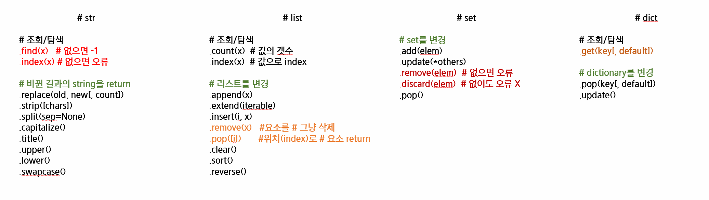

# 정리 해보기

## 저장과 복사

* 다음의 [주피터 노트북](./assignment_and_copy.ipynb)을 참고 해주세요.

* 사실은 박스에 값이 저장되는 것이 아니라 파이썬은 모든 것이 객체로 이뤄졌고, 해당 하는 객체의 주소를 저장합니다.

  ```python
  a = 20210125
  print(id(a))
  ```

* **핵심은 `immutable` 과 `mutable` 은 기존의 객체를 수정할 수 있음/없음이고, 아래의 코드는 `재할당` 의 코드입니다. 주피터 노트북을 봐주세요.**

  ```
  a = 1231231
  b = a
  b = 123
  ```

* 객체라는 용어가 수요일에 등장하게 될텐데, 그 전에 용어를 사용하지 않으려고 하였던 것이 오히려 오해를 더 불러일으킬 것 같아서 추가 작성하였습니다. 지금 객체는 숫자? 리스트? 이런 식으로 생각해주시면 됩니다. 

* 수요일 OOP 수업을 통해 한번 더 이해 시키고 객체라는 단어를 모두에게 이해시키도록 하겠습니다 :)

  * ~~수요일 강의 시작전 물 떠놓고 기도도 하겠습니다.~~

## 메서드 나만의 정리

> 다른 친구들을 위하여 여러분들의 정리 노트를 공유해주세요!



* 유사하지만 다른 동작

  * str : `.find(x)` , `.index(x)`
  * list : `.remove(x)` , `.pop([i])`
  * set : `.remove(elem)` , `discard(elem)`
  * dict : `dict[key]`, `dict.get(key)`

* 데이터 구조에 따른 결과 I

  * str은 바뀐 결과의 문자열을 return

  * 나머지는 모두 해당 하는 자료구조를(list, set, dict)를 바꿔버림

  * str와 list/set/dict가 다른 특성과 같이 생각해보기 

    ```python
    a = 'Hi'
    a.upper()# return 값 확인
    print(a) # a 자체가 바뀌지는 않음
    b = [3, 1, 2]
    b.sort() # return 값 확인
    print(b) # b 자체가 바뀜
    ```

* 데이터 구조에 따른 결과 II

  * 하나의 요소를 반환하는 메서드

  * 왜 이렇게 동작할까? set을 특정위치를 기준으로 뽑을 수는 없을까?

    ```bash
    # list
    a = [1, 2, 3]
    a.pop()  # 맨마지막이거나
    print(a) # [1, 2]
    a.pop(0) # 특정 위치
    print(a) # [2]
    
    # set
    b1 = {'hi', 1, 2, 3}
    b1.pop()   # 임의로
    print(b1)  # {1, 'hi', 2}
    
    b2 = {1, 2, 3}
    b2.pop()   # 임의로
    print(b2)  # {2, 3}
    
    # dictionary
    c = {'a': 'apple', 'b': 'banana'}
    c.pop('a') # 특정 key로
    print(c)   # {'b': 'banana'}
    
    ```


### 정리

* `return` 과 관련된 동작들을 잘 기억 해야한다.
* 절대적인 이유라기보다는 조금 더 쉽게 로직을 이해하면서 단순 메서드를 암기하는 것이 아니기 위하여 **데이터구조**별 특성을 잘 기억하자.
  * mutable? immutable?
  * ordered? unordered?
  * key-value? elem?
* 반드시 직접 출력해보고! 더 자세하게 알고 싶으면 파이썬 문서를 통하여 확인!

