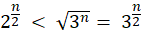
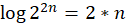
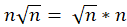
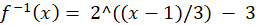

# 수와 표현

> 페어와 함께 학습하고 고민하고 설명하며 작은 부분 하나라도 '내 것'으로 만들어보세요. 😁

## 2 번

`sol`

2^20

## 3-2 & 3-4 번

`sol`

**2)** 

**4)**

n이 충분히 클 때, 2 < n(1/2)이므로 오른쪽이 크다.

## 4번

`sol`

## 6번

`sol`

f(x) = 3 log(x+3) + 1

f(x)-1 = 3log(x+3)

(f(x)-1) / 3 = log(x+3)

2^((f(x)-1)/3) = x + 3

x = 2^((f(x)-1)/3) - 3 

**정리 예시**

