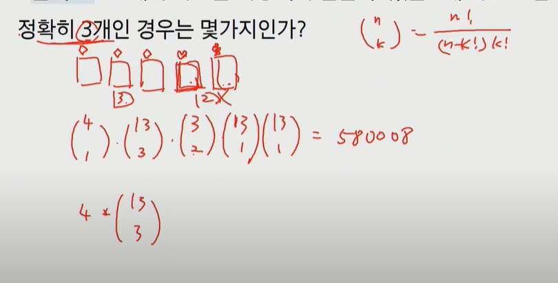

# 집합과 조합

> 페어와 함께 학습하고 고민하고 설명하며 작은 부분 하나라도 '내 것'으로 만들어보세요. 😁

## 3 번

i) 원소의 개수가 0개 일 때,

{공집합} 이므로 1개(2^0개)이다.

ii) i = n개 일 때, 2^n개라고 가정,

i가 n+1 = 2^n + 2^1이 될 것이다.

n+1 = 2^(n+1) 이다.

따라서, 수학적 귀납법에 의하여 n개의 원소를 가진 부분집합의 종류는 2^n개이다. 

 

## 10 번

[중복을 허용하지 않을 때]

i) 숫자를 4개 사용할 경우

10P4 = 10 * 9 * 8 * 7 = 5040

ii) 숫자를 5개 사용할 경우

10P5 = 10 * 9 * 8 * 7 * 6 = 30240

iii) 숫자를 6개 사용할 경우

10P6 = 10 * 9 * 8 * 7 * 6 * 5 = 151200

따라서, 가능한 비밀번호의 가지수는 186480개이다.

[중복을 허용할 때]

i) 숫자를 4개 사용할 경우

10^4 = 10000개

ii) 숫자를 5개 사용할 경우

10^5 = 100000개

iii) 숫자를 6개 사용할 경우

10^6 = 1000000개

따라서, 가능한 비밀번호의 가지수는 1110000개이다.

## 13 번

카드 무늬 : 하트, 다이아, 클로버, 스페이드 ( 한 무늬 당 13개의 카드가 있다 )

i) 각 무늬가 3개는 있고 나머지 2개의 카드는 나머지 무늬에서 선택

13C3 * 39C2 * 4 = 286 * 741 * 4 = 847704 이다.

따라서 경우는 847704 가지이다.

## 16 번

52개의 카드 중에서 같은 숫자 : 4개씩 있다

52C1 * 48C1 * 44C1 * 40C1 * 36C1 / 5! = 158,146,560 / 120 이다.

따라서 같은 숫자 카드가 한 쌍도 없는 경우는 1317888가지이다.

**정리 예시**

