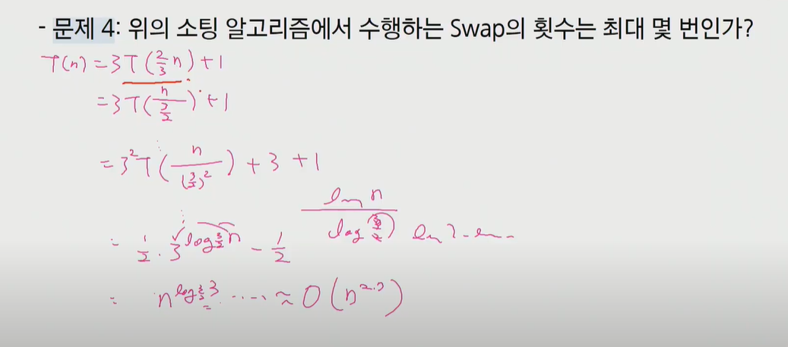

# 재귀

> 페어와 함께 학습하고 고민하고 설명하며 작은 부분 하나라도 '내 것'으로 만들어보세요. 😁


## 1번 

.PNG)

`sol`

```python
#수도코드
def F(n):
    if n == 1 or n == 2:
        return 1
    
    return F(n-1) + F(n-2)


#정확성 증명 - 수학적 귀납법
F(n) = F(n-1) + F(n-2)라고 가정
F(n+1) = F(n) + F(n-1)


#시간 복잡도
F(n) = F(n-1) + F(n-2) + 1
<= 2F(n-1) + 1 
= 2(2F(n-2)+1) + 1
= 2^2*F(n-2) + 2 + 1
= 2^n*F(0) + n + ... + 2 + 1
= 2^n*F(0) + n(n+1)/2
 
따라서 시간복잡도는 O(2^n)이다.
```


## 2번

신경써서 볼 것!


`sol`

```python
#수도코드
def Merge_sort(arr, l, r):
    mid = (l+r) // 2
    
    Merge_sort(arr, l, mid)
    Merge_sort(arr, mid+1, r)
    
    return Merge(arr, mid, l, r)
#Merge 함수 쪼개진 두 배열을 첫항부터 차례로 비교한 후 작은 수부터 순서에 맞게 정렬해줌, 구현은 하지 않는다.


#시간복잡도
T(n) = 2T(n/2) + n - 1
= 2(2T(n/4) + n/2 + -1) + n - 1
= 4T(n/4) + 2n - 3
...
= 2^k*T(n/2^k) + kn -2^k + 1
= 2^logn * T(n/2^logn) + n*logn - 2^logn + 1 
= nT(1) + n*logn - n + 1
따라서 시간복잡도는 O(n*logn)이다.
```


