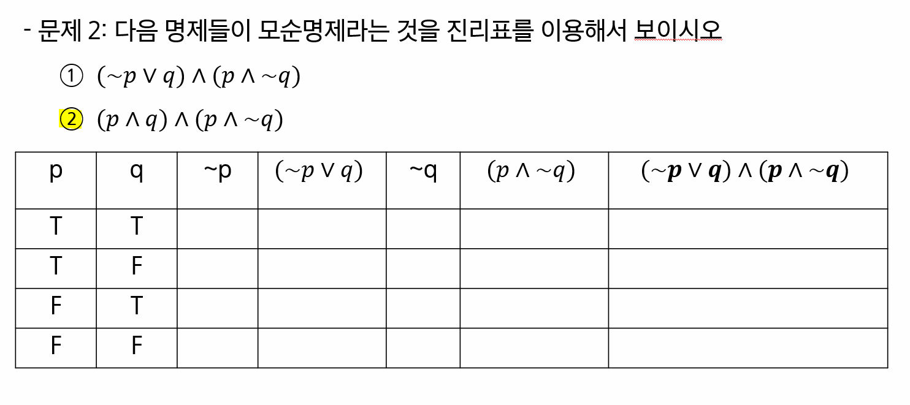
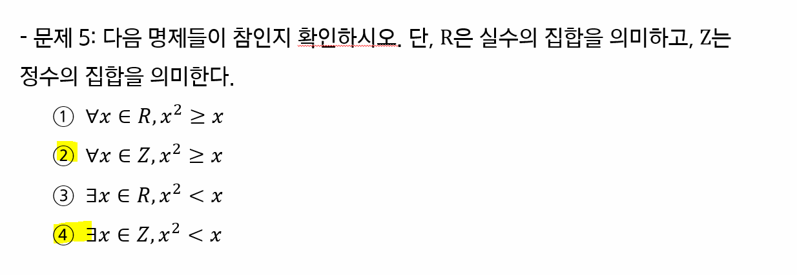
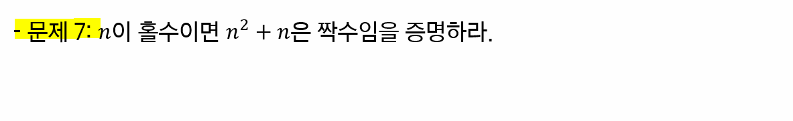
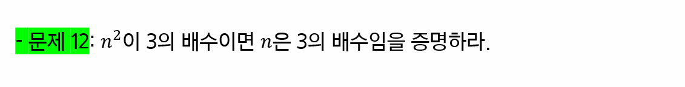

# 논리와 증명

> 페어와 함께 학습하고 고민하고 설명하며 작은 부분 하나라도 '내 것'으로 만들어보세요. 😁

**이 과정은 왜 배우냐면요..🐱‍🏍**

1. 컴퓨터공학과에서 어떤 주제로 학습을 하는지 경험해 볼 수 있습니다.
2. 느낌에 의존하는 것이 아닌 명확한 근거를 기반으로 사고하는 것이 어떤 것인지 체험해 볼 수 있습니다.

3. 개발자가 되기 위해 필요한 기본적인 수학적 지식을 가볍게 체험해 볼 수 있습니다.

**아래의 규칙을 지켜주시면 모두에게 더욱 더 유익한 학습이 될 것 같아요. 👍**

1. 학습한 내용을 직접 손으로 작성하거나 테블릿 등을 활용하여 작성한 내용을 이미지로 첨부하여 올려주시면 다른 분들이 참고 하실 때 훨씬 직관적으로 확인할 수 있을거에요!

2. 어떤 자료를 참고했고 어떤 과정을 통해 이 결과를 얻어 냈는지 조금 더 구체적으로 작성한다면 더 좋겠죠?!
   - 여러 분들의 교재를 기반으로 1차 학습
   - 추가 자료를 서칭하여 2차 학습
   - 이 과정에서 페어와 함께 의논하며 3차 학습 
     - 다른 조와의 대화도 아주 좋죠!
   - 이를 기반으로 같이 하나의 공동 문서를 작성하며 정리 

**참고 사이트**

https://www.desmos.com/calculator?lang=ko

https://www.wolframalpha.com/

부디 이 과정에 스트레스 받지 마시고 페어와 함께 공부하며 만들어 간다는 마음으로 재밌게 학습하셨으면 좋겠습니다.  해설은 금요일 오전 라이브 수업을 통해 진행합니다.

## 1-2 번

                              

| p    | q    | ~p   | (~p V q) | ~q   | (p ^ ~q) | (~p v q ) V (p ^ ~q) |
| ---- | ---- | ---- | -------- | ---- | -------- | -------------------- |
| T    | T    | F    | T        | F    | F        | **T**                |
| T    | F    | F    | F        | T    | T        | **T**                |
| F    | T    | T    | T        | F    | F        | **T**                |
| F    | F    | T    | T        | T    | F        | **T**                |

## 2-2 번  

| p    | q    | ~q   | (p ^ q) | (p ^ ~q) | (p ^ q) ^ (p ^ ~q) |
| ---- | ---- | ---- | ------- | -------- | ------------------ |
| T    | T    | F    | T       | F        | **F**              |
| T    | F    | T    | F       | T        | **F**              |
| F    | T    | F    | F       | F        | **F**              |
| F    | F    | T    | F       | F        | **F**              |

## 3-2 번

| ~p   | ~q   | ~p v ~q | p    | q    | (p v q) | ~(p v q) |
| ---- | ---- | ------- | ---- | ---- | ------- | -------- |
| F    | F    | **F**   | T    | T    | T       | **F**    |
| F    | T    | **T**   | T    | F    | T       | **F**    |
| T    | F    | **T**   | F    | T    | T       | **F**    |
| T    | T    | **T**   | F    | F    | F       | **T**    |

## 4-2 번

`(p v ~q) ^ (~p v ~q)` = `(~q v p ) ^ (~q v ~p)` = `~q v (p ^ ~p)` = `~q v ∅ `

## 5-2 번 & 5-4번

**5-2번**
$$
\forall x \in Z, x^2 \geq x
$$
해당 명제를 만족하지 않는 x의  `0 < x < 1`인데, 해당 범위엔 정수 값이 존재하지 않는다. 다시 말해 모든 정수 `x`에 대해 부등식 `x^2 >= x`을 만족한다고 할 수 있다. 따라서 ② 명제는 참이다.

**5-4번**
$$
\exists \in Z, x^2 < x
$$
`x^2 < x, x^2-x < 0, x(x-1) < 0`이므로, 가 된다. 이때, `0 < x < 1`해당 부등식 조건을 만족하는 어떤 정수도 존재하지 않는다. 따라서 ④ 명제는 거짓이다.

# 7번

$$
n = 2k + 1일때, \\

n^2 + n = (2k + 1)^2 + (2k + 1) = 4k^2 + 4k + 1 + 2 + 1 = 4k^2 + 4k + 4 = 2(2k^2 + 2k + 2)이다. \\
 
그러므로 n^2 + n 은 짝수이다.
$$

## 9번

주어진 본 명제 대신 대우를 증명하여 본 명제가 참임을 증명하는 간접 증명을 활용해보자

대우명제: `n`이 홀수이면 `n^2 + 5` 은 짝수이다.
$$
n = 2k + 1 일때, n^2 + 5 = (2k + 1)^2 + 5 = 4k^2 + 4k + 6 = 2(2k^2 + 2k + 3)
$$
위와 같은 이유로 `n`이 홀수이면, `n^2 + 5`는 짝수이다. 대우 명제가 참이기 때문에, 본 명제 또한 참이다.

## 10번

간접 증명을 활용해보자

대우명제: `n`이 홀수이면 `n^2`이 홀수이다. 
$$
n = 2k + 1일 때, n^2 = (2k + 1)^2 = 4k^2 + 4k + 1 =2(2k^2 + 2k) + 1
$$
이므로 `n`이 홀수이면 `n^2`은 홀수이다. 대우 명제가 참이기 때문에 본 명제 또한 참이다.

## 11번

**n이 짝수인 경우**
$$
n = 2k, n^2 + 5n + 3 = (2k)^2 + 5(2k) + 3 = 4k^2 + 10k + 3 = 2(2k^2 + 5k + 1) + 1
$$
그러므로, n이 짝수인 경우 `n^2 + 5n + 3`은 항상 홀수이다.

**n이 홀수인 경우**
$$
n = 2k + 1, n^2 + 5n + 3 = (2k + 1)^2 + 5(2k + 1) + 3 = 4k^2 + 14k + 9 = 2(2k^2 + 7k + 4) + 1
$$
그러므로, n이 홀수인 경우 `n^2 + 5n + 3`은 항상 홀수이다.

**결론**

n이 짝수인 경우와 홀수인 경우 모두  `n^2 + 5n + 3`은 항상 홀수이므로, 자연수 n에 대해 `n^2 + 5n + 3`은 항상 홀수이다.

## 12번

주어진 명제의 대우 명제는 다음과 같다.

대우 명제: n이 3의 배수가 아니면 `n^2`은 3의 배수가 아니다.

**`n = 3k + 1`** 
$$
n = 3k + 1일때, n^2 = (3k + 1)^2 = 9k^2 + 6k + 1 = 3(3k^2 + 2k) + 1
$$
이므로 3의 배수가 아니다.

**`n = 3k + 2`**
$$
n^2 = (3k + 2)^2 = 9k^2 + 12k + 4 = 3(3k^2 + 4k + 1) + 1
$$
이므로 3의 배수가 아니다.

**결론**

따라서, n이 3의 배수가 아니면 `n^2`은 3의 배수가 아니다.

대우 명제가 참이기 때문에 본 명제 또한 참이다. 

