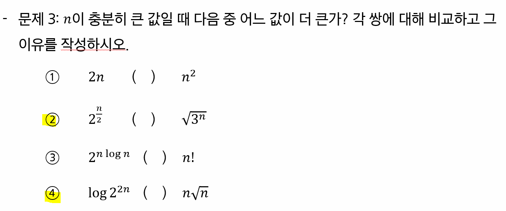

# 수와 표현

> 페어와 함께 학습하고 고민하고 설명하며 작은 부분 하나라도 '내 것'으로 만들어보세요. 😁

## 2 번

$$
2^{20} = 1048576 
$$

## 3-2 & 3-4 번

**3-2번**
$$
2_n^2 < \sqrt{2^n}
$$
`n > 0` 일 때, `3^n/2` > `2^n/2`이 항상 성립하므로, 0보다 큰 모든 n에 대해 부등호가 항상 성립한다.

**3-4번**
$$
log_{2}2^{2n} < n \sqrt{n}
$$
`n > 4`일 때 `2n < n^3/2` 이 항상 성립한다. 따라서 4보다 큰 모든 n에 대해 부등호가 항상 성립한다.

## 4번

$$
\frac {log_{2}y + log_{2}z} {log_{2}a}
$$

## 6번

$$
10^\frac{f(x) - 1} {3} = x + 3 \\
x = 10^\frac{f(x) - 1} {3}  - 3 \\
f^{-1}(x)  = 10^\frac{f(x) - 1} {3}  - 3
$$

**정리 예시**

