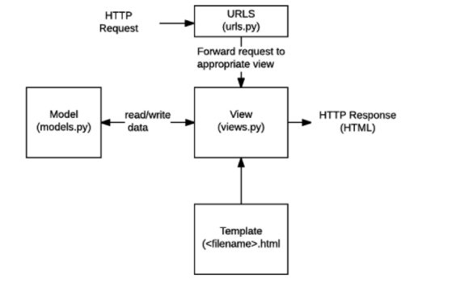

# Django Intro

#### Django

- dynamic web

- 웹의 프로토콜 : 클라이언트에서 서버로 요청을 보내고 서버에서 클라이언트로 응답보냄 (예 : 네이버 화면)

- django는 파이썬으로 작성된 오픈 소스 웹 어플리케이션 프레임워크로, 모델 - 뷰 컨트롤러 모델 패턴을 따르고 있다. (MTV)

  > 모델 - 뷰- 컨트롤러 (MVC)  : 소프트웨어 공학에서 사용되는 소프트웨어 디자인 패턴이다. 
  >
  > M : model (데이터베이스관리)
  >
  > T : Template (레이아웃_화면)
  >
  > V : View (중심 컨트롤러_심장)



#### 명령어 (vscode 터미널)

- django-admin startproject 프로젝트이름 : 시작폴더생성

- python manage.py runserver : 서버켤때

- python manage.py startapp 앱이름 : 앱 생성 > 이거 하고  settings에 등록

- settings > Installed_Apps : 장고가 기본적으로 구동되는데 필요해 미리 만들어진 것 들 (여기에 생성한 앱 등록함 // 위치는 가장 위에다가 )

- settings > LANGUAGE_CODE = 'ko-kr' 한국어로 변경 가능

  

#### 파일 (중요하게 생각할)

1. urls.py
2. views.py
3. models.py

-------------------------

#### Template

**템플릿**

- (view에서 가공된 데이터를 받아서 잘 표현해주는 것)!!!

- 데이터 표현을 제어하는 도구이자 표현에 관련된 로직

- 사용하는 빌트인 시스템 : Django template language

**로직**

- articles > templates를 만들고 이 안에 index.html만듬 

- 그리고 views.py의 index함수의 return부분에 index.html이라는 경로를 씀 

- 템플릿 안에 파일을 읽어 올 수 있음 (즉, 템플릿 경로들을 templates 안에 넣어놓는다.)

**Django template language (DTL)**

- 조건, 반복, 변수치환, 필터 등의 기능을 제공

- 파이썬 처럼 일부 프로그래밍 구조를 사용할 수 있지만, 해당 파이썬 코드로 실행되는 것이 아님 

**DTL syntax**

- 변수 Variable

  변수를 기준으로 {{ name }}  이런식으로 한다.

  key에 해당하는 문자열이 template에서 사용 가능한 변수명이 된다.

- 필터 Filters

  {{ Variable|filter }}

  표시할 변수를 수정할 때 사용한다.

- 태그 Tags

   ... 

  출력 텍스트를 만들거나, 반복 또는 논리를 수행하여 제어 흐름을 만드는 등 변수보다 복잡한 일들을 수행

- 주석 Comments

  주석처리

**Template inheritance**

- 템플릿 상속은 기본적으로 코드의 재사용성에 초점을 맞춤

- 템플릿 상속을 사용하면 사이트의 모든 공통 요소를 포함하고,하위 템플릿이 재정의 할 수 있는 블록을 정의하는 기본 템플릿을 만들 수 있다.

- 지금까지 greeting, dinner, index html들은 하나의 앱이 들고 있는 것이었는데 base.html은 다른 앱들에서도 사용하고 싶을 땐, 프로젝트에 templates를 만들어서 거기 안에 넣는다

  그리고 index.html은 이렇게 바꿈 

  ```django
  
  
    <h1>만나서 반가워요!!</h1>
    <a href="/greeting/">greeting</a>
    <a href="/dinner/">dinner</a>
  
  
  ```

  settings > templates 에 추가 경로 넣어줘야함 

  ```django
  'DIRS': [BASE_DIR / 'firstpjt' / 'templates'],
  ```

  Base Dir은 FIRST PROJECt 인듯 하다. 한칸 한칸 경로를 새로 지정해주는 것.

- 반드시  가 템플릿 최상단에 있어야 한다.

-   block은 부모 쪽에서 먼저 지정해주고, 자식쪽에서도 지정해줘야함.

  하위 템플릿에서 재지정 할 수 있는 블록을 정의한다.  (즉, block 밖에는 공통적인 요소들)

**템플릿시스템** 

- 템플릿은 표현에 관련된 로직일 뿐이다.
- 중복을 배제

----

#### HTML 

**HTML form element**

- action
- method

**HTML input element**

사용자로부터 데이터를 입력받기위해 사용

- name (key): 서버가 접근할 수 있는 값

**HTML request method - GET**

- get : 서버로부터 정보를 조회할 때 사용 / 데이터를 가져올 때만 사용하는 메서도 / 데이터를 서버로 전송할 때 바디가 아닌 query string parameters를 통해 전송 
- throw & catch  => url 두개, view 두개, 템플릿 두개
  1. view : 데이터 받을 템플릿 출력하는 애
  2. view : 보내준 데이터 받는 view (결과를 보여줄 )

----------

#### Django URLs

> 웹 어플리케이션은 URL을 통한 클라이언트의 요청에서부터 시작됨

**App url mapping**

- app의 view 함수가 많아지면 사용하는 path() 또한 많아지고, app 도 더 많이 작성되기 때문에 프로젝트의 urls.py에서 모두 관리하는 것은 코드 유지보수에 좋지 않다.
- 따라서 각 app에 urls.py를 작성하게 된다. 유용성을 위해 

**Naming URL patterns**

- 링크에 url을 직접 작성하는 것이 아니라 path() 함수의 name 인자를 정의해서 사용
- Django Template Tag 중 하나인 url 태그를 사용해서 path() 함수에 작성한 name을 사용할 수 있음 

---------

#### Namespace

**URL namespace**

>  url에 namespace를 설정함으로써 어떤 app에 작성된 url name인지 정확히 사용할 수 있음 

```python
app_name = 'articles'
urlpatterns = [
	path('admin/', admin.site.urls),
	path('index/', views.index, name = 'index')
]
```

```django
<a href="">메인페이지</a>
```

**Template namespace**

- Django는 기본적으로 app_name/templates 경로에 있는 templates 파일들만 찾을 수 있으며, INSTALLED_APPS에 작성한 app 순서로 template를 검색 후 렌더링함

- 그래서 임의로 templates의 폴더 구조를 app_name/templates/app_name 형태로 변경해 임의로 이름 공간 생성 후 변경된 추가 경로로 수정

  ```python
  def index(request):
  	return render(request, 'articles/index.html')
  ```

----------

#### 핵심 정리

1. 즉,,,,,,,,,!!! 사용자로부터 urls.py에서 index/라는 요청을 받으면 views.index 함수를 호출하고 여기서 index.html을 찾아가고 이게 templates안에 index.html인 것 !!

   일단 urls.py에 사용자 요청에 대한 경로 만들어주고, views.py에서 함수 호출부분 만들고, templates에 html 만들고 서버 런!

2. ```views.py에서 return render(request,'greeting.html', {'name':'hyein',})```

   이렇게 하면 greeting.html에 name저거 key:value를 같이 담아서 보내주는 것

3. 느낌표 + tap

   for + tap

4. app 이름은 복수형 + app 생성(startapp) 후 등록

5. 파일작성순서

   1) url

   2) views.py > 함수 생성 

   3) templates > 해당 html