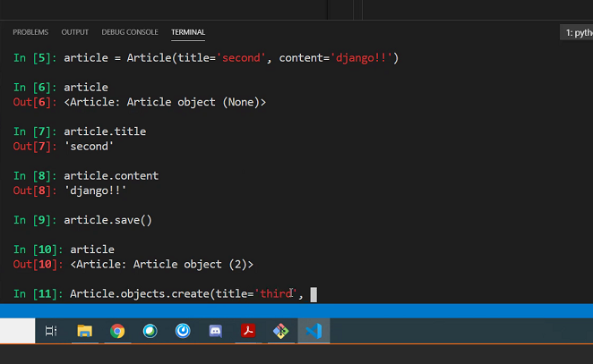
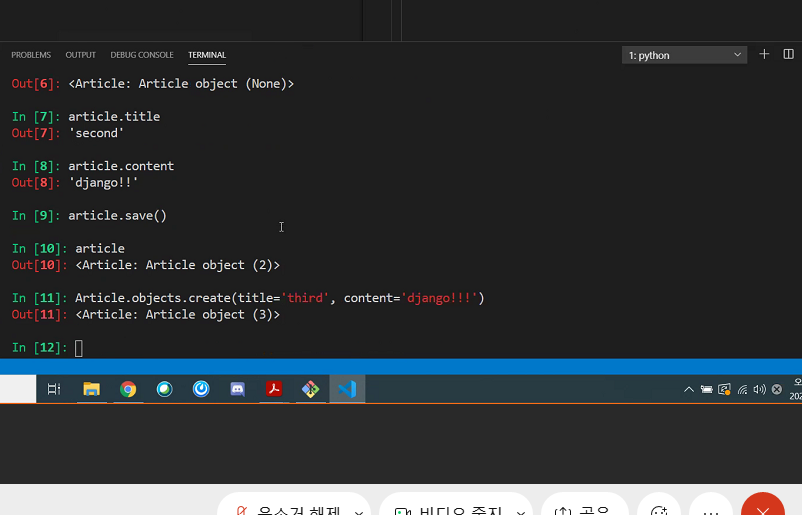

# 02_django_model

model

웹 어플리케이션의 데이터를 구조화하고 조작하기 위한 도구

단일한 데이터에 대한 정보를 가짐 

저장된 데이터베이스의 구조

각각의 model은 하나의 데이터베이스 테이블에 매핑

(model != database)


데이터베이스

체계화된 데이터의 모임 

쿼리

데이터를 조회하기 위한 명령어

구조

스키마

데이터베이스의 전반적인 자료 구조

테이블 

필드 / 컬럼 / 속성

레코드 / 행 / 튜플

PK (기본키)

데이터베이스 관리 및 관계 설정시 주요하게 활용됨


ORM

객체지향프로그래밍 언어를 사용하여 호환되지 않는 유형의 시스템(Django-SQL) 간에 데이터를 변환하는 프로그래밍 기술. 

장점

SQL을 잘 알지 못해도 DB조작이 가능

SQL의 절차적 접근이 아닌 객체 지향적 접근으로 인한 높은 생산성

단점

ORM만으로 완전한 서비스를 구현하기 어려운 경우가 있음 


migrations

django가 model에 생긴 변화(필드를 추가했다던가 모델을 삭제했다던가 등)를 반영하는 방법

migration 실행 및 DB 스키마를 다루기 위한 몇 가지 명령어

makemigrations **

>  model의 변경 사항에 기반해서 새로운 마이그레이션(like 설계도)을 만들 때 사용
>
> 이때는 실제 DB는 비어있음 
>
> 중간에 변경사항이 생기면 다시 makemigrations해서 설계도 만들어야함

migrate **

> 위에서 만들어진 설계도들을 (마이그레이션을) DB에 실제로 반영하기 위해 사용
>
> 모델에서의 변경 사항들과 DB의 스키마가 동기화를 이룸

sqlmigrate

> 마이그레이션에 대한 SQL 구문을 보기 위해 사용

showmigrations

> 프로젝트 전체의 마이그레이션 상태를 확이하기 위해 사용
>
> 마이그레이션 파일들이 migrate 됐는지 안됐느지 여부를 확인할 수 있음 


반드시 기억해야 할 3단계

1. models.py

   model 변경사항 발생

2. python manage.py makemigrations

   migrations 파일 생성

3. python manage.py migrate

   DB 적용


Database API

> DB와의 대화
>
> DB를 조작하기 위한 도구
>
> django가 기본적으로 ORM을 제공함에 따른 것으로 DB를 편하게 조작할 수 있도록 도와줌 

DB API 구문

ClassName.Manager.QuerySetAPI

> Article.objects.all()

Manager


CRUD

> 대부분의 컴퓨터 소프트웨어가 가지는 기본적인 데이터 처리 기능인 Create, Read, Update, Delete 를 묶어서 일컫는 말

create

```

USER@LAPTOP-L0LDBJLT MINGW64 ~/Desktop/TIL_G/04_Django/02_django_modelud (master)
$ python manage.py runserver
Watching for file changes with StatReloader
Performing system checks...

System check identified no issues (0 silenced).

You have 18 unapplied migration(s). Your project may not work properlytil you apply the migrations for app(s): admin, auth, contenttypes, seons.
Run 'python manage.py migrate' to apply them.
March 10, 2021 - 09:22:49
Django version 3.1.7, using settings 'crud.settings'
Starting development server at http://127.0.0.1:8000/
Quit the server with CTRL-BREAK.
[10/Mar/2021 09:22:52] "GET / HTTP/1.1" 200 16351
[10/Mar/2021 09:22:52] "GET /static/admin/css/fonts.css HTTP/1.1" 304 
d-webfont.woff HTTP/1.1" 304 0
[10/Mar/2021 09:22:52] "GET /static/admin/fonts/Roboto-Regular-webfont/1.1" 304 0
[10/Mar/2021 09:22:52] "GET /static/admin/fonts/Roboto-Light-webfont.w.1" 304 0
Not Found: /favicon.ico
[10/Mar/2021 09:22:52] "GET /favicon.ico HTTP/1.1" 404 1970

USER@LAPTOP-L0LDBJLT MINGW64 ~/Desktop/TIL_G/04_Django/02_django_modelter)
$ python manage.py startapp articles

USER@LAPTOP-L0LDBJLT MINGW64 ~/Desktop/TIL_G/04_Django/02_django_modelter)
$ python manage.py makemigrations
Migrations for 'articles':
  articles\migrations\0001_initial.py
    - Create model Article

USER@LAPTOP-L0LDBJLT MINGW64 ~/Desktop/TIL_G/04_Django/02_django_modelter)
$ python manage.py migrate
Operations to perform:
  Apply all migrations: admin, articles, auth, contenttypes, sessions
Running migrations:
  Applying contenttypes.0001_initial... OK
  Applying auth.0001_initial... OK
  Applying admin.0001_initial... OK
  Applying admin.0002_logentry_remove_auto_add... OK
  Applying admin.0003_logentry_add_action_flag_choices... OK
  Applying articles.0001_initial... OK
  Applying contenttypes.0002_remove_content_type_name... OK
  Applying auth.0002_alter_permission_name_max_length... OK
  Applying auth.0003_alter_user_email_max_length... OK
  Applying auth.0004_alter_user_username_opts... OK
  Applying auth.0005_alter_user_last_login_null... OK
  Applying auth.0006_require_contenttypes_0002... OK
  Applying auth.0007_alter_validators_add_error_messages... OK
  Applying auth.0008_alter_user_username_max_length... OK
  Applying auth.0009_alter_user_last_name_max_length... OK
  Applying auth.0010_alter_group_name_max_length... OK
  Applying auth.0011_update_proxy_permissions... OK
  Applying auth.0012_alter_user_first_name_max_length... OK
  Applying sessions.0001_initial... OK

USER@LAPTOP-L0LDBJLT MINGW64 ~/Desktop/TIL_G/04_Django/02_django_modelter)
$ python manage.py sqlmigrate articles 0001
BEGIN;
--
-- Create model Article
--
CREATE TABLE "articles_article" ("id" integer NOT NULL PRIMARY KEY AUT, "title" varchar(10) NOT NULL, "content" text NOT NULL);
COMMIT;

USER@LAPTOP-L0LDBJLT MINGW64 ~/Desktop/TIL_G/04_Django/02_django_modelter)
$ python manage.py showmigrations
admin
 [X] 0001_initial
 [X] 0002_logentry_remove_auto_add
 [X] 0003_logentry_add_action_flag_choices
articles
 [X] 0001_initial
auth
 [X] 0001_initial
 [X] 0002_alter_permission_name_max_length
 [X] 0003_alter_user_email_max_length
 [X] 0004_alter_user_username_opts
 [X] 0005_alter_user_last_login_null
 [X] 0007_alter_validators_add_error_messages
 [X] 0008_alter_user_username_max_length
 [X] 0009_alter_user_last_name_max_length
 [X] 0010_alter_group_name_max_length
 [X] 0011_update_proxy_permissions
 [X] 0012_alter_user_first_name_max_length
contenttypes
 [X] 0001_initial
 [X] 0002_remove_content_type_name
sessions
 [X] 0001_initial

USER@LAPTOP-L0LDBJLT MINGW64 ~/Desktop/TIL_G/04_Django/02_django_model
$ python manage.py makemigrations
No changes detected

USER@LAPTOP-L0LDBJLT MINGW64 ~/Desktop/TIL_G/04_Django/02_django_model
$ python manage.py makemigrations
You are trying to add the field 'created_at' with 'auto_now_add=True' t a default; the database needs something to populate existing rows.

 1) Provide a one-off default now (will be set on all existing rows)
You can accept the default 'timezone.now' by pressing 'Enter' or you can provide another value.
The datetime and django.utils.timezone modules are available, so you can do e.g. timezone.now
Type 'exit' to exit this prompt
[default: timezone.now] >>>
Migrations for 'articles':
  articles\migrations\0002_auto_20210310_1040.py
    - Add field created_at to article

USER@LAPTOP-L0LDBJLT MINGW64 ~/Desktop/TIL_G/04_Django/02_django_model/crud (master)
$ python manage.py migrate
Operations to perform:
  Apply all migrations: admin, articles, auth, contenttypes, sessions        
Running migrations:
  Applying articles.0002_auto_20210310_1040... OK

USER@LAPTOP-L0LDBJLT MINGW64 ~/Desktop/TIL_G/04_Django/02_django_model/crud (master)
$
$ ^C

USER@LAPTOP-L0LDBJLT MINGW64 ~/Desktop/TIL_G/04_Django/02_django_model/crud (master)     
$ pip install django-extensions
Collecting django-extensions
  Downloading django_extensions-3.1.1-py3-none-any.whl (222 kB)
     |████████████████████████████████| 222 kB 2.2 MB/s
Installing collected packages: django-extensions
Successfully installed django-extensions-3.1.1

USER@LAPTOP-L0LDBJLT MINGW64 ~/Desktop/TIL_G/04_Django/02_django_model/crud (master)     
$ python manage.py shell
Python 3.8.5 (default, Sep  3 2020, 21:29:08) [MSC v.1916 64 bit (AMD64)] on win32       
Type "help", "copyright", "credits" or "license" for more information.
(InteractiveConsole)
>>> exit
Use exit() or Ctrl-Z plus Return to exit
>>> exit()

USER@LAPTOP-L0LDBJLT MINGW64 ~/Desktop/TIL_G/04_Django/02_django_model/crud (master)     
$ python manage.py shell_plus
# Shell Plus Model Imports
from articles.models import Article
from django.contrib.admin.models import LogEntry
from django.contrib.auth.models import Group, Permission, User
from django.contrib.contenttypes.models import ContentType
from django.contrib.sessions.models import Session
# Shell Plus Django Imports
from django.core.cache import cache
from django.conf import settings
from django.contrib.auth import get_user_model
from django.db import transaction
from django.db.models import Avg, Case, Count, F, Max, Min, Prefetch, Q, Sum, When       
from django.utils import timezone
from django.urls import reverse
from django.db.models import Exists, OuterRef, Subquery
Python 3.8.5 (default, Sep  3 2020, 21:29:08) [MSC v.1916 64 bit (AMD64)] on win32       
Type "help", "copyright", "credits" or "license" for more information.
(InteractiveConsole)
>>> exit
Use exit() or Ctrl-Z plus Return to exit
>>> exit()

USER@LAPTOP-L0LDBJLT MINGW64 ~/Desktop/TIL_G/04_Django/02_django_model/crud (master)     
$ pip install ipython
Collecting ipython
  Downloading ipython-7.21.0-py3-none-any.whl (784 kB)
     |████████████████████████████████| 784 kB 1.6 MB/s 
Collecting traitlets>=4.2
  Using cached traitlets-5.0.5-py3-none-any.whl (100 kB)
Collecting backcall
  Using cached backcall-0.2.0-py2.py3-none-any.whl (11 kB)
Requirement already satisfied: setuptools>=18.5 in c:\users\user\miniconda3\lib\site-packages (from ipython) (50.3.1.post20201107)
Collecting prompt-toolkit!=3.0.0,!=3.0.1,<3.1.0,>=2.0.0
  Downloading prompt_toolkit-3.0.16-py3-none-any.whl (366 kB)
     |████████████████████████████████| 366 kB 3.2 MB/s 
Collecting jedi>=0.16
  Using cached jedi-0.18.0-py2.py3-none-any.whl (1.4 MB)
Collecting pygments
  Downloading Pygments-2.8.1-py3-none-any.whl (983 kB)
     |████████████████████████████████| 983 kB 3.2 MB/s 
Collecting decorator
  Using cached decorator-4.4.2-py2.py3-none-any.whl (9.2 kB)
Collecting colorama; sys_platform == "win32"
  Using cached colorama-0.4.4-py2.py3-none-any.whl (16 kB)
Collecting pickleshare
  Using cached pickleshare-0.7.5-py2.py3-none-any.whl (6.9 kB)
Collecting ipython-genutils
  Using cached ipython_genutils-0.2.0-py2.py3-none-any.whl (26 kB)
Collecting wcwidth
  Using cached wcwidth-0.2.5-py2.py3-none-any.whl (30 kB)
Collecting parso<0.9.0,>=0.8.0
  Using cached parso-0.8.1-py2.py3-none-any.whl (93 kB)
Installing collected packages: ipython-genutils, traitlets, backcall, wcwidth, prompt-toolkit, parso, jedi, pygments, decorator, colorama, pickleshare, ipython
Successfully installed backcall-0.2.0 colorama-0.4.4 decorator-4.4.2 ipython-7.21.0 ipython-genutils-0.2.0 jedi-0.18.0 parso-0.8.1 pickleshare-0.7.5 prompt-toolkit-3.0.16 pygments-2.8.1 traitlets-5.0.5 wcwidth-0.2.5

USER@LAPTOP-L0LDBJLT MINGW64 ~/Desktop/TIL_G/04_Django/02_django_model/crud (master)     
$ python manage.py shell_plus
# Shell Plus Model Imports
from articles.models import Article
from django.contrib.admin.models import LogEntry
from django.contrib.auth.models import Group, Permission, User
from django.contrib.contenttypes.models import ContentType
from django.contrib.sessions.models import Session
# Shell Plus Django Imports
from django.core.cache import cache
from django.conf import settings
from django.contrib.auth import get_user_model
from django.db import transaction
from django.db.models import Avg, Case, Count, F, Max, Min, Prefetch, Q, Sum, When       
from django.utils import timezone
from django.urls import reverse
from django.db.models import Exists, OuterRef, Subquery
Python 3.8.5 (default, Sep  3 2020, 21:29:08) [MSC v.1916 64 bit (AMD64)]
Type 'copyright', 'credits' or 'license' for more information
IPython 7.21.0 -- An enhanced Interactive Python. Type '?' for help.

In [1]: Article
Out[1]: articles.models.Article

In [2]: Article.objects.all()
Out[2]: <QuerySet []>

In [3]: article = Article()

In [4]: article
Out[4]: <Article: Article object (None)>

In [5]: article.title = 'first'

In [6]: article.title
Out[6]: 'first'

In [7]: article.content = 'django!'

In [8]: article.content
Out[8]: 'django!'

In [9]: Article.objects.all()
Out[9]: <QuerySet []>

In [10]: article.save()

In [11]: article
Out[11]: <Article: Article object (1)>
```





위까지 총 3가지 방법

```
# 1번째 방법
article = Article()
article.title = ''
article.content = ''
article.save()

# 2번째 방법 (인스턴스 생성하면서 클래스 인자에 넣어주는거)
article = Article(title=' ', content=' ')
article.save()

# 3번째 방법
Article.objects.create(title=' ', content=' ')

```

article 인스턴스 하나 당 테이플의 튜플 하나라고 생각하면 될듯 

---------

crude 에서 read는 2가지 (조회)

1. all

   ```
   In [8]: Article.objects.all()
   Out[8]: <QuerySet [<Article: first>, <Article: second>, <Article: third>, <Article: 4444>]>
   ```

2. get

   ```
   In [9]: article = Article.objects.get(pk=4)
   In [10]: article
   Out[10]: <Article: 4444>
   ```

   pk로만 조회할 때만 사용한다 (유니크한 값)

   왜냐하면 객체가 없으면 DoesNotExist 에러 발생

   객체가 여러개일경우 Multiple~ 에러 발생

   위와 같은 특징을 가지고 있기 때문에 unique 혹은 NOT NULL 특징을 가지고 있는 경우에만 사용 가능 (즉 pk로 조회할 때만 사용)

3. filter

   지정된 것을 포함하는 모든 데이터값을 쿼리셋으로 줌

   하나의 쿼리셋에 데이터가 여러개인것

   ```
   In [13]: Article.objects.filter(content='django!')
   Out[13]: <QuerySet [<Article: first>, <Article: 5555!>]>
   ```

   만약 그 요구한 데이터가 1개일경우 

   ```
   In [14]: Article.objects.filter(title='first')
   Out[14]: <QuerySet [<Article: first>]>
   ```

   하나의 쿼리셋에 데이터가 하나인것

-------

Field lookups

> 조회 시 특정 조건을 적용시키기 위해 사용
>
> QuerySet Method(get, filter, exclude) 에 대한 키워드 인수로 사용됨

```
In [15]: Article.objects.filter(content__contains='!')
Out[15]: <QuerySet [<Article: first>, <Article: second>, <Article: third>, <Article: 4444>, <Article: 5555!>]>

In [16]: Article.objects.filter(pk__gt=1)  # 1보다 크거나 같은
Out[16]: <QuerySet [<Article: second>, <Article: third>, <Article: 4444>, <Article: 5555!>]>
```

--------------

update

```
# 1번 글 가져와서 수정하려면 
In [18]: article = Article.objects.get(pk=1)

In [19]: article
Out[19]: <Article: first>

In [19]: article
Out[19]: <Article: first>

In [20]: article.title
Out[20]: 'first'

In [21]: article.title='byebye'

In [22]: article.title
Out[22]: 'byebye'

In [23]: article.save()

In [24]: article.title
Out[24]: 'byebye'
```

이렇게 하면 updated_at 수정시간이 변경되었다.

-----

delete

```
In [26]: article.delete()
Out[26]: (1, {'articles.Article': 1})

In [27]: Article.objects.get(pk=1)
---------------------------------------------------------------------------
DoesNotExist                              Traceback (most recent call last)
<ipython-input-27-00adbda49bfd> in <module>
----> 1 Article.objects.get(pk=1)

~\miniconda3\lib\site-packages\django\db\models\manager.py in manager_method(self, *args, **kwargs)
     83         def create_method(name, method):
     84             def manager_method(self, *args, **kwargs):
---> 85                 return getattr(self.get_queryset(), name)(*args, **kwargs)       
     86             manager_method.__name__ = method.__name__
     87             manager_method.__doc__ = method.__doc__

~\miniconda3\lib\site-packages\django\db\models\query.py in get(self, *args, **kwargs)   
    427             return clone._result_cache[0]
    428         if not num:
--> 429             raise self.model.DoesNotExist(
    430                 "%s matching query does not exist." %
    431                 self.model._meta.object_name

DoesNotExist: Article matching query does not exist.
```

어떤거 삭제할 지 선택하고 delete 하면 됨

여기서 1을 지웠는데 바로 이 상태에서 추가하면 마지막에 추가됨. 1번으로는 추가되지 않음 

------

Admin site

Automatic admin interface

> 사용자가 아닌 서버의 관리자가 활용하기 위한 페이지
>
> django.contrib.auth 모듈에서 제공 

```
from django.contrib import admin
# from . import models
from .models import Article

# Register your models here.
class ArticleAdmin(admin.ModelAdmin):
	list_display = ('pk', 'title', 'content', 'created_at', 'updated_at',)	# list_display : 정해진 클래스 변수명


admin.site.register(Article, ArticleAdmin)

# admin site에 Article클래스를 register하겠다.
```


```
$ python manage.py createsuperuser
Username (leave blank to use 'user'): admin
Email address:
Password:
Password (again):
Superuser created successfully.
```

-------

url, view보다 model 먼저함

model 하고 makemigrations > migrate 함


settings > django_extensions 등록해야함

