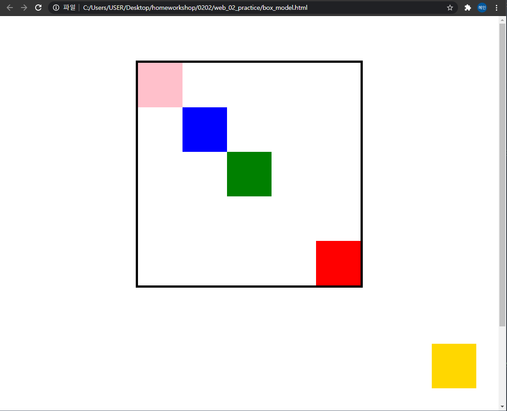
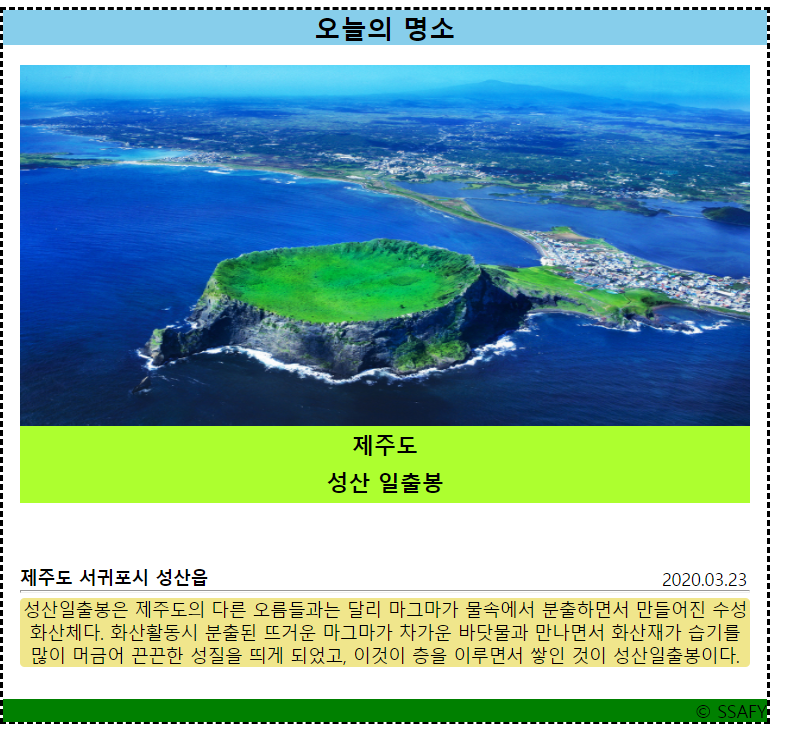

# Web_02_Practice

### 1. css

```css
.big-box {
  position: relative;
  margin: 100px auto 500px;
  border: 5px solid black;
  width: 500px;
  height: 500px;
}

.small-box {
  width: 100px;
  height: 100px;
}

#red {
  background-color: red;
  /* 큰 사각형 내부의 우측 하단 모서리에 빨간 사각형 위치시키기 */
  position: absolute;
  top: 400px;
  left: 400px;
}

#gold {
  background-color: gold;
  /* 브라우저의 하단에서 50px, 우측에서 50px 위치에 고정하기 */
  position: fixed;
  bottom: 50px;
  right: 50px;
  
}

#green {
  background-color: green;
  /* 큰 사각형의 가운데 위치시키기 */
  position: absolute;
  top: 200px;
  left: 200px;
}

#blue {
  background-color: blue;
  /* 큰 사각형 좌측 상단 모서리에서 100px, 100px 띄우기 */
  position: absolute;
  top: 100px;
  left: 100px;

}

#pink {
  background-color: pink;
  /* 큰 사각형 내부의 좌측 상단 모서리로 옮기기*/
  
}
```

html은 파일 그대로 했을 때 출력결과는 다음과 같다



노란색 사각형은 브라우저를 내릴 때도 해당 위치에 고정하기 위해 position을 fixed로 잡았다. 나머지는 빨간색, 초록색, 파란색 사각형은 absolute로 position을 설정하였다.

### 2.

```css
* {
  box-sizing: border-box;
  margin: 0;
  padding: 0;
}

.container {
  width: 1200px;
  margin: 200px auto;
  
}

.card{
  width: 700px;
  border-style: dashed;
  height: 652px;
  
}

.card-nav{
  background-color: skyblue;
  text-align: center;

}

.card-header{
  width: 664px;
  margin: 0px auto;
  height: 18px;

}

.card-img{
  width: 664px;
  height: 330px;
  position: relative;
  top: 18px;
}

.card-img-description{
  position: relative;
  top: 13px;
  background-color: greenyellow;
  height: 70px;
  text-align: center;
  /* 상하 센터 */
  font-weight: bold;
  font-size: 20px;
  line-height: 35px;


}

.card-body{
  width: 664px;
  margin: 0px auto;
  position: relative;
  top: 436px;
  
}

.card-body-title {
  display: inline-block;
  /* text-align: right; */
  
}

.card-body-title p{
  text-align: right;
  position: relative;
  left: 490px;
  
}

.card-body-title h4{
  
  position: relative;
  top: 20px;
  
}

.card-body-content{
  background-color: khaki;
  border-radius: 4px;
  text-align: center;
  position: relative;
  top: 5px;

}


.card-footer{
  width: 694px;
  position: relative;
  top: 470px;
  background-color: green;
  text-align: right;
  margin: 0px auto;
  

}
```


출력결과


