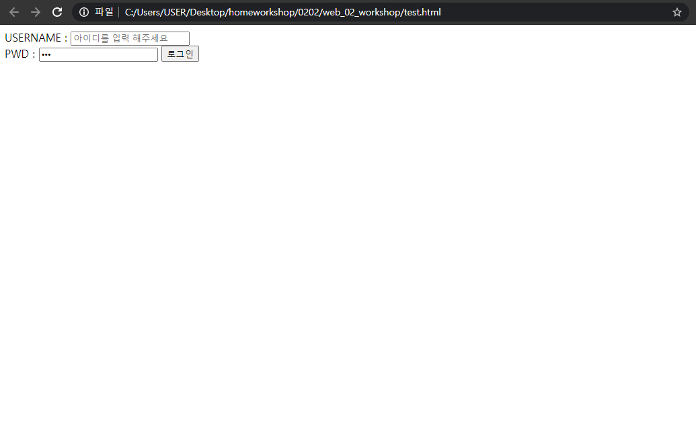

# web_02_homework

### 1.

```
header, footer, section
```


### 2. 

```html
<!DOCTYPE html>
<html lang="en">
<head>
  <meta charset="UTF-8">
  <meta name="viewport" content="width=device-width, initial-scale=1.0">
  <title>Document</title>
</head>
<body>
  <form action="#">
    <div>
        <!-- lagel for과 input의 id가 연결 되어서 Username누르면 마우스 커서가 저기로 가는 것  -->
      <label for="USERNAME">USERNAME : </label>
      <input type="text" id="USERNAME" placeholder="아이디를 입력 해주세요" autofocus> 
    </div>
    <div>
      <label for="PWD">PWD : </label>
      <input type="password" id="PWD" autofocus> 
      <input type="submit" value="로그인">
    </div>
  </form>
</body>
</html>
```

> 출력결과




### 3. 

```
rem
```


### 4.

```
자손 선택자는 div안에 p가 다 바뀌게 되고, 자식 선택자는 div의 바로 하나 안에만 있는 p가 바뀌게 된다. 자식은 바로 직계까지만, 자손은 다 바뀌게 된다. 


```

