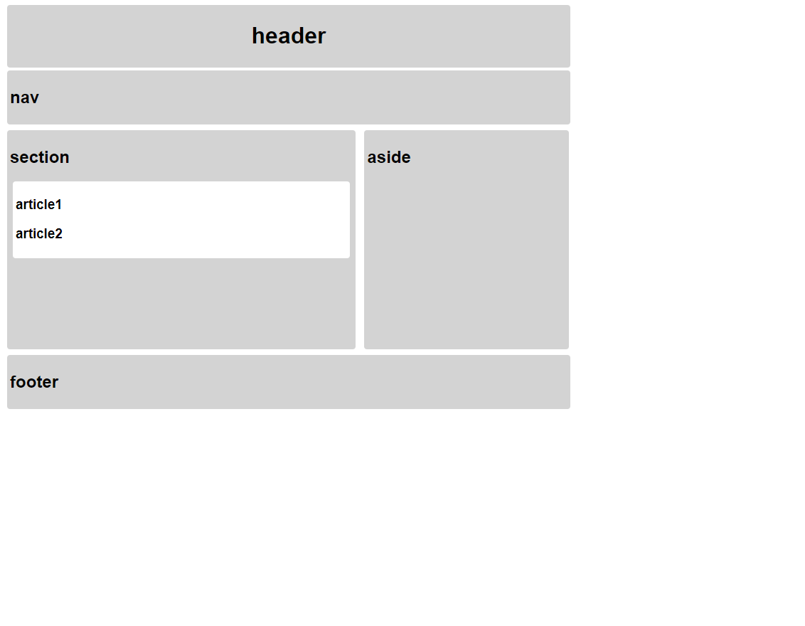

# web_02_workshop.md

css

```css
body {
  font-family: Arial;
  width: 800px;
}

/* 모든 스타일링 요소를 클래스로 만들어 사용합니다. */

/* 1. article 태그는 white로 나머지 시멘틱 태그는 lightgrey로 배경색을 바꿔주세요. */
.white {
  background-color: white;
}

.lightgrey {
  background-color: lightgrey;
}

/* 2. 모든 시멘틱 태그의 margin과 padding을 4px로 만들어주세요. */
.mar_pad {
  margin: 4px;
  padding: 4px;
}
/* 3. h1 태그를 중앙 정렬 시켜주세요. */
.cen_ter {
  text-align: center;
}
/* 4. section과 aside 태그의 display를 inline-block으로 바꿔주세요. */
.display {
  display: inline-block;
}
/* 5. section 태그는 width 482px height 300px, aside 태그는 width 280px height 300px로 만들어주세요.*/
.box1{
  width: 482px;
  height: 300px;
}

.box2{
  width: 280px;
  height: 300px;
}
/* 6. aside 태그에 vertical-align속성의 값을 top으로 적용해주세요.*/

.ver{
  vertical-align: top;
}
/* 7. 모든 semantic 태그의 border 모서리 반경을 4px로 만들어주세요. */

.border{
  border-radius: 4px;
}
```

html

```html
<!DOCTYPE html>
<html lang="ko">
<head>
  <meta charset="UTF-8">
  <meta name="viewport" content="width=device-width, initial-scale=1.0">
  <link rel="stylesheet" href="semantic.css">
  <title>Layout Practice</title>
</head>
<body>
  <header class="lightgrey mar_pad cen_ter border">
    <h1 >header</h1>
  </header>
  <nav class="lightgrey mar_pad border">
    <h2>nav</h2>
  </nav>
  <section class="mar_pad display box1 border lightgrey">
    <h2>section</h2>
    <article class="white mar_pad border">
      <h3>article1</h3>
      <h3>article2</h3>
    </article>
  </section>
  <aside class="lightgrey mar_pad display box2 ver border">
    <h2>aside</h2>
  </aside>
  <footer class="lightgrey mar_pad border">
    <h2>footer</h2>
  </footer>
</body>
</html>

```

> 출력결과



