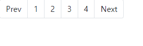
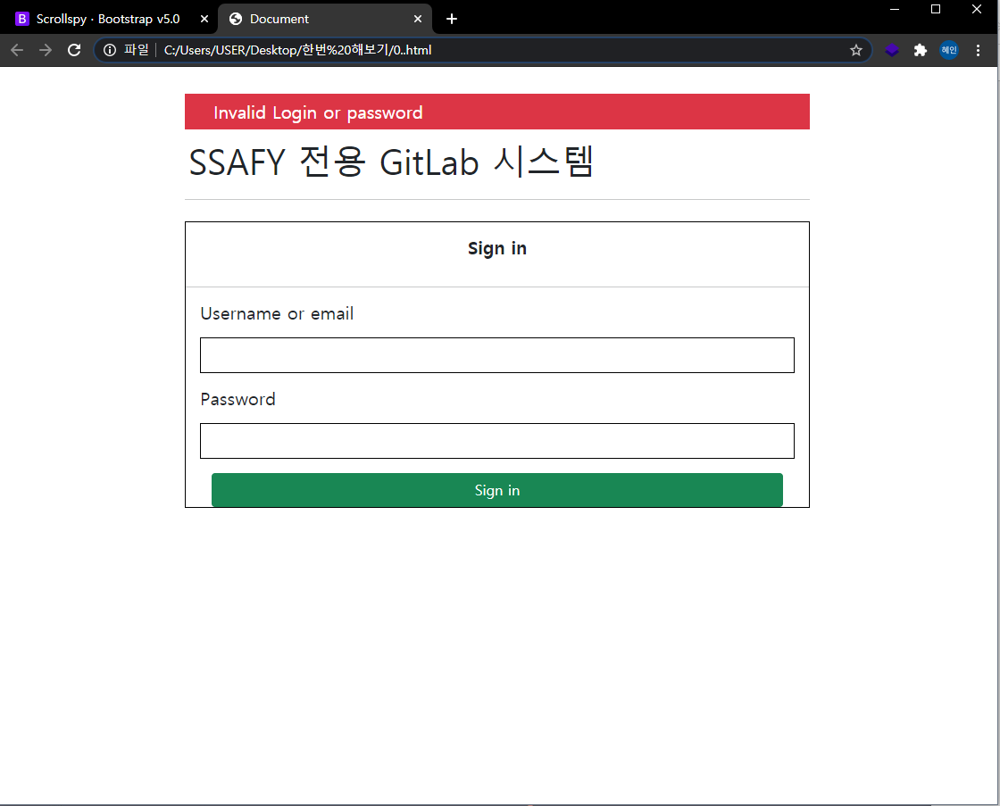

# web_03_homework

### 1. 

button


```html
<!DOCTYPE html>
<html lang="en">
<head>
  <meta charset="UTF-8">
  <meta name="viewport" content="width=device-width, initial-scale=1.0">
  <link href="https://cdn.jsdelivr.net/npm/bootstrap@5.0.0-beta1/dist/css/bootstrap.min.css" rel="stylesheet" integrity="sha384-giJF6kkoqNQ00vy+HMDP7azOuL0xtbfIcaT9wjKHr8RbDVddVHyTfAAsrekwKmP1" crossorigin="anonymous">
  <title>Document</title>
</head>
<body>
  
  <div class="d-grid gap-2 col-6 mx-auto">
    <button class="btn btn-success" type="button">Sign in</button>
    
  </div>

</body>
</html>
```


### 2. 

Nav and tabs


```html
<!DOCTYPE html>
<html lang="en">
<head>
  <meta charset="UTF-8">
  <meta name="viewport" content="width=device-width, initial-scale=1.0">
  <link href="https://cdn.jsdelivr.net/npm/bootstrap@5.0.0-beta1/dist/css/bootstrap.min.css" rel="stylesheet" integrity="sha384-giJF6kkoqNQ00vy+HMDP7azOuL0xtbfIcaT9wjKHr8RbDVddVHyTfAAsrekwKmP1" crossorigin="anonymous">
  <title>Document</title>
</head>
<body>
  
  <ul class="nav bg-dark">
    <li class="nav-item">
      <a class="nav-link active text-white" aria-current="page" href="#">프로젝트</a>
    </li>
    <li class="nav-item">
      <a class="nav-link text-white" href="#">그룹들</a>
    </li>
    <li class="nav-item">
      <a class="nav-link text-white" href="#">활동</a>
    </li>
    <li class="nav-item">
      <a class="nav-link text-white" href="#">마일스톤</a>
    </li>
    <li class="nav-item">
      <a class="nav-link text-white" href="#">스니펫</a>
    </li>
    
  </ul>

</body>
</html>
```


### 3. 

pagination



```html
<!DOCTYPE html>
<html lang="en">
<head>
  <meta charset="UTF-8">
  <meta name="viewport" content="width=device-width, initial-scale=1.0">
  <link href="https://cdn.jsdelivr.net/npm/bootstrap@5.0.0-beta1/dist/css/bootstrap.min.css" rel="stylesheet" integrity="sha384-giJF6kkoqNQ00vy+HMDP7azOuL0xtbfIcaT9wjKHr8RbDVddVHyTfAAsrekwKmP1" crossorigin="anonymous">
  <title>Document</title>
</head>
<body>
  
  <nav aria-label="Page navigation example">
    <ul class="pagination">
      <li class="page-item"><a class="page-link text-dark" href="#">Prev</a></li>
      <li class="page-item"><a class="page-link text-dark" href="#">1</a></li>
      <li class="page-item"><a class="page-link text-dark" href="#">2</a></li>
      <li class="page-item"><a class="page-link text-dark" href="#">3</a></li>
      <li class="page-item"><a class="page-link text-dark" href="#">4</a></li>
      <li class="page-item"><a class="page-link text-dark" href="#">Next</a></li>
    </ul>
  </nav>

</body>
</html>
```


### 4. 



```html
<!DOCTYPE html>
<html lang="en">
<head>
  <meta charset="UTF-8">
  <meta name="viewport" content="width=device-width, initial-scale=1.0">
  <link href="https://cdn.jsdelivr.net/npm/bootstrap@5.0.0-beta1/dist/css/bootstrap.min.css" rel="stylesheet" integrity="sha384-giJF6kkoqNQ00vy+HMDP7azOuL0xtbfIcaT9wjKHr8RbDVddVHyTfAAsrekwKmP1" crossorigin="anonymous">
  <title>Document</title>
  <style>
    .box1 {
      background-color: white;
      width: 700px;
      margin: 0 auto;
    }

    .container {
      width: 1000px;
      margin: 30px auto;
    }

    .box2 {
      background-color: white;
      border: black 1px solid;
      
    }

    .box3 {
      background-color: white;
      border: black 1px solid;
      height: 40px;
    }

    .box4 {
      background-color: white;
      border: black 1px solid;
      width: 4px;
      height: 4px;
    }


  </style>
</head>
<body>
  <div class="container">
    <div class="box1">
      <div class="bg-danger">
        <h5 class="text-white p-2 ms-4">Invalid Login or password</h5>
      </div>
      <div>
        <h1 class="p-1">SSAFY 전용 GitLab 시스템</h1>
      </div>
      <hr>

      <div class="box2 mt-4">
        <div class="d-flex justify-content-center">
          <h5 class="fw-bold p-2 m-2">Sign in</h5>
        </div>
        <hr>

        <div>
          <h5 class="m-3">Username or email</h5>
        </div>
        <div class="box3 m-3">
        </div>
        <div>
          <h5 class="m-3">Password</h5>
        </div>
        <div class="box3 m-3">
        </div>
        <!-- <div class="d-flex justify-content-between align-items-center mb-5">
          <div>
            <div class="box4">/div>
            <p>Remember me</p>
          </div>
          <p class="text-primary">Forgot your password?</p>
        </div> -->

        <div class="d-grid gap-2 col-11 mx-auto">
          <button class="btn btn-success" type="button">Sign in</button>
        </div>

      </div>

    </div>
  </div>
  
</body>
</html>
```

 Remember me와 Forgot your password? 부분은 시간이 부족해 완성하지 못했습니다 ..ㅜ