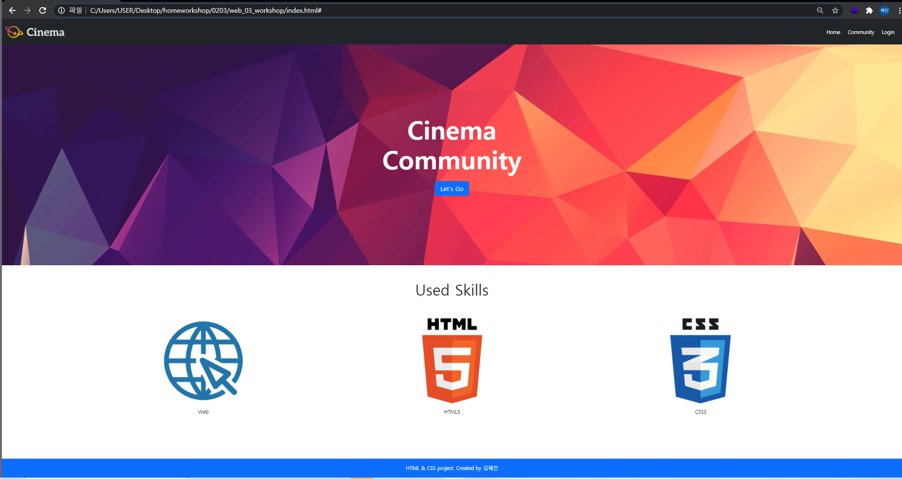

# web_03_workshop

##### 결과




##### 코드

```html
<!DOCTYPE html>
<html lang="ko">
<head>
  <meta charset="UTF-8">
  <meta name="viewport" content="width=device-width, initial-scale=1.0">
  <link rel="stylesheet" href="style.css">
  <link href="https://cdn.jsdelivr.net/npm/bootstrap@5.0.0-beta1/dist/css/bootstrap.min.css" rel="stylesheet" integrity="sha384-giJF6kkoqNQ00vy+HMDP7azOuL0xtbfIcaT9wjKHr8RbDVddVHyTfAAsrekwKmP1" crossorigin="anonymous">
  <title>Document</title>

</head>
<body>
  <!-- 1. Nav -->
  <!-- d 플랙스 부모에 먼저 해야한다 아래처럼 -->
  <!-- 아니면 sticky-top -->
  <nav class="bg-dark d-flex justify-content-between sticky-top">
    <a href="#">
      
    </a>
    <ul class="d-flex align-items-center mb-0">
      <li class="ms-4"><a href="#" class="text-decoration-none text-white">Home</a></li>
      <li class="ms-4"><a href="#" class="text-decoration-none text-white">Community</a></li>
      <li class="ms-4 me-4"><a href="#" class="text-decoration-none text-white">Login</a></li>
    </ul>
  </nav>

  <!-- 2. Header -->
  <header class="d-flex flex-column justify-content-center align-items-center">
      <div class="text-white fw-bold display-1">Cinema</div>
      <div class="text-white fw-bold display-1">Community</div>
      <a href="#" type="button" class="btn btn-primary btn-lg mt-4">Let's Go</a>
  </header>

  <!-- 3. Section -->
  <section>
    <h2 class="d-flex justify-content-center mt-5 mb-5">Used Skills</h2>
    <article class="d-flex justify-content-evenly">
      <div>
        
        <p class="d-flex justify-content-center">Web</p>
      </div>
      <div>
        
        <p class="d-flex justify-content-center">HTML5</p>
      </div>
      <div>
        
        <p class="d-flex justify-content-center">CSS3</p>
      </div>
    </article>
  </section>

  <!-- 4. Footer -->
  <footer class="fixed-bottom bg-primary text-white d-flex justify-content-center align-items-center mt-5">
    <p class="mb-0">HTML & CSS project. Created by 김혜인</p>
  </footer>
  <script src="https://cdn.jsdelivr.net/npm/bootstrap@5.0.0-beta1/dist/js/bootstrap.bundle.min.js" integrity="sha384-ygbV9kiqUc6oa4msXn9868pTtWMgiQaeYH7/t7LECLbyPA2x65Kgf80OJFdroafW" crossorigin="anonymous"></script>
</body>
</html>

```


- spacing에서 2rem으로 하는 부분은 해결하지 못했습니다. spacing Doc를 보니 이런 글이 적혀있던데```You can add more sizes by adding entries to the `$spacers` Sass map variable``` 예제를 따라해보았는데 뭔가 잘 안되어서 이 부분은 ms-4로 대체하여 작성하였습니다. 

