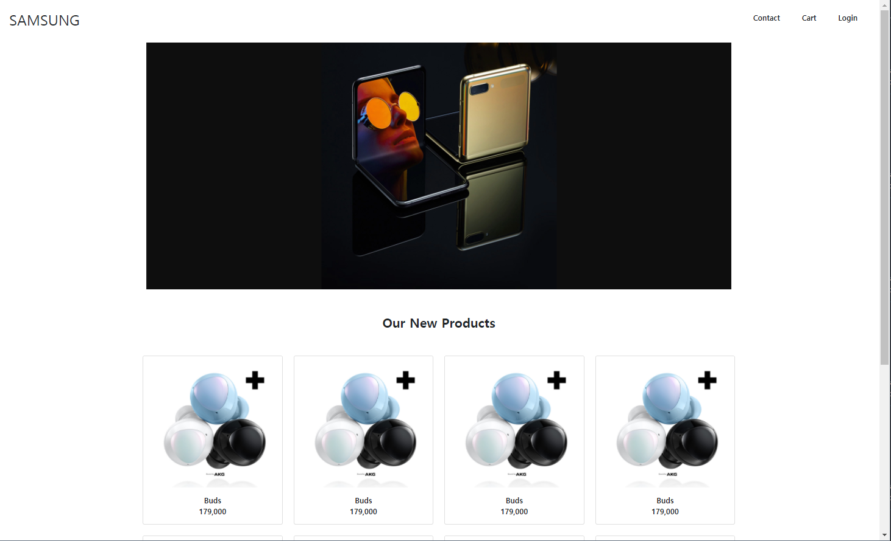
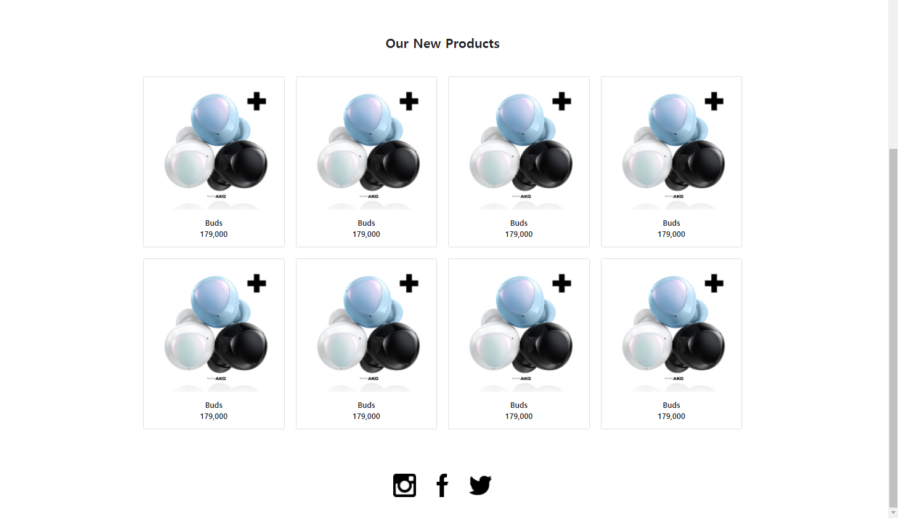

# Web_04_practice







##### CSS

```css
/* 아래에 코드를 작성하시오. */
footer {
  height: 70px;
}
footer img {
  height: 50px;
}
```

footer 이미지는 CSS로 크기를 조절하였습니다. 


##### html

```html
<!DOCTYPE html>
<html lang="en">
<head>
  <meta charset="UTF-8">
  <meta name="viewport" content="width=device-width, initial-scale=1.0">
  <link rel="stylesheet" href="shop.css">
  <link href="https://cdn.jsdelivr.net/npm/bootstrap@5.0.0-beta1/dist/css/bootstrap.min.css" rel="stylesheet" integrity="sha384-giJF6kkoqNQ00vy+HMDP7azOuL0xtbfIcaT9wjKHr8RbDVddVHyTfAAsrekwKmP1" crossorigin="anonymous">
  <title>Title</title>
</head>
<body>
    
  <!-- nav -->
  <nav class="h-10 bg-white d-flex justify-content-between fixed-top align-items-center p-4">
    <h2>SAMSUNG</h2>
    <ul class="d-flex list-unstyled">
      <li class="px-4"><a href="#" class="text-decoration-none text-dark fw-bold">Contact</a></li>
      <li class="px-4"><a href="#" class="text-decoration-none text-dark fw-bold">Cart</a></li>
      <li class="px-4"><a href="#" class="text-decoration-none text-dark fw-bold">Login</a></li>
    </ul>
  </nav>

    
  <div class="container">
    <!-- section -->
    <section>
      
      <div class="bg-white p-5">
        <h3 class="fw-bold text-dark text-center">Our New Products</h3>
      </div>
    </section>

      
    <!-- article -->
    <article>
      <div class="row row-cols-1 row-cols-md-2 row-cols-lg-4 g-4">
        <div class="col">
          <div class="card">
            
            <div class="fw-bold card-body d-flex flex-column align-items-center">
              <a href="#" class="text-dark text-decoration-none">Buds</a>
              <p class="card-text">179,000</p>
            </div>
          </div>
        </div>
        <div class="col">
          <div class="card">
            
            <div class="fw-bold card-body d-flex flex-column align-items-center">
              <a href="#" class="text-dark text-decoration-none">Buds</a>
              <p class="card-text">179,000</p>
            </div>
          </div>
        </div>
        <div class="col">
          <div class="card">
            
            <div class="fw-bold card-body d-flex flex-column align-items-center">
              <a href="#" class="text-dark text-decoration-none">Buds</a>
              <p class="card-text">179,000</p>
            </div>
          </div>
        </div>
        <div class="col">
          <div class="card">
            
            <div class="fw-bold card-body d-flex flex-column align-items-center">
              <a href="#" class="text-dark text-decoration-none">Buds</a>
              <p class="card-text">179,000</p>
            </div>
          </div>
        </div>
        <div class="col">
          <div class="card">
            
            <div class="fw-bold card-body d-flex flex-column align-items-center">
              <a href="#" class="text-dark text-decoration-none">Buds</a>
              <p class="card-text">179,000</p>
            </div>
          </div>
        </div>
        <div class="col">
          <div class="card">
            
            <div class="fw-bold card-body d-flex flex-column align-items-center">
              <a href="#" class="text-dark text-decoration-none">Buds</a>
              <p class="card-text">179,000</p>
            </div>
          </div>
        </div>
        <div class="col">
          <div class="card">
            
            <div class="fw-bold card-body d-flex flex-column align-items-center">
              <a href="#" class="text-dark text-decoration-none">Buds</a>
              <p class="card-text">179,000</p>
            </div>
          </div>
        </div>
        <div class="col">
          <div class="card">
            
            <div class="fw-bold card-body d-flex flex-column align-items-center">
              <a href="#" class="text-dark text-decoration-none">Buds</a>
              <p class="card-text">179,000</p>
            </div>
          </div>
        </div>
      </div>
    </article>

    <!-- footer -->
    <footer class="p-5 m-5 d-flex justify-content-center">
      <a href="https://www.instagram.com/">
        
      </a>
      <a href="https://ko-kr.facebook.com/">
        
      </a>
      <a href="https://twitter.com/?lang=ko">
        
      </a>
    </footer>
  </div>
  
  <script src="https://cdn.jsdelivr.net/npm/bootstrap@5.0.0-beta1/dist/js/bootstrap.bundle.min.js" integrity="sha384-ygbV9kiqUc6oa4msXn9868pTtWMgiQaeYH7/t7LECLbyPA2x65Kgf80OJFdroafW" crossorigin="anonymous"></script>
</body>
</html>

```

- 상단바는 fixed-top으로 고정하였습니다.

- 버즈 사진같은 경우, 버즈글씨를 hyper link처리하였습니다. 

- ```html
  <div class="col">
            <div class="card">
              
              <div class="fw-bold card-body d-flex flex-column align-items-center">
                <a href="#" class="text-dark text-decoration-none">Buds</a>
                <p class="card-text">179,000</p>
              </div>
            </div>
          </div>
  ```

- 이 코드를 넣어서 버즈 사진들이 1개, 2개, 4개 순으로 보이도록 하였습니다.

  ```html
  <div class="row row-cols-1 row-cols-md-2 row-cols-lg-4 g-4">
  ```

- footer는 각 이미지마다 홈페이지 링크를 걸어두었습니다. flex를 이용해 이미지를 정렬하였습니다. 