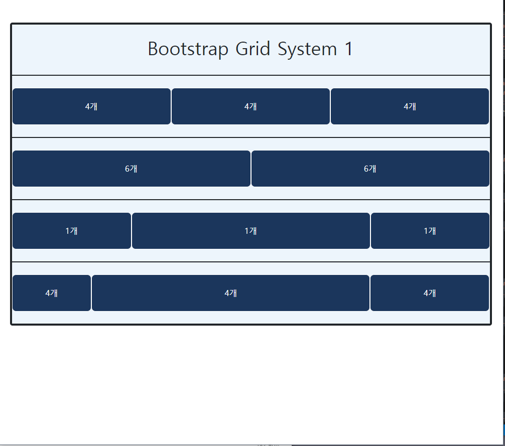
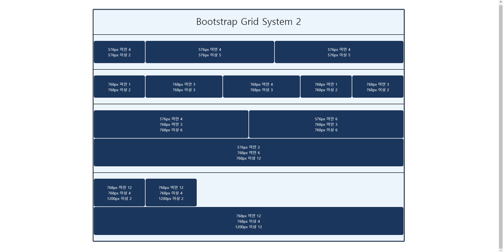

# Web_04_workshop 🐾

### 1.



- col을 클래스에 추가해주었다. 같은 비율은 col로 하였고, 다른 비율은 col-3이런 식으로 하였다. 

```html
<body>
  <div class="container">
    <div class="row">
      <div class="col">
        <h1>Bootstrap Grid System 1</h1>
      </div>
    </div>

    <!-- 1. -->
    <div class="row">
      <div class="item col">
        <p>4개</p>
      </div>
      <div class="item col">
        <p>4개</p>
      </div>
      <div class="item col">
        <p>4개</p>
      </div>
    </div>

    <!-- 2. -->
    <div class="row">
      <div class="item col">
        <p>6개</p>
      </div>
      <div class="item col">
        <p>6개</p>
      </div>   
    </div>

    <!-- 3. -->
    <div class="row">
      <div class="item col-3">
        <p>1개</p>
      </div>
      <div class="item col-6">
        <p>1개</p>
      </div>
      <div class="item col-3">
        <p>1개</p>
      </div>
    </div> 
    
    <!-- 4. -->
    <div class="row">
      <div class="item col-2">
        <p>4개</p>
      </div>
      <div class="item col-7">
        <p>4개</p>
      </div>
      <div class="item col-3">
        <p>4개</p>
      </div> 
    </div>
  </div>
  
  <script src="https://cdn.jsdelivr.net/npm/bootstrap@5.0.0-beta1/dist/js/bootstrap.bundle.min.js" integrity="sha384-ygbV9kiqUc6oa4msXn9868pTtWMgiQaeYH7/t7LECLbyPA2x65Kgf80OJFdroafW" crossorigin="anonymous"></script>
</body>


```


### 2.



- 공식문서의 Grid options를 참고하여  픽셀크기별 col를 클래스에 추가해주었다. 

```html
<body>
  <div class="container">
    <div class="row">
      <div class="col">
        <h1>Bootstrap Grid System 2</h1>
      </div>
    </div>

    
    <!-- 1. -->
    <div class="row">
      <div class="item col-4 col-sm-2">
        <p>576px 미만 4 <br> 576px 이상 2</p>
      </div>
      <div class="item col-4 col-sm-5">
        <p>576px 미만 4 <br> 576px 이상 5</p>
      </div>
      <div class="item col-4 col-sm-5">
        <p>576px 미만 4 <br> 576px 이상 5</p>
      </div>
    </div>


    <!-- 2. -->
    <div class="row">
      <div class="item col-1 col-md-2">
        <p>768px 미만 1 <br> 768px 이상 2</p>
      </div>
      <div class="item col-3 col-md-3">
        <p>768px 미만 3 <br> 768px 이상 3</p>
      </div>
      <div class="item col-4 col-md-3">
        <p>768px 미만 4 <br> 768px 이상 3</p>
      </div>
      <div class="item col-1 col-md-2">
        <p>768px 미만 1 <br> 768px 이상 2</p>
      </div>
      <div class="item col-3 col-md-2">
        <p>768px 미만 3 <br> 768px 이상 2</p>
      </div>
    </div>


    <!-- 3. -->
    <div class="row">
      <div class="item col-4 col-sm-3 col-md-6">
        <p>576px 미만 4 <br> 768px 미만 3 <br> 768px 이상 6</p>
      </div>
      <div class="item col-6 col-sm-3 col-md-6">
        <p>576px 미만 6 <br> 768px 미만 3 <br> 768px 이상 6</p>
      </div>
      <div class="item col-2 col-sm-6 col-md-12">
        <p>576px 미만 2 <br> 768px 미만 6 <br> 768px 이상 12</p>
      </div>
    </div>


    <!-- 4. -->
    <div class="row">
      <div class="item col-12 col-md-4 col-xl-2">
        <p>768px 미만 12 <br> 768px 이상 4 <br> 1200px 이상 2</p>
      </div>
      <div class="item col-12 col-md-4 col-xl-2">
        <p>768px 미만 12 <br> 768px 이상 4 <br> 1200px 이상 2</p>
      </div>
      <div class="item col-12 col-md-4 col-xl-12">
        <p>768px 미만 12 <br> 768px 이상 4 <br> 1200px 이상 12</p>
      </div>
    </div>
  </div>
  <script src="https://cdn.jsdelivr.net/npm/bootstrap@5.0.0-beta1/dist/js/bootstrap.bundle.min.js" integrity="sha384-ygbV9kiqUc6oa4msXn9868pTtWMgiQaeYH7/t7LECLbyPA2x65Kgf80OJFdroafW" crossorigin="anonymous"></script>
</body>
```


### 3.


- offset과 Grid options를 활용하여 작성하였다. 

```html
<body>
  <div class="container">
    <div class="row">
      <div class="col">
        <h1>Bootstrap Grid System 3</h1>
      </div>
    </div>

    <!-- 1. -->
    <div class="row">
      <div class="item col-4 col-md-4">
        <p>item1</p>
      </div>
      <div class="item col-8 col-md-4 offset-md-4">
        <p>item2</p>
      </div>
    </div>


    <!-- 2. -->
    <div class="row">
      <div class="item col-4 col-md-4 offset-md-4 col-lg-5 offset-lg-7">
        <p>item1</p>
      </div>
      <div class="item col-4 offset-4 col-md-4 offset-md-0 col-lg-8 offset-lg-2">
        <p>item2</p>
      </div>
    </div>
    

    <!-- 3. -->
    <div class="row">
      <div class="item col-12 col-md-3 col-lg-3">
        item1
      </div>
      <div class="item col-12 col-md-9 col-lg-9">
        <div class="row">
          <div class="item col-6 col-md-6 col-lg-3">item2</div>
          <div class="item col-6 col-md-6 col-lg-3">item3</div>
          <div class="item col-6 col-md-6 col-lg-3">item4</div>
          <div class="item col-6 col-md-6 col-lg-3">item5</div>
        </div>
      </div>
    </div>
  </div>
  
  <script src="https://cdn.jsdelivr.net/npm/bootstrap@5.0.0-beta1/dist/js/bootstrap.bundle.min.js" integrity="sha384-ygbV9kiqUc6oa4msXn9868pTtWMgiQaeYH7/t7LECLbyPA2x65Kgf80OJFdroafW" crossorigin="anonymous"></script>
</body>
```

