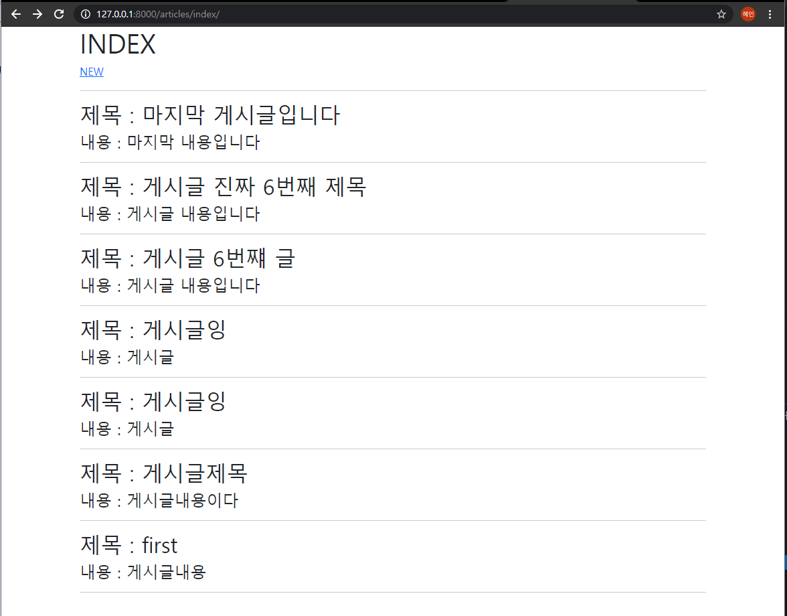
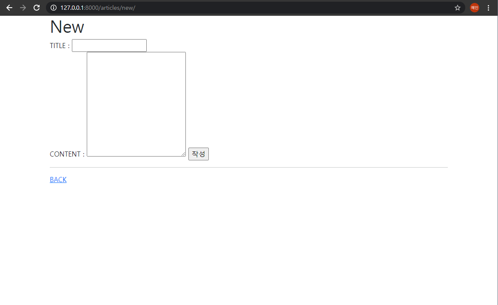
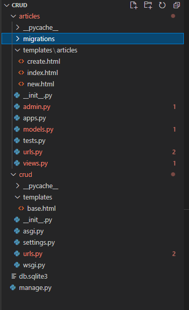

# 03_django_workshop

#### Background

> Web Framework
>
> Django Model

#### Goal

> Django CR


#### 결과화면





#### Code

##### 1. crud/urls.py

```python
from django.contrib import admin
from django.urls import path, include

urlpatterns = [
    path('admin/', admin.site.urls),
    path('articles/', include('articles.urls')),
]

```

articles 경로 설정

##### 2. crud/templates/base.html

```django
<!DOCTYPE html>
<html lang="en">
<head>
  <meta charset="UTF-8">
  <meta http-equiv="X-UA-Compatible" content="IE=edge">
  <meta name="viewport" content="width=device-width, initial-scale=1.0">
  <link href="https://cdn.jsdelivr.net/npm/bootstrap@5.0.0-beta2/dist/css/bootstrap.min.css" rel="stylesheet" integrity="sha384-BmbxuPwQa2lc/FVzBcNJ7UAyJxM6wuqIj61tLrc4wSX0szH/Ev+nYRRuWlolflfl" crossorigin="anonymous">
  <title>Document</title>
</head>
<body>
  <div class="container">
    
    
  </div>
  <script src="https://cdn.jsdelivr.net/npm/bootstrap@5.0.0-beta2/dist/js/bootstrap.bundle.min.js" integrity="sha384-b5kHyXgcpbZJO/tY9Ul7kGkf1S0CWuKcCD38l8YkeH8z8QjE0GmW1gYU5S9FOnJ0" crossorigin="anonymous"></script>
</body>
</html>
```

bootstrap CDN 추가, block 설정

##### 3. articles/urls.py

```python
from django.urls import path 
from . import views 

app_name = 'articles'
urlpatterns = [
    path('index/', views.index, name='index'),
    path('new/', views.new, name='new'),
    path('create/', views.create, name='create'),
]
```

Read를 위한 index, Create을 위한 new, DB저장을 위한 create url 설정

##### 4. articles/views.py

```python
from django.shortcuts import render
from .models import Article  

def index(request):
	articles = Article.objects.all()[::-1]
	context = {
		'articles' : articles,
	}
	return render(request, 'articles/index.html', context)

def new(request):
	return render(request, 'articles/new.html')
	
def create(request):
	title = request.GET.get('title')
	content = request.GET.get('content')

	article = Article(title=title, content=content)
	article.save()

	return render(request, 'articles/create.html')
```

index - articles에 DB저장된 것 오름차순으로 가져옴

create - request로 온 것을 DB에 저장

##### 5. articles/models.py

```python
from django.db import models

# Create your models here.
class Article(models.Model):
	title = models.CharField(max_length=10)
	content = models.TextField()
```

title과 content의 테이블

##### 6. articles/templates/index.html

```django


  <h1>INDEX</h1>
  <a href="">NEW</a>
  <hr>
  
    <h2>제목 : {{ article.title }}</h2>
    <h4>내용 : {{article.content }}</h4>
    <hr>
  

```

##### 7. articles/templates/new.html

```django


  <h1>New</h1>
  <form action="" method="GET">
    <label for="title">TITLE : </label>
    <input type="text", name="title", id="title"><br>
    <label for="content">CONTENT : </label>
    <textarea name="content" id="content" cols="30" rows="10"></textarea> <!--내용은 큰 인풋-->
    <input type="submit" value="작성">  
  </form>
  <hr>
  <a href="">BACK</a>

```

##### 8. articles/templates/create.html

```django


  <p>저장되었습니다</p>
  <a href="">게시글로 돌아가기</a>

```

##### 9. 

