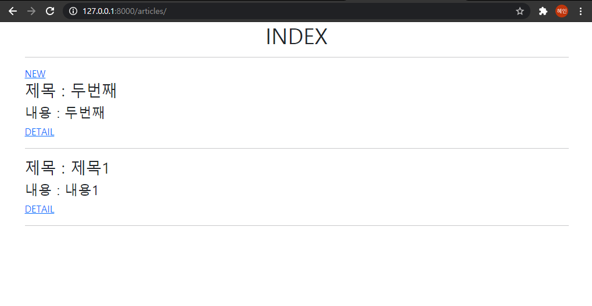
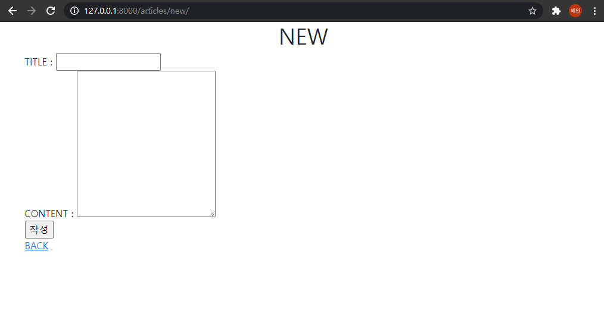
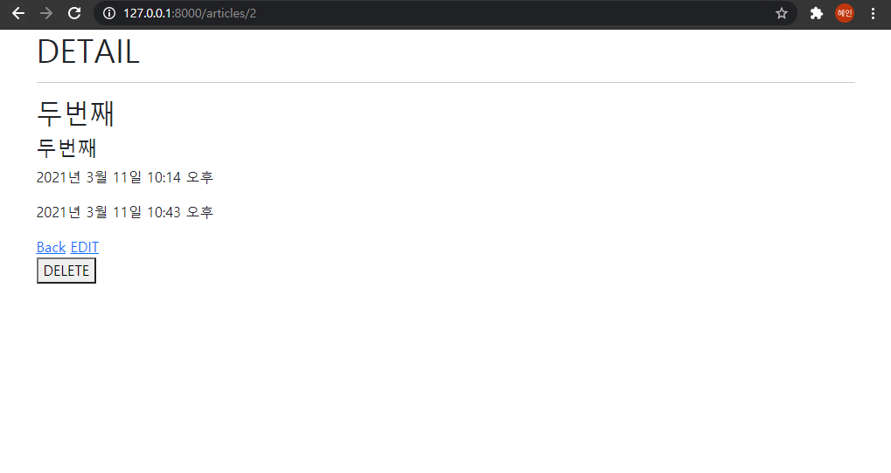
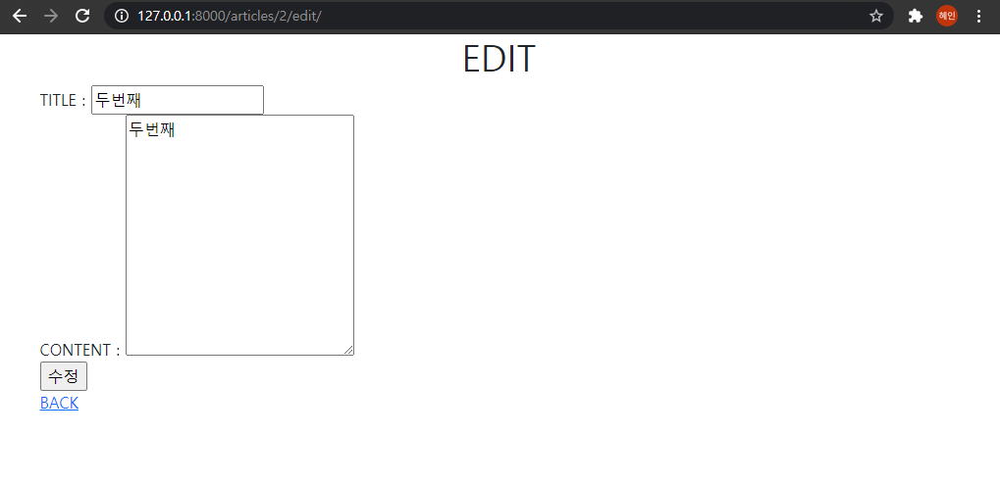
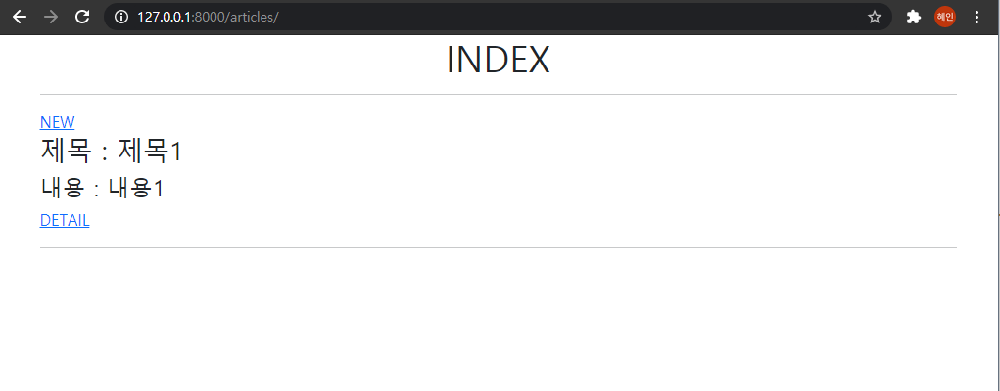

# 04_django_workshop


#### Background

> Web Framework
>
> Django Model

#### Goal

> Django CRUD

#### 결과화면

1. Read

   

2. Create

   

3. Detail

   

4. Update

   

5. Delete

   

#### Code

##### articles/urls.py

```python
from django.urls import path
from . import views

app_name = 'articles'
urlpatterns = [
    path('', views.index, name="index"),
    path('new/', views.new, name="new"),
    path('create/', views.create, name="create"),
    path('<int:pk>', views.detail, name="detail"),
    path('<int:pk>/edit/', views.edit, name="edit"),
    path('<int:pk>/update/', views.update, name="update"),
    path('<int:pk>/delete/', views.delete, name="delete"),
]
```

##### articles/views.py

```python
from django.shortcuts import render, redirect
from .models import Article

def index(request):
	articles = Article.objects.order_by('-pk')		# all
	context = {
		'articles' : articles,
	}
	return render(request, 'articles/index.html', context)

def new(request):
	return render(request, 'articles/new.html')

def create(request):
	article = Article()
	article.title = request.POST.get('title')
	article.content = request.POST.get('content')
	article.save()

	return redirect('articles:detail', article.pk)

def detail(request, pk):
	article = Article.objects.get(pk=pk)
	context = {
		'article' : article,
	}
	return render(request, 'articles/detail.html', context)

def edit(request, pk):
	article = Article.objects.get(pk=pk)
	context = {
		'article' : article,
	}
	return render(request, 'articles/edit.html', context)

def update(request, pk):
	article = Article.objects.get(pk=pk)
	article.title = request.POST.get('title')
	article.content = request.POST.get('content')
	article.save()

	return redirect('articles:detail', article.pk)

def delete(request, pk):
	article = Article.objects.get(pk=pk)
	if request.method == 'POST':
		article.delete()
		return redirect('articles:index')
	else:
		return redirect('articles:detail', article.pk)
```

##### articles/models.py

```python
from django.db import models

class Article(models.Model):
    title = models.CharField(max_length=10)
    content = models.TextField()
    created_at = models.DateTimeField(auto_now_add=True)
    edited_at = models.DateTimeField(auto_now=True)

    def __str__(self):
        return self.title
```

##### articles/templates/articles/index.html

```django


  <h1 class="text-center">INDEX</h1>
  <hr>
  <a href="">NEW</a>
  
    <h3>제목 : {{ article.title }}</h3>
    <h4>내용 : {{ article.content }}</h4>
    <a href="">DETAIL</a>
    <hr>
  

```

##### articles/templates/articles/new.html

```django


  <h1 class="text-center">NEW</h1>
  <form action="" method="POST">
    
    <label for="title">TITLE : </label>
    <input type="text" name="title" id="title"><br>
    <label for="content">CONTENT : </label>
    <textarea name="content" id="content" cols="30" rows="10"></textarea><br>
    <input type="submit" value="작성">
  </form>
  <a href="">BACK</a>

```

##### articles/templates/articles/edit.html

```django


  <h1 class="text-center">EDIT</h1>
  <form action="" method="POST">
    
    <label for="title">TITLE : </label>
    <input type="text" name="title" id="title" value="{{ article.title }}"><br>
    <label for="content">CONTENT : </label>
    <textarea name="content" id="content" cols="30" rows="10">{{ article.content }}</textarea><br>
    <input type="submit" value="수정">
  </form>
  <a href="">BACK</a>

```

##### articles/templates/articles/detail.html

```django


  <h1>DETAIL</h1>
  <hr>
  <h2>{{ article.title }}</h2>
  <h4>{{ article.content }}</h4>
  <p>{{ article.created_at }}</p>
  <p>{{ article.edited_at }}</p>
  <a href="">Back</a>
  <a href="">EDIT</a>
  <form action="" method="POST">
    
    <button>DELETE</button>
  </form>


```


