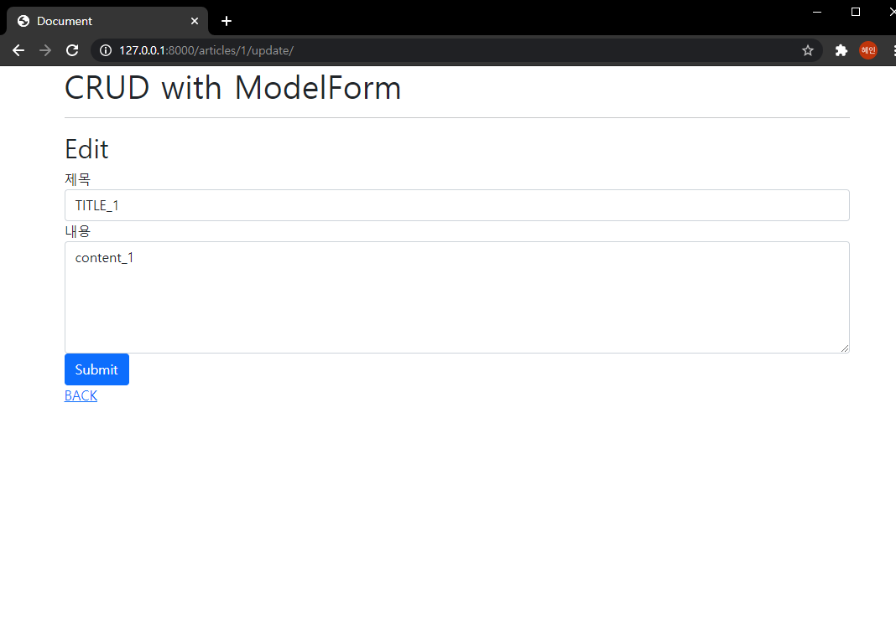

# 07_django_workshop

### Django Project

### 1. 결과 사진

#### Read


#### Create


#### Detail


#### Update



#### Delete


### 2. Code

#### crud

- settings.py

  앱등록, bootstrap5 설치 후 bootstrap5 등록을 해주었다.

  언어를 ko-kr로 바꾸어주고 시간을 Asia/Seoul로 바꾸었다.

- urls.py

  ```python
  from django.contrib import admin
  from django.urls import path, include
  
  urlpatterns = [
      path('admin/', admin.site.urls),
      path('articles/', include('articles.urls')),
  ]
  
  ```

  articles로 들어오는 경로를 include 해주었다.

- templates > base.html

  ```django
  
  <!DOCTYPE html>
  <html lang="en">
  <head>
    <meta charset="UTF-8">
    <meta http-equiv="X-UA-Compatible" content="IE=edge">
    <meta name="viewport" content="width=device-width, initial-scale=1.0">
    <link href="https://cdn.jsdelivr.net/npm/bootstrap@5.0.0-beta2/dist/css/bootstrap.min.css" rel="stylesheet" integrity="sha384-BmbxuPwQa2lc/FVzBcNJ7UAyJxM6wuqIj61tLrc4wSX0szH/Ev+nYRRuWlolflfl" crossorigin="anonymous">
    <title>Document</title>
  </head>
  <body>
    <div class="container">
      
      
      
  
    </div>
    <script src="https://cdn.jsdelivr.net/npm/bootstrap@5.0.0-beta2/dist/js/bootstrap.bundle.min.js" integrity="sha384-b5kHyXgcpbZJO/tY9Ul7kGkf1S0CWuKcCD38l8YkeH8z8QjE0GmW1gYU5S9FOnJ0" crossorigin="anonymous"></script>
  </body>
  </html>
  ```

  상단에 bootstrap 을 load 해준다.

#### articles

- models.py

  ```python
  from django.db import models
  
  class Article(models.Model):
      title = models.CharField(max_length=10)
      content = models.TextField()
      created_at = models.DateTimeField(auto_now_add=True)
      updated_at = models.DateTimeField(auto_now=True)
  
      def __str__(self):
          return self.title
  ```

  제목, 내용, 생성시간, 수정시간의 스키마를 만든다.

  python manage.py makemigrations

  python manage.py migrate 명령어를 추가적으로 한다.

- forms.py

  ```python
  from django import forms
  from .models import Article
  
  class ArticleForm(forms.ModelForm):
  	title = forms.CharField(
  		label = '제목',
  		widget = forms.TextInput(
  			attrs={
  				'class' : 'my-title form-control',
  				'placeholder' : '제목을 입력하시오',
  				'maxlength' : 10,
  			}
  		),
  		error_messages={
  			'required' : '제목 입력 필수',
  		}
  	)
  	content = forms.CharField(
  		label = '내용',
  		widget = forms.Textarea(
  			attrs = {
  				'class' : 'my-content form-control',
  				'placeholder' : '내용을 입력하시오',
  				'rows' : 5,
  				'cols' : 30,
  			}
  		),
  		error_messages={
  			'required' : '내용 입력 필수',
  		}
  	)
  
  	class Meta:
  		model = Article
  		fields = '__all__'
  ```

  models에서 만든 스키마 구조를 상속받고자 models에서 클래스를 import해온다. ttile과 content를 위 코드와 같이 만들고 title은 textinput으로 content는 textarea로 한다. attrs에서 class에 form-control을 추가하면 bootstrap이 적용된 모습으로 나오게 된다. required를 각각 넣어줘서 공백 입력시 각각 문구가 나오게 한다. 

  ** error_messages에서 뒤에 s를 꼭 붙여야 한다. 안 붙여서 에러가 있었다. 

- urls.py

  ```python
  from django.urls import path
  from . import views
  
  app_name = 'articles'
  urlpatterns = [
      path('', views.index, name='index'),
      path('create/', views.create, name='create'),
      path('<int:pk>/', views.detail, name='detail'),
      path('<int:pk>/update/', views.update, name='update'),
      path('<int:pk>/delete/', views.delete, name='delete'),
  ]
  
  ```

  url을 만들어준다.

- views.py

  ```python
  from django.shortcuts import render, redirect
  from .models import Article
  from .forms import ArticleForm
  
  # Create your views here.
  def index(request):
      articles = Article.objects.all()
      context = {
          'articles' : articles,
      }
      return render(request, 'articles/index.html', context)
  
  
  def create(request):
  
      if request.method == "POST":
          form = ArticleForm(request.POST)
          if form.is_valid():
              article = form.save()
              return redirect('articles:detail', article.pk)
      else:
  
          form = ArticleForm()
      context = {
          'form' : form,
      }
      return render(request, 'articles/create.html', context)
  
  def detail(request, pk):
      article = Article.objects.get(pk=pk)
      context = {
          'article' : article,
      }
      return render(request, 'articles/detail.html', context)
  
  def delete(request, pk):
      article = Article.objects.get(pk=pk)
      article.delete()
      return redirect('articles:index')
  
  def update(request, pk):
      article = Article.objects.get(pk=pk)
      if request.method == 'POST':
          form = ArticleForm(request.POST, instance=article)
          if form.is_valid():
              form.save()
              return redirect('articles:detail', article.pk)
      else:
          form = ArticleForm(instance = article)
      context = {
          'form' : form,
          'article' : article,
      }
      return render(request, 'articles/update.html', context)
  ```

  models에서 Article과 forms에서 ArticleForm 클래스를 import해온다. 

  index, detail, delete는 지금까지 해온 방식으로 하고, create와 update는 기존에 나눠서 작성하던 두 부분을 합친 코드로 작성한다. 

  create은 request방식이 POST이면 저장해야하므로 위와 같은 코드를 넣어주고 POST 방식이 아니면 form을 전달해 새로운 입력을 받게 한다. update에서도 마찬가지이다. 대신 article.pk를 context에 같이 보내서 그 해당 게시글임을 알린다. 또한 ```article = Article.objects.get(pk=pk)```을 해주어 해당 게시글에서 수정하게 한다.

- templates > articles > index.html

  ```html
  
  
    <h1>CRUD with ModelForm</h1>
    <hr>
    <h2>Articles</h2>
    <a href="">NEW</a>
    <hr>
    
      <h2>{{ article.pk }}</h2><br>
      <h2>{{ article.title }}</h2><br>
      <a href="">DETAIL</a>
      <hr>
    
  
  
  
  ```

  articles에서 하나씩 꺼내서 for문을 돌려 보여준다. 

- templates > articles > detail.html

  ```django
  
  
  
    <h1>CRUD with ModelForm</h1>
    <hr>
    <h2>Detail</h2>
    <hr>
    <h3>글 번호 : {{ article.pk }}</h3>
    <h3>글 제목 : {{ article.title }}</h3>
    <p>글 내용 : {{ article.content }}</p>
    <p>글 생성시각 : {{ article.created_at }}</p>
    <p>글 수정시각 : {{ article.updated_at }}</p>
    <a href="">EDIT</a>
    <form action="" method="POST">
      
      <button>DELETE</button>
    </form>
    <hr>
    <a href="">BACK</a>
  
  ```

  기존에 하던 방식과 유사하게 하면 된다. 

- templates > articles > create.html

  ```django
  
  
    <h1>CRUD with ModelForm</h1>
    <hr>
    <h2>New</h2>
    <form action="" method="POST">
      
      
        <div class="mb-3">
          {{ field.errors }}
          {{ field.label_tag }}
          {{ field }}
        </div>
      
      
      <input type="submit" value = "submit">
      
    </form>
    <a href="">BACK</a>
  
  
  ```

  titler과 content부분을 꺼내기 위해 for 태그를 활용한다. 

  위 코드 말고,

  아래처럼 bootstrap5 load 해서 update처럼 해도 된다. 그러면 아래 사진처럼 된다. 

  ```django
  
  
  
  
  
    <h1>CRUD with ModelForm</h1>
    <hr>
    <h2>New</h2>
    <form action="" method="POST">
      
      
      <input type="submit" value = "submit">
    
    </form>
    <a href="">BACK</a>
  
  ```

  

- templates > articles > update.html

  ```django
  
  
  
    <h1>CRUD with ModelForm</h1>
    <hr>
    <h2>Edit</h2>
    <form action="" method = "POST">
      
      
      
    </form>
    <a href="">BACK</a>
  
  ```

  bootsrtap5를 로드하여 `````` 로 form을 간편하게 불러온다. 