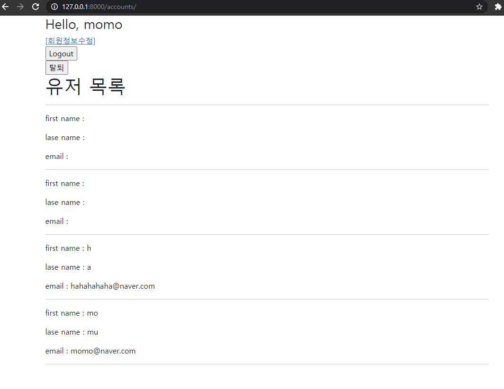
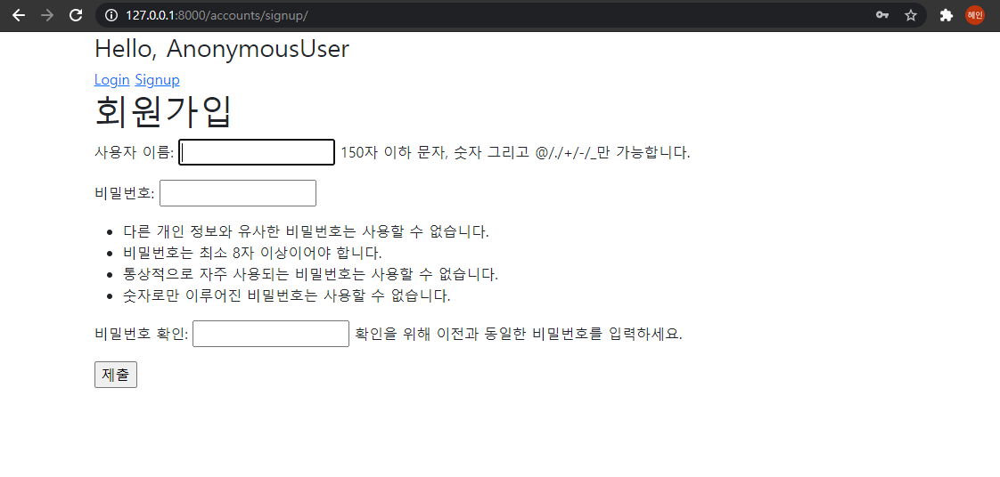

# 08_django_workshop

### 1. /accounts/



**accounts > urls.py**

```python
path('', views.index, name='index'),   # 추가한다
```

**accounts > views.py**

```python
from django.contrib.auth import get_user_model

def index(request):
    users = get_user_model().objects.all()
    context = {
        'users' : users,
    }
    return render(request, 'accounts/index.html', context)
```

get_user_model의 전체를 불러와서 넘겨준다.

**accounts > index.html**

```django



<h1>유저 목록</h1>
<hr>

  <p>first name : {{ us.first_name}}</p>
  <p>lase name : {{ us.last_name}}</p>
  <p>email : {{ us.email}}</p>
  <hr>


```

forms.py에서 first_name, last_name, email을 지정했으므로 이 세가지를 보여준다.

### 2. accounts/signup/



**accounts > urls.py**

```
path('signup/', views.signup, name='signup'),
```

**accounts > views.py**

```python
def signup(request):
    if request.user.is_authenticated:
        return redirect('articles:index')

    if request.method == 'POST':
        form = UserCreationForm(request.POST)
        if form.is_valid():
            user = form.save()
            auth_login(request, user)
            return redirect('articles:index')
    else:
        form = UserCreationForm()
    context = {
        'form': form,
    }
    return render(request, 'accounts/signup.html', context)
```

request method가 POST일때는 데이터 넘어온 것을 저장해준다. 그리고 POST가 아니면 유저 생성하는 form을 signup.html로 넘겨준다. 이미 로그인되어있으면 index로 넘겨준다. 

**accounts > signup.html**

```


<h1>회원가입</h1>
<form action="" method="POST">
  
  {{ form.as_p }}
  <input type="submit">
</form>

```

form 입력된 것을 POST method로 자기 url로 넘긴다. 그러면 위 views.py 에 있는 코드에서 if문 함수가 실행된다. 