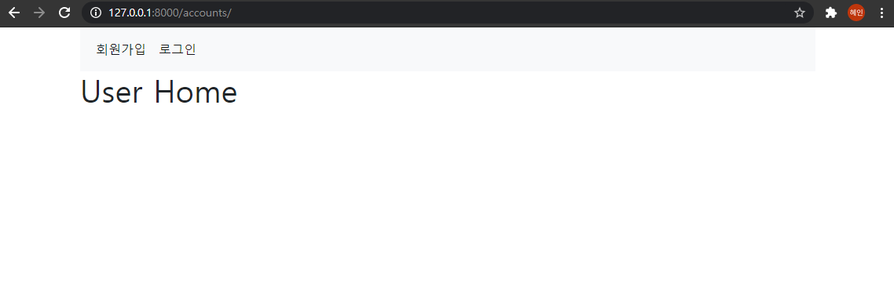
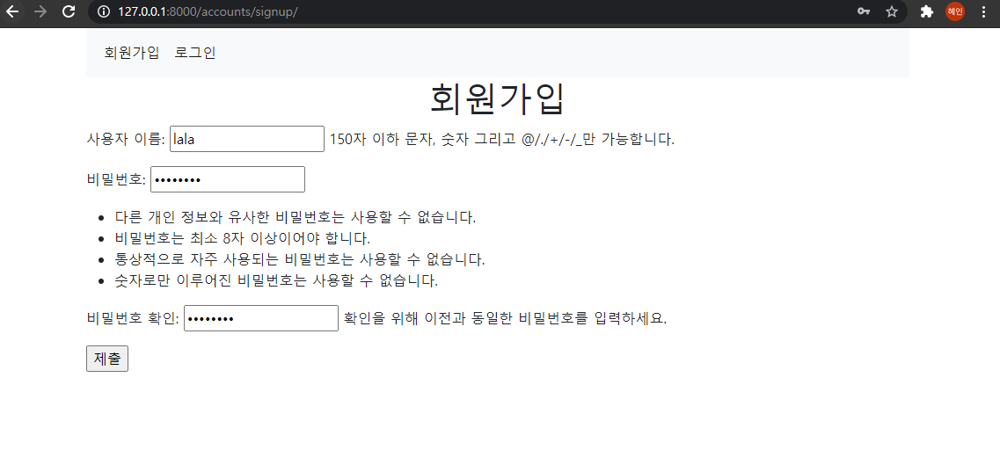
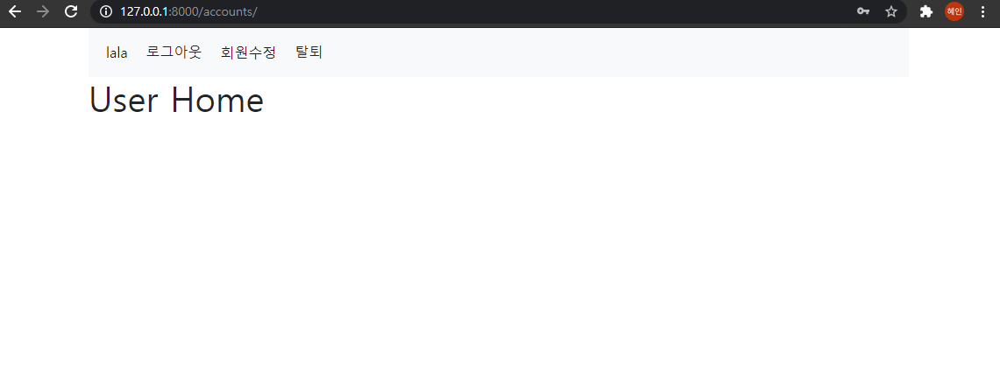
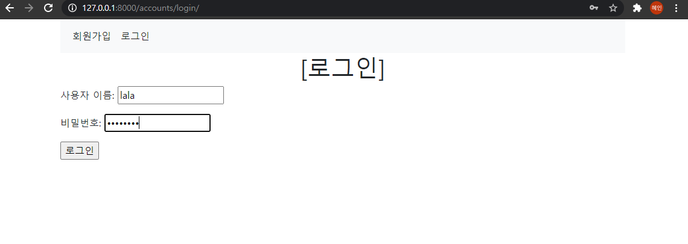
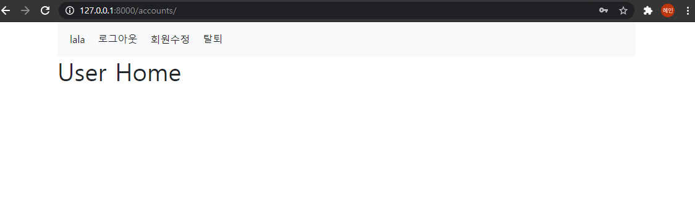
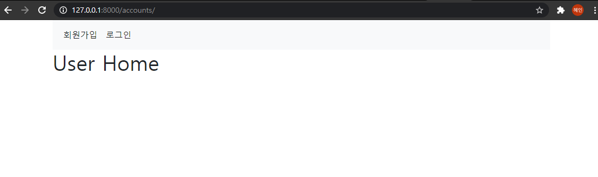
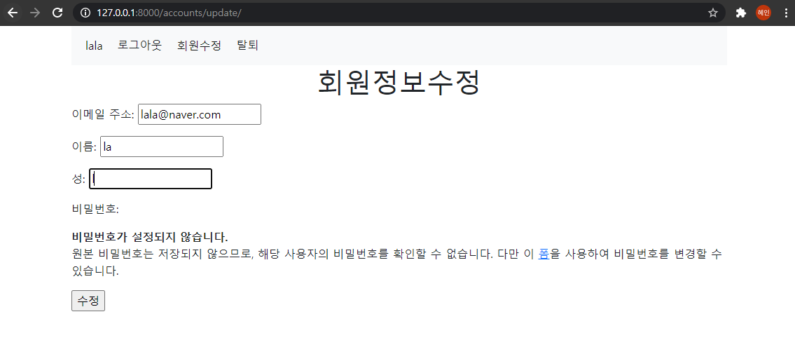
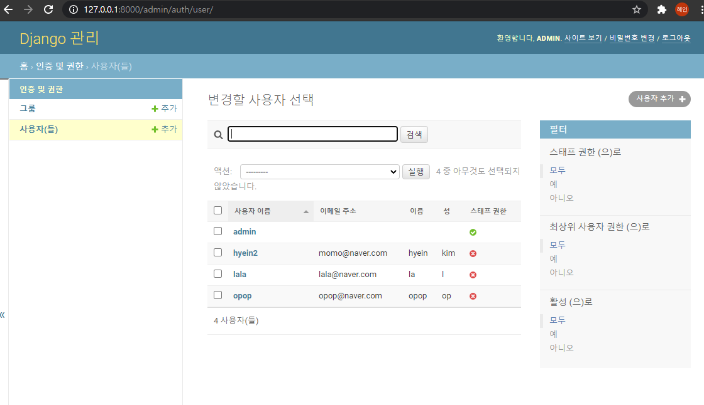
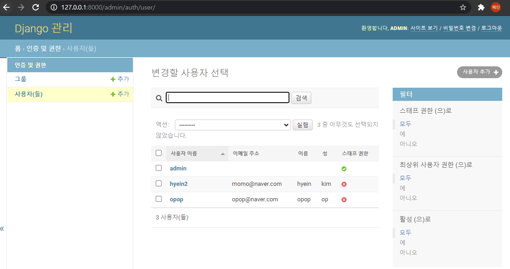

# 09_django_practice

### 1. User Create







로그인 전에는 회원가입과 로그인이라는 배너가 뜨고, 로그인 후에는 유저 정보, 로그아웃, 회원수정, 탈퇴가 뜨는 것을 볼 수 있다. 

### 2. Login






### 3. Logout



### 4. User Update






회원정보를 수정하고 admin에서 확인하면 수정이 된 것을 확인할 수 있다. 

### 5. User Delete



탈퇴하고 admin에서 보면 탈퇴가 된 것을 볼 수 있다. 

### 6. Code

##### views.py

```python
from django.shortcuts import render, redirect
from django.contrib.auth.forms import UserCreationForm, AuthenticationForm		# form
from django.contrib.auth import login as auth_login
from django.contrib.auth import logout as auth_logout
from .forms import CustomUserChangeForm		# update의 Form
# 다른 접근일 떄 제한 
from django.views.decorators.http import require_POST
from django.contrib.auth.decorators import login_required


def index(request):
	return render(request, 'accounts/index.html')

def signup(request):
	if request.user.is_authenticated:		# 이미 로그인 되어있으면 회원가입안됨
		return redirect('accounts:index')

	if request.method == 'POST':
		form = UserCreationForm(request.POST)
		if form.is_valid():
			user = form.save()
			auth_login(request, user)
			return redirect('accounts:index')
	else:
		form = UserCreationForm()
	context = {
		'form' : form,
	}
	return render(request, 'accounts/signup.html', context)


def login(request):
	if request.user.is_authenticated:		# 이미 로그인 되어있으면 다른 곳으로
		return redirect('accounts:index')

	if request.method == 'POST':
		form = AuthenticationForm(request, request.POST)
		if form.is_valid():
			auth_login(request, form.get_user())		# request와 user객체를 받는 로그인 함수
			return redirect(request.GET.get('next') or 'accounts:index')
	else:
		form = AuthenticationForm()
	context = {
		'form' : form,
	}
	return render(request, 'accounts/login.html', context)


@require_POST
def logout(request):
	auth_logout(request)
	return redirect('accounts:index')

@require_POST
def delete(request):
	if request.user.is_authenticated:
		request.user.delete()
		auth_logout(request)
	return redirect('accounts:index')

@login_required
def update(request):
	if request.method == 'POST':
		form = CustomUserChangeForm(request.POST, instance=request.user)
		if form.is_valid():
			form.save()
			return redirect('accounts:index')
	else:
		form = CustomUserChangeForm()
	context = {
		'form' : form,
	}
	return render(request, 'accounts/update.html', context)

```

logout 과 delete일 때 POSTmethod만 허용하도록 해서 url로의 접근을 막는다. index를 추가해주어서 User의 Home을 만들어주었다. 

login, signup, update는 POST일 때와 GET일 때 나눠서 처리해준다. 