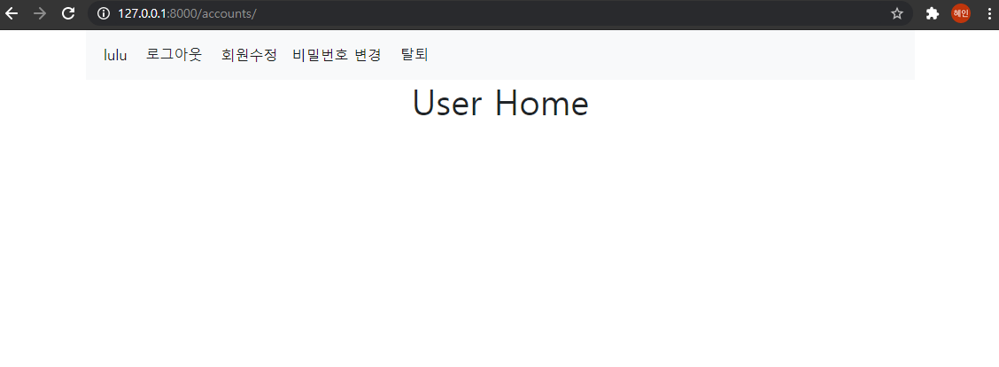
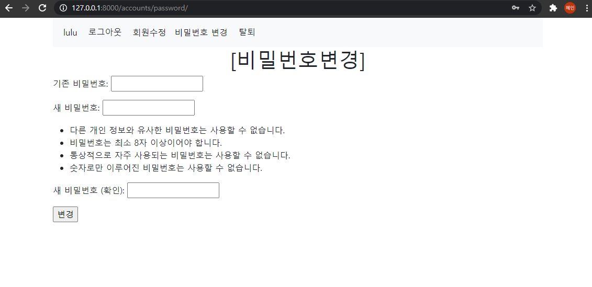
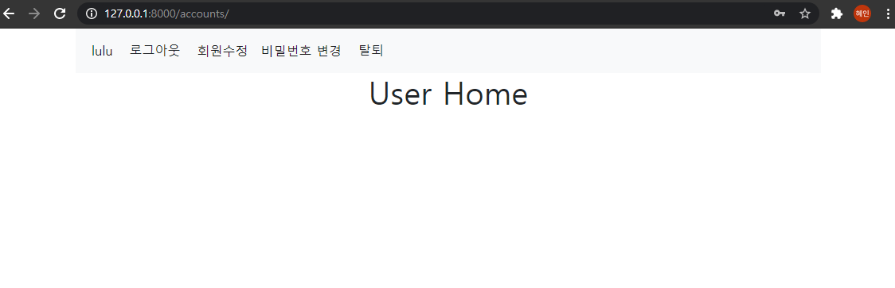

# 09_django_workshop

### 1. User Change Password



```
로그인 하면 상단에 비밀번호 변경 배너가 생기게 된다. 
```




```
누르면 비밀번호 변경하는 곳으로 가게 된다. 
```




```
비밀번호를 변경하면 로그아웃 되지 않고 홈으로 돌아온다. 
```


##### code

views.py

```python
from django.contrib.auth.forms import UserCreationForm, AuthenticationForm, PasswordChangeForm
# 패스워드 변경시 로그아웃 되는거 방지
from django.contrib.auth import update_session_auth_hash


def password(request):
	if request.method == 'POST':
		form = PasswordChangeForm(request.user, request.POST)
		if form.is_valid():
			user = form.save()
			update_session_auth_hash(request, user)		# 비번 변경시 로그아웃 되는거 방지
			return redirect('accounts:index')

	else:
		form = PasswordChangeForm(request.user)
	context = {
		'form' : form,
	}
	return render(request, 'accounts/password.html', context)
```

PasswordChangeForm을 import해주고, 패스워드 변경시 로그아웃 되는 것을 방지하기 위한 update_session_auth_hash를 import해준다. 

form 을 생성시에는 request.user를 넣어 user객체를 넣어준다. 