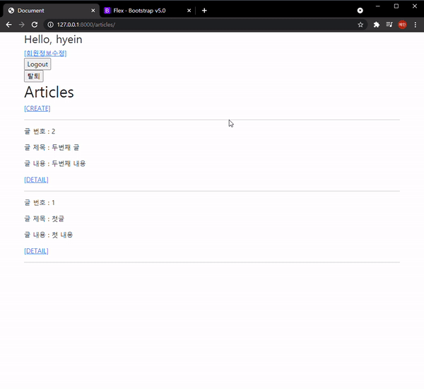

# 10_django_workshop


### Django Project

#### [ Comment 결과 ]



#### [ Code ]

##### 1. articles/models.py

```python
class Comment(models.Model):
    article = models.ForeignKey(Article, on_delete=models.CASCADE)
    content = models.CharField(max_length=200)
    created_at = models.DateTimeField(auto_now_add=True)
    updated_at = models.DateTimeField(auto_now=True)

    def __str__(self):
        return self.content
```

기존 코드에 Comment 클래스를 추가로 만들어주었다. 몇 번째 글에 있는 댓글인지 알아야 하기 때문에 1:N에 중 N에 해당되는 Comment에 ```article = models.ForeignKey(Article, on_delete=models.CASCADE)``` 을 넣어준다. 


##### 2. articles/forms.py

```python
from .models import Article, Comment 

class CommentForm(forms.ModelForm):

    class Meta:
        model = Comment
        exclude = ('article',)     
```

models.py에서 정의한 class를 import해서 가져온다. 그리고 exclude에 article을 제외해서 html에서 몇번째 글에 댓글을 쓰는 건지 선택할 수 있는 부분을 없애준다. 


##### 3. articles/urls.py

```python
path('<int:article_pk>/comments/', views.comment_create, name='comment_create'),
path('<int:article_pk>/comments/<int:comment_pk>/delete/', views.comment_delete, name='comment_delete'),
```

url_patterns에 위 코드를 넣어준다. 댓글 생성과 삭제의 url을 만들어준다. 누구의 Pk인지를 주의한다. 


##### 4. articles/views.py

```python
from .models import Article, Comment
from .forms import ArticleForm, CommentForm 

@require_safe       
def detail(request, pk):
    article = get_object_or_404(Article, pk=pk)
    comment_form = CommentForm()      
    comments = article.comment_set.all() 
    context = {
        'article': article,
        'comment_form' : comment_form, 
        'comments' : comments,    
    }
    return render(request, 'articles/detail.html', context)


@require_POST
def comment_create(request, article_pk):
    if request.user.is_authenticated:
        # 이미 get요청은 detail에서 걸러졌으니까 POST일때만 신경쓰면 되는듯?하다
        article = get_object_or_404(Article, pk=article_pk)
        comment_form = CommentForm(request.POST)
        if comment_form.is_valid():
            comment = comment_form.save(commit=False)
            comment.article = article
            comment.save()
            return redirect('articles:detail', article.pk)
        context = {  
            'comment_form' : comment_form,
            'article' : article,
        }
        return render(request, 'articles/detail.html', context)
    return redirect('accounts:login')


@require_POST
def comment_delete(request, article_pk, comment_pk):
    # 이 함수를 실행할 때는 article과 comment가 이미 html에서 있음 
    # 지울 댓글만 찾아오기
    if request.user.is_authenticated:
        comment = get_object_or_404(Comment, pk=comment_pk)
        comment.delete()
    return redirect('articles:detail', article_pk)
```

models와 forms에서 만들어준 클래스들을 import로 가져온다. 

detail.html 에서는 ```세부article, 댓글입력form, 지금까지 작성된 댓글보기``` 기능이 있어야하므로 article, comment_form, comments를 정의해주고 context에 넣어준다. 이때 comment_form은 댓글작성을 위한 것이고, comments는 해당 article에 있는 comment를 모두 불러온다.  

comment_create함수를 실행할 때는 detail.html에서 댓글작성 후 submit을 눌렀을 때이다. 따라서 article과 comment_form을 불러오고 유효성을 통과하면 저장한다. 이때 주고받는 method는 POST이고, 로그인이 되어있을 때 실행하도록 한다.

comment_delete는 detail.html에서 각 댓글에서 delete버튼을 눌렀을 때 url을 거쳐 실행된다. comment_pk를 통해 해당 comment를 가져오고 지운다. 그리고 받은 article_pk의 detail url로 보낸다. 


##### 5. articles/templates/articles/detail.html

```django
<!--댓글 입력 form-->
  <form action="" method="POST">
    
    {{ comment_form }}
    <input type="submit">
  </form>
  <hr>

  <!--댓글 읽기 기능-->
  
    <div class='d-flex justify-content-between'>
      <div>
        <p>{{ comment.content }}</p>
        <p>{{ comment.created_at }}</p>
      </div>
      <div class='d-flex align-items-end'>
        <form action="" method="POST">
          
          <button type="submit">DELETE</button>
        </form>
      </div>
    </div>
    <hr>
  
```

detail 코드에서 위 부분을 추가한다. 댓글 입력 form같은 경우 form 태그를 이용한다. 

댓글 읽기 기능 같은 경우, for태그를 활용해서 detail함수에서 넘겨준 comments들을 순회한다. 이때 comment의 내용과 작성 시각을 가져온다. 추가로 각 댓글마다 delete를 위한 form태그를 추가한다. 여기서 내용과 작성시각을 하나로 묶고 delete form을 하나로 묶어서 flex 하여  정렬해주었다. 