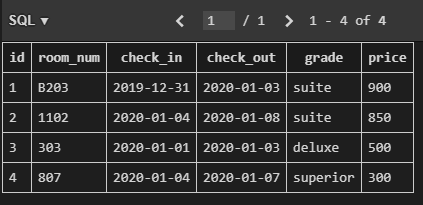

# 11_django_workshop

**1) countries 테이블 생성**

```sql
sqlite> CREATE TABLE countries (
   ...> id INTEGER PRIMARY KEY,
   ...> room_num TEXT NOT NULL,
   ...> check_in TEXT NOT NULL,
   ...> check_out TEXT NOT NULL,
   ...> grade TEXT NOT NULL,
   ...> price INTEGER NOT NULL);
```


**2) 데이터 입력**

```sql
sqlite> INSERT INTO countries VALUES(1,'B203','2019-12-31','2020-01-03','suite',900);   
sqlite> INSERT INTO countries VALUES(2,'1102','2020-01-04','2020-01-08','suite',850);   
sqlite> INSERT INTO countries VALUES(3,'303','2020-01-01','2020-01-03','deluxe',500);   
sqlite> INSERT INTO countries VALUES(4,'807','2020-01-04','2020-01-07','superior',300);
```



**3) 테이블 이름을 hotels로 변경**

```sql
sqlite> ALTER TABLE countries RENAME TO hotels;
```

**4) 객실 가격 내림차순 정렬 후 상위 2개의 room_num과 price 조회**

```
sqlite> SELECT room_num, price FROM hotels ORDER BY price DESC LIMIT 2;
room_num  price
--------  -----
B203      900
1102      850
```

**5) grade 별로 분류, 분류된 grade 개수를 내림차순으로 조회**

```sql
sqlite> SELECT grade, COUNT(*) AS grade_count 
   ...> FROM hotels
   ...> GROUP BY grade;
grade     grade_count
--------  -----------
deluxe    1
suite     2
superior  1
```

**6) 객실의 위치가 지하 혹은 등급이 deluxe인 객실의 모든 정보 조회**

```sql
sqlite> SELECT * FROM hotels WHERE room_num LIKE 'B%'or grade='deluxe'; 
id  room_num  check_in    check_out   grade   price
--  --------  ----------  ----------  ------  -----
1   B203      2019-12-31  2020-01-03  suite   900
3   303       2020-01-01  2020-01-03  deluxe  500 
```

**7)  지상층 객실 이면서 2020.1.4일에 체크인 한 객실의 목록을 price 오름차순으로 조회**

```
sqlite> SELECT * FROM hotels WHERE room_num NOT LIKE 'B%'and check_in='2020-01-04' ORDER BY price;
id  room_num  check_in    check_out   grade     price
--  --------  ----------  ----------  --------  -----
4   807       2020-01-04  2020-01-07  superior  300
2   1102      2020-01-04  2020-01-08  suite     850
```

