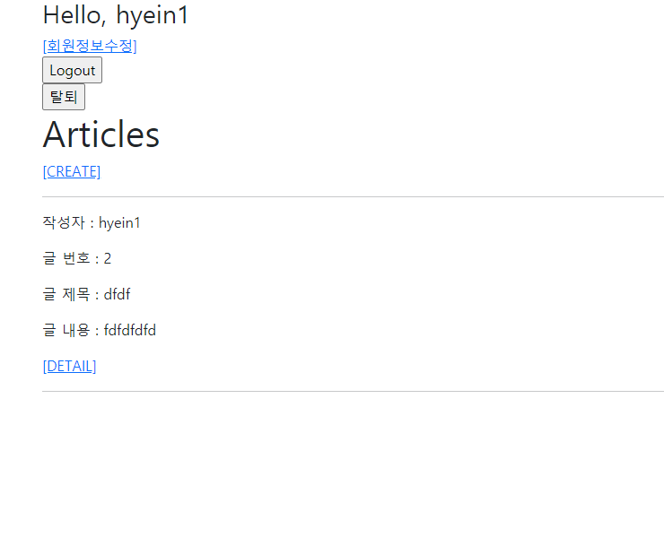
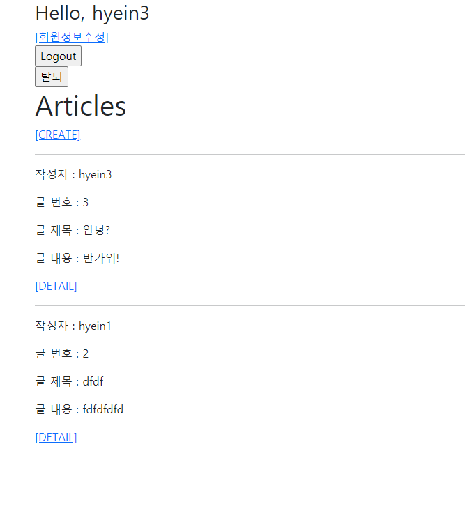
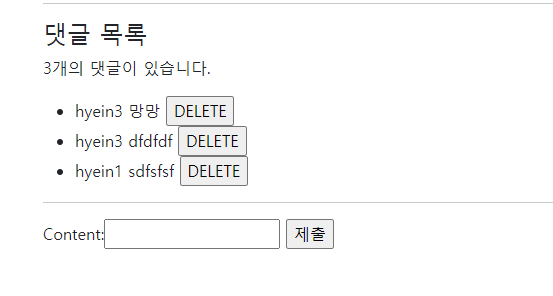

# 12_django_workshop

### 🌞 Django Project 🌞


#### 1) User model 대체

##### crud > settings.py

```python
AUTH_USER_MODEL = 'accounts.User'
```

##### accounts > models.py

```python
from django.contrib.auth.models import AbstractUser

class User(AbstractUser):
    pass
```

##### accounts > admin.py

```python
from django.contrib import admin
from django.contrib.auth.admin import UserAdmin
from .models import User

admin.site.register(User, UserAdmin)
```

migrations 파일을 삭제 > db.sqlite3 삭제 > migations 진행


#### 2) 회원가입 정상적 동작



##### accounts > forms.py

```python
from django.contrib.auth.forms import UserChangeForm, UserCreationForm

class CustomUserCreationForm(UserCreationForm):
    class Meta:
        model = get_user_model()
        fields = UserCreationForm.Meta.fields

```

CustomUserCreationForm을 재정의한다.

##### accounts > views.py

```python
@require_http_methods(['GET', 'POST'])
def signup(request):
    if request.user.is_authenticated:
        return redirect('articles:index')

    if request.method == 'POST':
        form = CustomUserCreationForm(request.POST)
        if form.is_valid():
            user = form.save()
            auth_login(request, user)
            return redirect('articles:index')
    else:
        form = CustomUserCreationForm()
    context = {
        'form': form,
    }
    return render(request, 'accounts/signup.html', context)

```

UsercreationForm을 CustomUserCreationForm으로 대체


#### 3) 메인페이지에서 작성자 정보 출력



##### articles > models.py

```python
from django.db import models
from django.conf import settings

# Create your models here.
class Article(models.Model):
    user = models.ForeignKey(settings.AUTH_USER_MODEL, on_delete=models.CASCADE)
    title = models.CharField(max_length=10)
    content = models.TextField()
    created_at = models.DateTimeField(auto_now_add=True)
    updated_at = models.DateTimeField(auto_now=True)

    def __str__(self):
        return self.title


class Comment(models.Model):
    user = models.ForeignKey(settings.AUTH_USER_MODEL, on_delete=models.CASCADE)
    article = models.ForeignKey(Article, on_delete=models.CASCADE)
    content = models.CharField(max_length=200)
    created_at = models.DateTimeField(auto_now_add=True)
    updated_at = models.DateTimeField(auto_now=True)

    def __str__(self):
        return self.content
```

aritcle과 comment model에 user를 추가하고 migations를 다시 진행한다.

##### articles > views.py

```python
@login_required
@require_http_methods(['GET', 'POST'])
def create(request):
    if request.method == 'POST':
        form = ArticleForm(request.POST)
        if form.is_valid():
            article = form.save(commit=False)
            article.user = request.user
            article.save()
            return redirect('articles:detail', article.pk)
    else:
        form = ArticleForm()
    context = {
        'form': form,
    }
    return render(request, 'articles/create.html', context)
```

article.user에 request.user를 넣어준다.

##### articles > templates > articles > index.html

```django

    <p>작성자 : {{ article.user }}</p>
    <p>글 번호 : {{ article.pk }}</p>
    <p>글 제목 : {{ article.title }}</p>
    <p>글 내용 : {{ article.content }}</p>
    <a href="">[DETAIL]</a>
    <hr>
  
```

article.user를 넣어줘서 메인 페이지에서 작성자가 나타나게 한다. 


#### 4) 게시글 작성자 본인만 게시글을 수정 및 삭제할 수 있다

##### accounts > views.py

```python
@require_POST
def delete(request, pk):
    if request.user.is_authenticated:
        article = get_object_or_404(Article, pk=pk)
        if request.user == article.user:
            article.delete()
        else:
            return redirect('articles:detail', article.pk)
    return redirect('articles:index')
    
@login_required
@require_http_methods(['GET', 'POST'])
def update(request, pk):
    article = get_object_or_404(Article, pk=pk)
    if request.user == article.user:
        if request.method == 'POST':
            form = ArticleForm(request.POST, instance=article)
            if form.is_valid():
                form.save()
                return redirect('articles:detail', article.pk)
        else:
            form = ArticleForm(instance=article)
        context = {
            'form': form,
            'article': article,
        }
        return render(request, 'articles/update.html', context)
    return redirect('articles:detail', article.pk)
```

request.user == article.user를 확인하는 if문을 넣어준다. 

#### 5) 각 댓글에는 댓글 작성자 정보가 출력된다



##### articles > forms.py

```python
class CommentForm(forms.ModelForm):

    class Meta:
        model = Comment
        # fields = '__all__'
        exclude = ('article', 'user',)
```

exclude에 user를 추가해서 댓글 작성시 user선택이 나타나지 않게 한다.

##### articles > views.py 

```python
@require_POST
def comments_create(request, pk):
    if request.user.is_authenticated:
        article = get_object_or_404(Article, pk=pk)
        comment_form = CommentForm(request.POST)
        if comment_form.is_valid():
            comment = comment_form.save(commit=False)
            comment.article = article
            comment.user = request.user
            comment.save()
            return redirect('articles:detail', article.pk)
        context = {
            'comment_form': comment_form,
            'article': article,
        }
        return render(request, 'articles/detail.html', context)
    return redirect('accounts:login')
    # return HttpResponse(status=401)
```

comment.user에 request.user를 넣어준다

##### articles > templates > articles > detail.html

```python
<h4>댓글 목록</h4>
  <p>{{ comments|length }}개의 댓글이 있습니다.</p>
  <ul>
    
      <li>
        {{ comment.user }}
        {{ comment.content }}
        <form action="" method="POST" class="d-inline">
          
          <input type="submit" value="DELETE">
        </form>
      </li>
    
      <p>아직 댓글이 없네요...</p>
    
```

{{ comment }}를 {{ comment.user }}와 {{ comment.content }} 로 바꿔준다.


#### 6) 댓글 작성자 본인만 댓글을 삭제할 수 있다

##### articles > views.py

```python
@require_POST
def comments_delete(request, article_pk, comment_pk):
    if request.user.is_authenticated:
        comment = get_object_or_404(Comment, pk=comment_pk)
        if comment.user == request.user:
            comment.delete()
    return redirect('articles:detail', article_pk)
```

comment.user와 request.user가 같은지 확인하는 과정을 거쳐 본인만 댓글을 삭제할 수 있도록 한다.