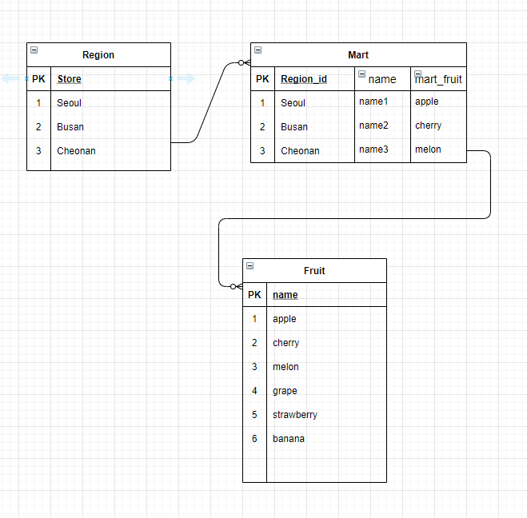

# 13_django_homework

#### Modeling


#### ERD



#### models.py

```python
class Region(models.Model):
    store = models.CharField(max_length=100)

class Fruit(models.Model):
    name = models.CharField(max_length=100)

class Mart(models.Model):
    region = models.ForeignKey(Region, on_delete=models.CASCADE) 
    name = models.CharField(max_length=100)
    mart_fruit = models.CharField(max_length=100)
```

한 지역에 편의점들이 여러개 있으므로 Region과 Mart클래스를 만들어준다. 

각 상품들을 특정 조건 별로 분류하는 것을 잘 모르겠습니다..ㅜㅜ