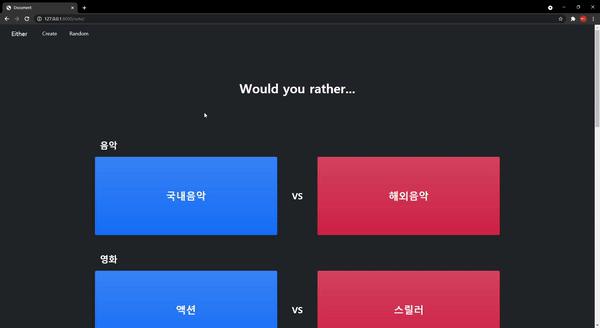

# 13_django_workshop

### Django Project


### 결과화면




### 코드

##### 1.  crud > templates > base.html

```django
<!DOCTYPE html>
<html lang="en">
<head>
  <meta charset="UTF-8">
  <meta http-equiv="X-UA-Compatible" content="IE=edge">
  <meta name="viewport" content="width=device-width, initial-scale=1.0">
  <link href="https://cdn.jsdelivr.net/npm/bootstrap@5.0.0-beta3/dist/css/bootstrap.min.css" rel="stylesheet" integrity="sha384-eOJMYsd53ii+scO/bJGFsiCZc+5NDVN2yr8+0RDqr0Ql0h+rP48ckxlpbzKgwra6" crossorigin="anonymous">
  <title>Document</title>
</head>
<body class="bg-dark">
  <!--nav bar-->
  <nav class="navbar navbar-expand-lg navbar-dark bg-dark">
    <div class="container-fluid">
      <a class="navbar-brand ms-4" href="">Either</a>
      <button class="navbar-toggler" type="button" data-bs-toggle="collapse" data-bs-target="#navbarSupportedContent" aria-controls="navbarSupportedContent" aria-expanded="false" aria-label="Toggle navigation">
        <span class="navbar-toggler-icon"></span>
      </button>
      <div class="collapse navbar-collapse" id="navbarSupportedContent">
        <ul class="navbar-nav me-auto mb-2 mb-lg-0">
          <li class="nav-item">
            <a class="nav-link active ms-4" aria-current="page" href="">Create</a>
          </li>
          <li class="nav-item">
            <a class="nav-link active ms-4" href="">Random</a>
          </li>
        </ul>
        
      </div>
    </div>
  </nav>
  <div class="container">
    
    
  </div>
  <script src="https://cdn.jsdelivr.net/npm/bootstrap@5.0.0-beta3/dist/js/bootstrap.bundle.min.js" integrity="sha384-JEW9xMcG8R+pH31jmWH6WWP0WintQrMb4s7ZOdauHnUtxwoG2vI5DkLtS3qm9Ekf" crossorigin="anonymous"></script>
</body>
</html>
```

##### 2. crud > urls.py

```python
from django.contrib import admin
from django.urls import path, include

urlpatterns = [
    path('admin/', admin.site.urls),
    path('vote/', include('vote.urls')),
]
```

##### 3. vote > models.py

```python
from django.db import models

class Vote(models.Model):
    title = models.CharField(max_length=100)            # 투표 주제
    content1 = models.CharField(max_length=100)          # 한 주제당 항목 2개
    content2 = models.CharField(max_length=100)          

    def __str__(self):
        return self.title

class Comment(models.Model):
    vote = models.ForeignKey(Vote, on_delete=models.CASCADE)        # 한 투표당 댓글 여러개  
    pick = models.BooleanField()
    content = models.CharField(max_length=200)

    def __Str__(self):
        return self.content
```

##### 4. vote > forms.py

```python
from django import forms
from .models import Vote, Comment

class VoteForm(forms.ModelForm):
    class Meta:
        model = Vote
        fields = '__all__'

class CommentForm(forms.ModelForm):
    PICKS = [
        (False, 'BLUE'),
        (True, 'RED'),
    ]
    pick = forms.ChoiceField(choices=PICKS)
    class Meta:
        model = Comment
        fields = ('pick', 'content',)
```

##### 5. vote > urls.py

```python
from django.urls import path
from . import views

app_name = 'vote'
urlpatterns = [
    path('', views.index, name="index"),
    path('create/', views.create, name='create'),
    path('<int:pk>/', views.detail, name='detail'),
    path('<int:pk>/comment_create/', views.comment_create, name='comment_create'),
    path('random_page/', views.random_page, name="random_page"),
]
```

투표 생성, 조회, 댓글 생성, 랜덤페이지 생성으로 나누어 주었다. 

##### 6. vote > views.py

```python
from django.shortcuts import render, redirect, get_object_or_404
from django.views.decorators.http import require_safe, require_http_methods, require_POST
from .models import Vote, Comment
from .forms import VoteForm, CommentForm
import random

def index(request):
    votes = Vote.objects.order_by('-pk')
    context = {
        'votes' : votes,
    }
    return render(request, 'vote/index.html', context)

def create(request):
    if request.method == 'POST':
        form = VoteForm(request.POST)
        vote = form.save()
        return redirect('vote:detail', vote.pk)
    else:
        form = VoteForm()
    context = {
        'form' : form,
    }
    return render(request, 'vote/create.html', context)

def detail(request, pk):
    vote = get_object_or_404(Vote, pk=pk)

    comment_form = CommentForm()                # 댓글 작성 form
    comments = vote.comment_set.all()           # 모든 댓글 불러오기
    comments_count = vote.comment_set.all().count()
    comments_blue = vote.comment_set.all().filter(pick=0).count()
    comments_red = vote.comment_set.all().filter(pick=1).count()
    if comments_blue != 0 and comments_blue != 100:
        comments_ratio_b = comments_blue / comments_count * 100
        comments_ratio_r = 100 - comments_ratio_b
    else:
        comments_ratio_b = comments_blue
        comments_ratio_r = comments_red
    context = {
        'vote' : vote,
        'comment_form' : comment_form,
        'comments' : comments,
        'comments_ratio_b' : comments_ratio_b,
        'comments_ratio_r' : comments_ratio_r,
        
    }
    return render(request, 'vote/detail.html', context)

@require_POST
def comment_create(request, pk):
    vote = get_object_or_404(Vote, pk=pk)
    comment_form = CommentForm(request.POST)
    if comment_form.is_valid():
        comment = comment_form.save(commit=False)
        comment.vote = vote
        comment.save()
        return redirect('vote:detail', vote.pk)
    context = {
        'comment_form' : comment_form,
        'vote' : vote,
    }
    return render(request, 'vote/detail.html', context)


def random_page(request):
    num = Vote.objects.values('id')
    number = random.choice(num)['id']
    return redirect('vote:detail', number)
```

detail 함수에서는 vote, 댓글 생성 form, 댓글 전체, 파란색 댓글 비율, 빨간색 댓글 비율을 정의해 context로 넘겨주었다. 

##### 7. vote > templates > vote > index.html

```django


  <div style="height: 300px;" class="d-flex align-items-center justify-content-center">
    <h1 class="text-center text-white fw-bold">Would you rather...</h1>
    
  </div>

  
    <div class="mt-3 p-3 bg-dark d-flex align-items-end " style="height: 50px; width: 100%;">
      <a href="" class="text-decoration-none text-white fs-3 fw-bold">{{ vote.title }}</a>
    </div>

    <div class="d-flex">
      <div class="p-3 mb-5 bg-primary bg-gradient rounded d-flex align-items-center justify-content-center" style="height: 250px; width: 45%;">
        <a href="" class="text-decoration-none text-white fs-2 fw-bold">{{ vote.content1 }}</a>
      </div>
      <div class="p-3 mb-5 bg-dark rounded d-flex align-items-center justify-content-center" style="height: 250px; width: 10%">
        <a href="" class="text-decoration-none text-white fs-3 fw-bold">VS</a>
      </div>
      <div class="p-3 mb-5 bg-danger bg-gradient rounded d-flex align-items-center justify-content-center" style="height: 250px; width: 45%">
        <a href="" class="text-decoration-none text-white fs-2 fw-bold">{{ vote.content2 }}</a>
      </div>
    </div>
  


```

이 코드에서는 각각의 항목을 비교하여 보여준다. 

##### 8. vote > templates > vote > detail.html

```django


  
    <h1 class="text-center text-white mt-5 mb-5">{{ vote.title }}</h1>

    <h2 class="text-center text-white mt-5 mb-5">{{vote.content1}} vs {{vote.content2}}</h2>
    <div class="progress">
      <div class="progress-bar" role="progressbar" style="width: {{ comments_ratio_b }}%" aria-valuenow="15" aria-valuemin="0" aria-valuemax="100"></div>
      <div class="progress-bar bg-danger" role="progressbar" style="width: {{ comments_ratio_r }}%" aria-valuenow="30" aria-valuemin="0" aria-valuemax="100"></div>
    </div>
    <hr>
    
    <p>{{ comments_ratio}}</p>
    <p>{{ comments_count }}</p>
    <p>{{ comments_blue}}</p>
  <div class="bg-white mt-5 p-5 rounded" style="height: 100%; width: 100%;">

    <h3 class="text-center">Comment</h3>
    <form action="" method="POST">
      
      {{ comment_form}}
      <input type="submit" value="생성">
    </form>
    <hr>

    
      
        <p>PICK : {{ vote.content1}}</p>
      
        <p>PICK : {{ vote.content2}}</p>
      
      <p>{{ comment.content }}</p>
      <hr>
    
  </div>


```

progress를 이용해 비율을 보여주고 comment에서도 자신이 선택한 값을 보여준다.

##### 7. vote > templates > vote > create.html

```django


  <div class="bg-white mt-5 p-5 rounded bg-gradient" style="height: 700px; width: 100%;">
    <h1 class="text-center">Vote Create</h1>
    <form action="" method="POST" class="form-control" >
      
      {{ form.as_p }}
      <input type="submit" value="투표 생성">
    
    </form>
  </div>

```

투표를 생성한다.


