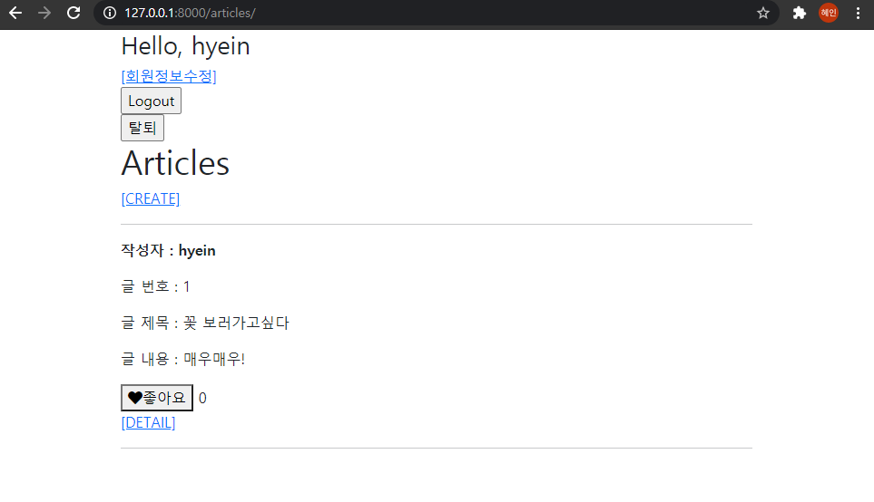
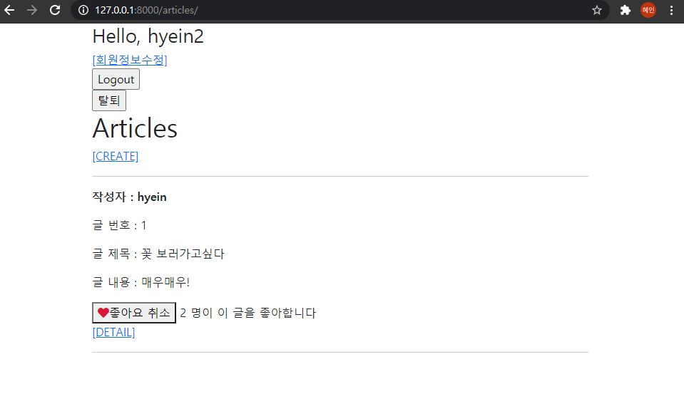

# 14_django_workshop

### Django Project





#### 1. views.py

```python
@required_POST
def like(request, article_pk):
    if request.user.is_authenticated:
        article = get_object_or_404(Article, pk=article_pk)
        if article.like_users.filter(pk=request.user.pk).exists():
            article.like_users.remove(request.user)
        else:
            article.like_users.add(request.user)
        return redirect('articles:index')
    return redirect('accounts:login')
```

like 함수를 만든다. 요청을 보낸 사용자가 해당 게시글의 좋아요 유저에 있을 경우 remove를 하고 그렇지 않을 경우 add를 한다. 

#### 2. models.py

```python
from django.db import models
from django.conf import settings

# Create your models here.
class Article(models.Model):
    user = models.ForeignKey(settings.AUTH_USER_MODEL, on_delete=models.CASCADE)
    like_users = models.ManyToManyField(settings.AUTH_USER_MODEL, related_name="likearticles")
    title = models.CharField(max_length=10)
    content = models.TextField()
    created_at = models.DateTimeField(auto_now_add=True)
    updated_at = models.DateTimeField(auto_now=True)

    def __str__(self):
        return self.title


class Comment(models.Model):
    article = models.ForeignKey(Article, on_delete=models.CASCADE)
    user = models.ForeignKey(settings.AUTH_USER_MODEL, on_delete=models.CASCADE)
    content = models.CharField(max_length=200)
    created_at = models.DateTimeField(auto_now_add=True)
    updated_at = models.DateTimeField(auto_now=True)

    def __str__(self):
        return self.content
```

model에 like_users 필드를 추가한다.  다대다 관계로 related_name은 likearticles로 한다. 

#### 3. index.html

```django



  <h1>Articles</h1>
  
    <a href="">[CREATE]</a>
  
    <a href="">[새 글을 작성하려면 로그인하세요.]</a>
  
  <hr>
  
    <p><b>작성자 : {{ article.user }}</b></p>
    <p>글 번호 : {{ article.pk }}</p>
    <p>글 제목 : {{ article.title }}</p>
    <p>글 내용 : {{ article.content }}</p>
    <form action="" method="POST">
      
      
        <button><i class="fas fa-heart" style="color: crimson"></i>좋아요 취소</button>
      
        <button><i class="fas fa-heart" style="color: black"></i>좋아요</button>
      
      <span>{{ article.like_users.all|length }} 명이 이 글을 좋아합니다</span>
    </form>
    <a href="">[DETAIL]</a>
    <hr>
  


```

