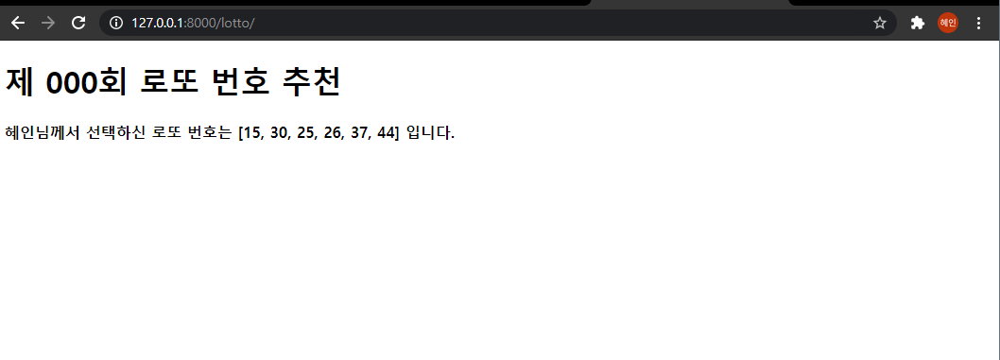

# 01_django_workshop



### 1. intro/urls.py

```python
from django.contrib import admin
from django.urls import path
from pages import views

urlpatterns = [
    path('admin/', admin.site.urls),
    path('lotto/', views.lotto),
]
```


### 2. pages/views.py

```python
import random
from django.shortcuts import render

# Create your views here.
def lotto(request):
    numbers = [i for i in range(1, 51)]
    pick = random.sample(numbers, 6)
    context = {
        'pick' : pick,
    }
    return render(request, 'lotto.html', context)
```


### 3. templates/lotto.html

```django
<!DOCTYPE html>
<html lang="en">
<head>
  <meta charset="UTF-8">
  <meta http-equiv="X-UA-Compatible" content="IE=edge">
  <meta name="viewport" content="width=device-width, initial-scale=1.0">
  <title>Document</title>
</head>
<body>
  <h1>제 000회 로또 번호 추천</h1>
  <h4>혜인님께서 선택하신 로또 번호는 {{ pick }} 입니다. </h4>
</body>
</html>
```

