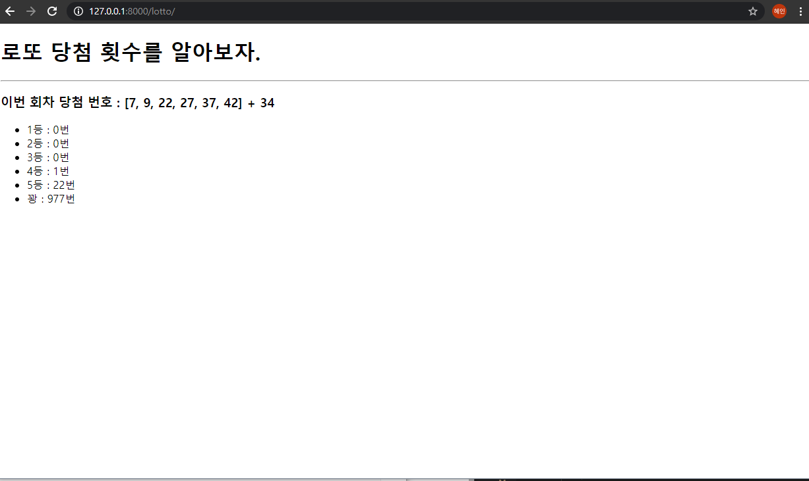
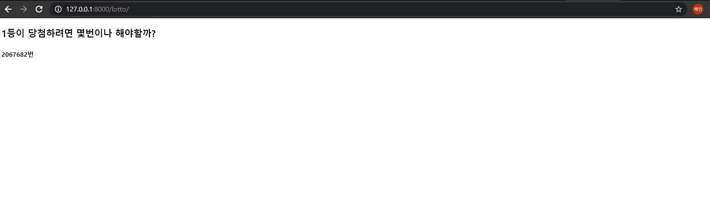

# 02_django_practice


#### 💡 Background

> Django Web Framwork
>
> 3rd Party Library


#### 💡 Goal

사용자가 /lotto/로 요청을 보냈을 때, 로또 당첨 번호와 보너스번호, 1000회 분량의 무작위 로또 추첨 결과를 보여주는 페이지를 만든다. 그리고 1등이 당첨되기 위해 몇 번이나 추첨해야하는지를 보여주는 페이지도 만든다.

> Django Template Language
>
> Open API와 3rd Party Library의 활용


#### 💡 결과 화면 





### 1. urls.py

lotto/ 형태의 요청 경로가 명시되는 파일

```python
from django.contrib import admin
from django.urls import path
from pages import views

urlpatterns = [
    path('admin/', admin.site.urls),
    path('lotto/', views.lotto),
]

```


### 2. views.py

이번 회차 로또 당첨 번호와 보너스 번호를 받아와 무작위로 생성한 1000회 분량의 로또 번호를 비교하고, 각 등수 별 당첨 횟수를 기록하여 lotto.html을 렌더링 할 때 해당 값들을 넘겨주는 함수가 작성된 파일

⭐⭐⭐ url 활용하는 부분 

```python
import requests
import random
from django.shortcuts import render

def lotto(request):
  url = 'https://www.dhlottery.co.kr/common.do?method=getLottoNumber&drwNo=953'
  res = requests.get(url)		# url로 요청을 보내서 정보를 받아줘
  res_dict = res.json()			# dict형태로 바꾼다
  res_list = []   # 로또 당첨 번호
  for i in range(1, 7):		# 리스트에 담기
    res_list.append(res_dict.get("drwtNo"+str(i)))
  vonus = []    # 보너스 번호
  vonus.append(res_dict.get("bnusNo"))
  
  # 무작위 생성 로또 번호
  rank = [0] * 6     # 1등 ~ 꽝 개수
  for i in range(1000):
    cnt = 0
    v_cnt = 0
    pick = random.sample(range(1, 46), 6)
    for j in pick:
      if j in res_list:		# 당첨번호 횟수 세기
        cnt += 1
      if j in vonus:		# 보너스 번호 횟수 세기
        v_cnt += 1
    if cnt == 6:
      rank[0] += 1
    elif cnt == 5 and v_cnt == 1:
      rank[1] += 1
    elif cnt == 5:
      rank[2] += 1
    elif cnt == 4:
      rank[3] += 1
    elif cnt == 3:
      rank[4] += 1
    else:
      rank[5] += 1

  context = {
    "num" : res_list,
    "vonus_num" : vonus[0],
    "rank" : rank,
  }
  return render(request, 'lotto.html', context)
```

##### 1등 당첨 횟수

while문으로 수정하였다.

```python
import requests
import random
from django.shortcuts import render

def lotto(request):
  url = 'https://www.dhlottery.co.kr/common.do?method=getLottoNumber&drwNo=953'
  res = requests.get(url)
  res_dict = res.json()
  res_list = []   # 로또 당첨 번호
  for i in range(1, 7):
    res_list.append(res_dict.get("drwtNo"+str(i)))
  vonus = []    # 보너스 번호
  vonus.append(res_dict.get("bnusNo"))

  # 무작위 생성 로또 번호
  rank = [0] * 6     # 1등 ~ 꽝 개수
  first = 0
  while True:
    first += 1
    cnt = 0
    v_cnt = 0
    pick = random.sample(range(1, 46), 6)
    for j in pick:
      if j in res_list:
        cnt += 1
      if j in vonus:
        v_cnt += 1
    if cnt == 6:
      rank[0] += 1
      break
    elif cnt == 5 and v_cnt == 1:
      rank[1] += 1
    elif cnt == 5:
      rank[2] += 1
    elif cnt == 4:
      rank[3] += 1
    elif cnt == 3:
      rank[4] += 1
    else:
      rank[5] += 1
```


### 3. lotto.html

views.py에서 넘어온 데이터를 출력하는 html 파일이다.

```django
<!DOCTYPE html>
<html lang="en">
<head>
  <meta charset="UTF-8">
  <meta http-equiv="X-UA-Compatible" content="IE=edge">
  <meta name="viewport" content="width=device-width, initial-scale=1.0">
  <title>Document</title>
</head>
<body>
  <h1>로또 당첨 횟수를 알아보자.</h1>
  <hr>
  <h3>이번 회차 당첨 번호 : {{ num }} + {{ vonus_num }}</h3>
  <ul>
    <li>1등 : {{ rank.0 }}번</li>
    <li>2등 : {{ rank.1 }}번</li>
    <li>3등 : {{ rank.2 }}번</li>
    <li>4등 : {{ rank.3 }}번</li>
    <li>5등 : {{ rank.4 }}번</li>
    <li>꽝 : {{ rank.5 }}번</li>
  </ul>
  
</body>
</html>

```

1등 추첨 횟수 보여주는 페이지에서 넣을 html

```django
  <h3>1등이 당첨하려면 몇번이나 해야할까?</h3>
  <h5>{{ first }}번</h5>
```

