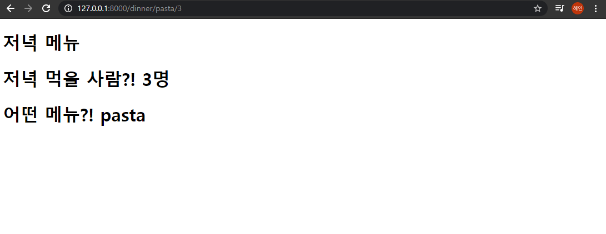

# 02_django_workshop

#### Background

> variable routing

#### Goal

> variable routing에 대한 이해
>
> 사용자가 /dinner/<저녁메뉴>/<인원수>/로 요청을 보냈을 때, URL을 통해 넘긴 값을 html에서 보여주는 페이지를 만든다

#### 결과 화면



### 1. intro/urls.py

/dinner/<저녁메뉴>/<인원수>/ 형태의 요청 경로가 명시되는 파일이다.

```python
from django.contrib import admin
from django.urls import path
from pages import views

urlpatterns = [
    path('admin/', admin.site.urls),
    path('dinner/<str:menu>/<int:people>', views.dinner),
]

```


### 2. pages/views.py

variable routing을 통해 전달 받은 인자를 html 파일에서 사용할 수 있도록 렌더링할 때 넘겨준다. 

```python
from django.shortcuts import render

# Create your views here.

def dinner(request, menu, people):
  context = {
    'menu' : menu,
    'people' : people,
  }
  return render(request, 'dinner.html', context)
```


### 3. templates/dinner.html

html마크업이 작성된 문서이다. views.py에서 넘어온 데이터가 해당 문서에서 출력된다. 

```django
<!DOCTYPE html>
<html lang="en">
<head>
  <meta charset="UTF-8">
  <meta http-equiv="X-UA-Compatible" content="IE=edge">
  <meta name="viewport" content="width=device-width, initial-scale=1.0">
  <title>Document</title>
</head>
<body>
  <h1>저녁 메뉴</h1>
  <h1>저녁 먹을 사람?! {{ people }}명</h1>
  <h1>어떤 메뉴?! {{ menu }}</h1>
</body>
</html>
```

