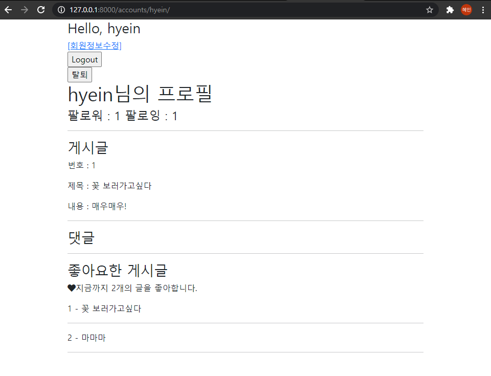
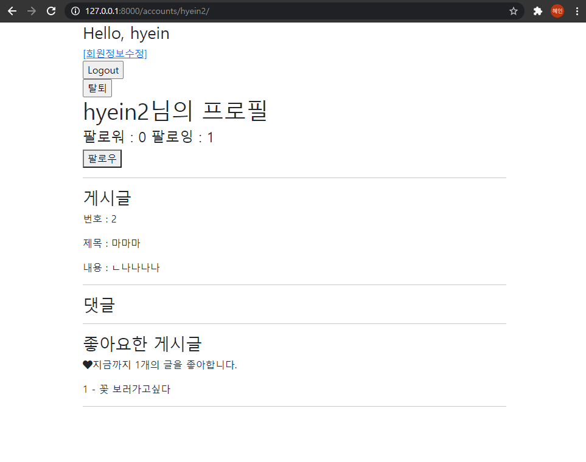

# 15_django_workshop


##### ** 자기 자신의 프로필 방문시



##### ** 다른 사람의 프로필 방문시



#### 1. accounts/views.py

```python
def profile(request, username):
    person = get_object_or_404(get_user_model(), username=username)
    context = {
        'person' : person,
    }
    return render(request, 'accounts/profile.html', context)

@require_POST
def follow(request, username):
    if request.user.is_authenticated:
        you = get_object_or_404(get_user_model(), username=username)
        me = request.user
        if you != me:
            if you.followers.filter(username=me.username).exists():
                you.followers.remove(me)
            else:
                you.followers.add(me)
        return redirect('accounts:profile', you.username)
    return redirect('accounts:login')
    
```


#### 2. accounts/models.py

```python
from django.db import models
from django.contrib.auth.models import AbstractUser

class User(AbstractUser):
    followings = models.ManyToManyField('self', symmetrical=False, related_name="followers")

```


#### 3. profile.html

```django



  <h1>{{ person.username }}님의 프로필</h1>
  <h4>팔로워 : {{ person.followers.all|length }}  팔로잉 : {{ person.followings.all|length }}</h4>

  
    <form action="" method="POST">
      
      
        <button>언팔로우</button>
      
        <button>팔로우</button>
      
    </form>
  
  <hr>
  
  <h3>게시글</h3>
  
    <p>번호 : {{ article.pk }}</p>
    <p>제목 : {{ article.title }}</p>
    <p>내용 : {{ article.content}}</p>
    <hr>
  
  
  <h3>댓글</h3>
  
    {{ article.comment }}
    <hr>
  
  <hr>
  
  <h3>좋아요한 게시글</h3>
  <p><i class="fas fa-heart" style="crimson"></i>지금까지 {{ person.likearticles.all|length }}개의 글을 좋아합니다.</p>
  
    {{ article.pk }} - {{ article.title }}
    <hr>
  


```

