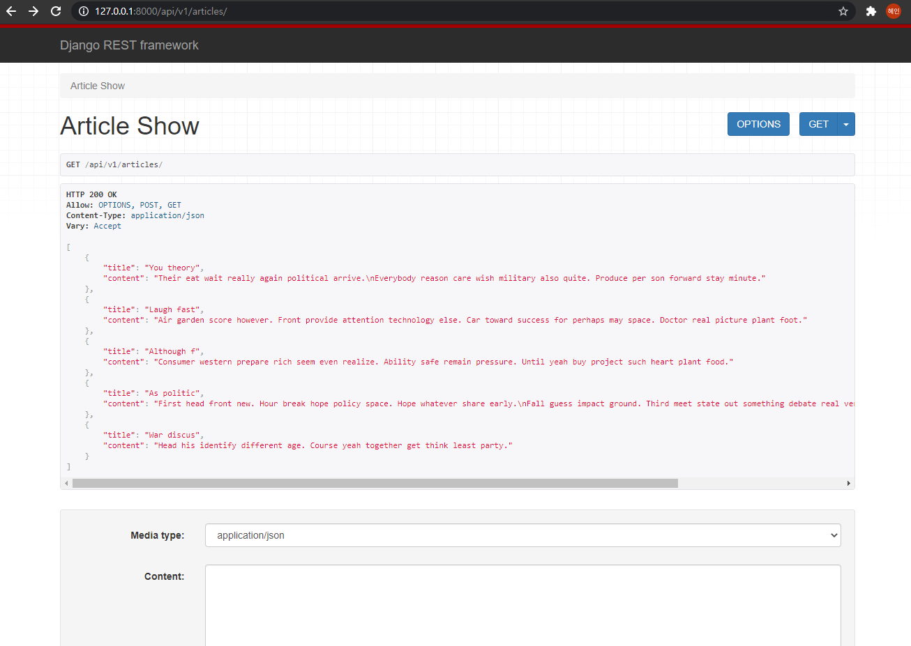
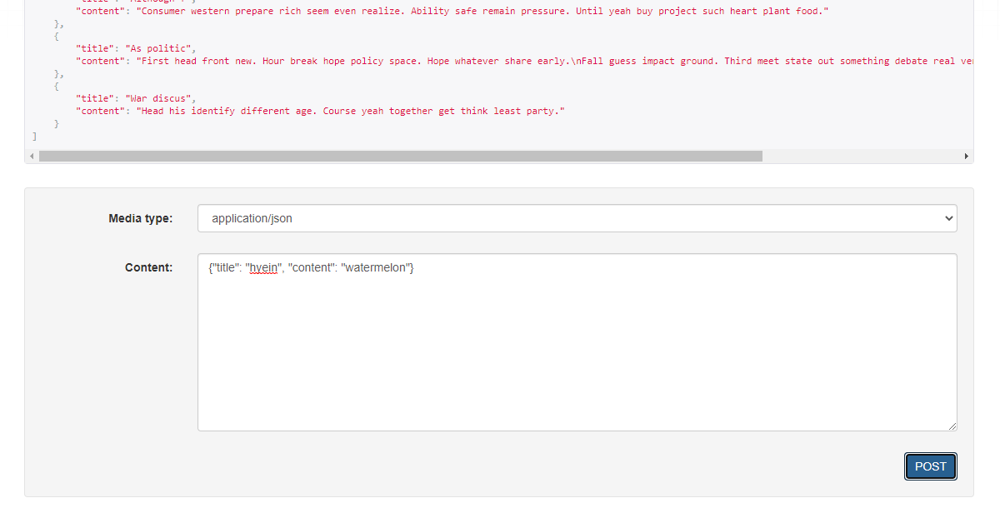
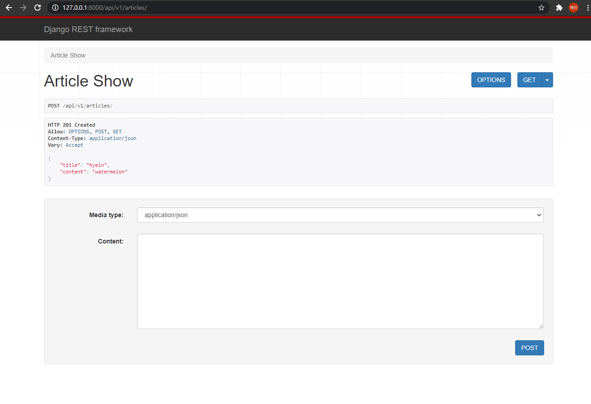
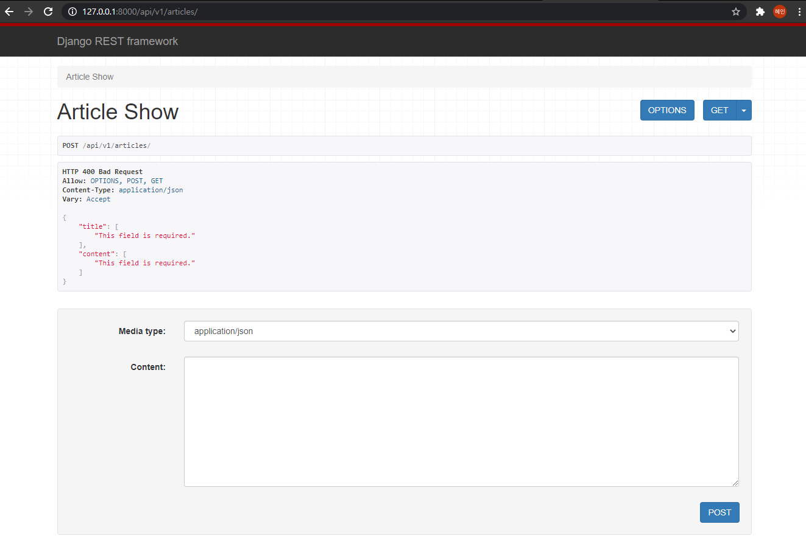
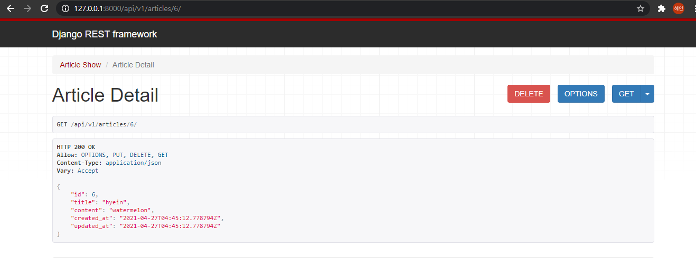
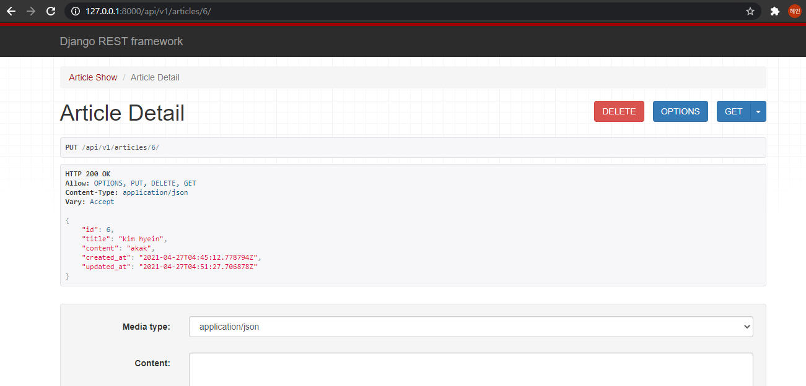
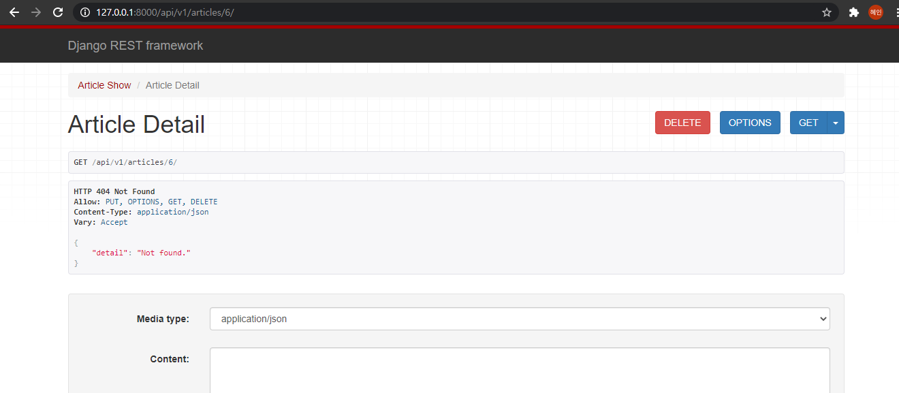

# 16_django_workshop


### Code

views.py

```python
from django.shortcuts import render, get_object_or_404, get_list_or_404
from .models import Article
from .serializers import ArticleListSerializer, ArticleSerializer
from rest_framework.response import Response
from rest_framework.decorators import api_view
from rest_framework import status

# Create your views here.

@api_view(['GET', 'POST'])
def article_show(request):
	if request.method == 'GET':
		articles = get_list_or_404(Article)
		serializer = ArticleListSerializer(articles, many=True)
		return Response(serializer.data)

	elif request.method == 'POST':
		serializer = ArticleListSerializer(data=request.data)
		if serializer.is_valid():		### ???????
			serializer.save()
			return Response(serializer.data, status=status.HTTP_201_CREATED)
		return Response(serializer.errors, status=status.HTTP_400_BAD_REQUEST)

@api_view(['GET', 'PUT', 'DELETE'])
def article_detail(request, article_pk):
	article = get_object_or_404(Article, pk=article_pk)
	if request.method == 'GET':
		serializer = ArticleSerializer(article)
		return Response(serializer.data)
	
	elif request.method == 'DELETE':
		article.delete()
		data = {
			'delete' : f'{article_pk}번 글이 삭제되었습니다.',
		}
		return Response(data, status=status.HTTP_204_NO_CONTENT)
	
	elif request.method == 'PUT':
		serializer = ArticleSerializer(article, data=request.data)
		if serializer.is_valid():
			serializer.save()
			return Response(serializer.data)
		return Response(serializer.errors, status=status.HTTP_400_BAD_REQUEST)
```

serializers.py

```python
from rest_framework import serializers
from .models import Article

class ArticleListSerializer(serializers.ModelSerializer):
	class Meta:
		model = Article
		fields = ('title', 'content',)

class ArticleSerializer(serializers.ModelSerializer):
	class Meta:
		model = Article
		fields = '__all__'
```


### JSON 응답 결과

`GET api/v1/articles`

모든 게시글의 id와 title 컬럼을 JSON으로 응답



`POST api/v1/articles`

검증에 성공할 경우,

새로운 게시글의 정보를 DB저장, 저장된 게시글의 정보 응답





###### **유효하지 않을 때**

400 Bad Request 오류를 발생시킨다.



`GET api/v1/articles/article_pk`



`PUT api/v1/articles/article_pk`



`DELETE api/v1/articles/article_pk`

