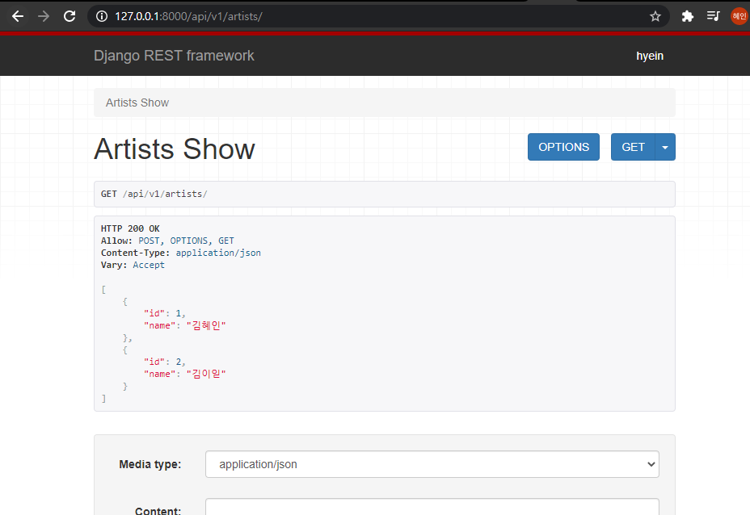
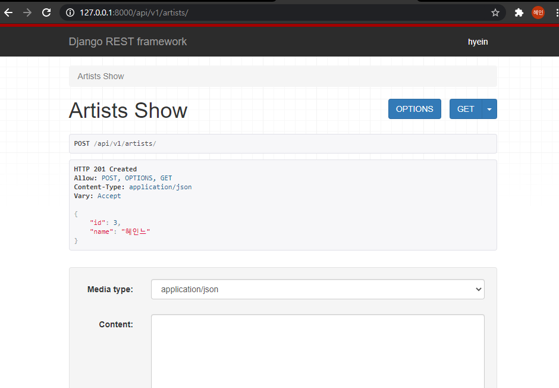
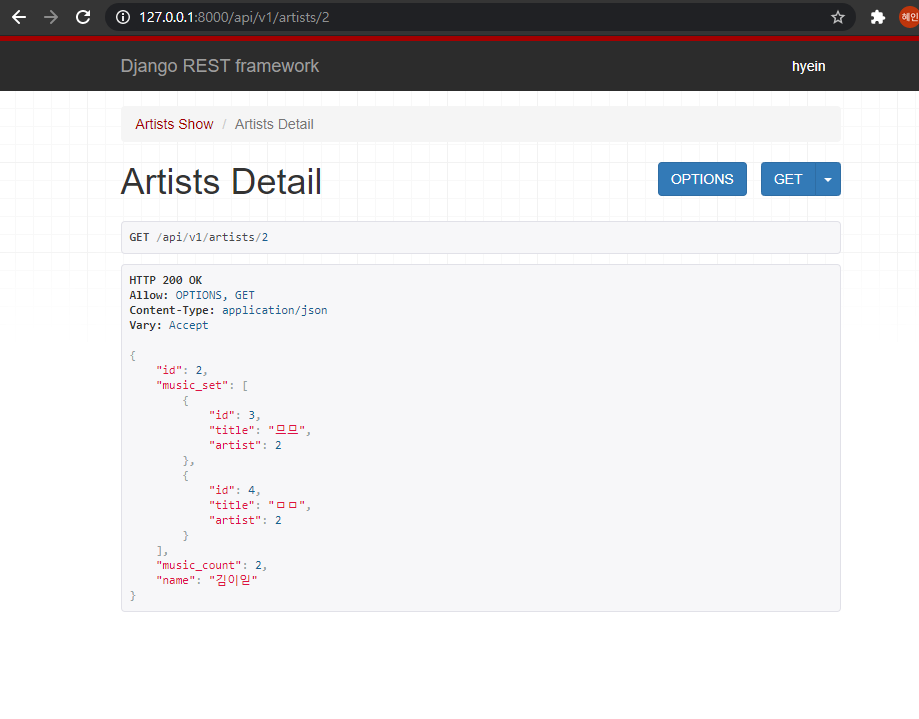
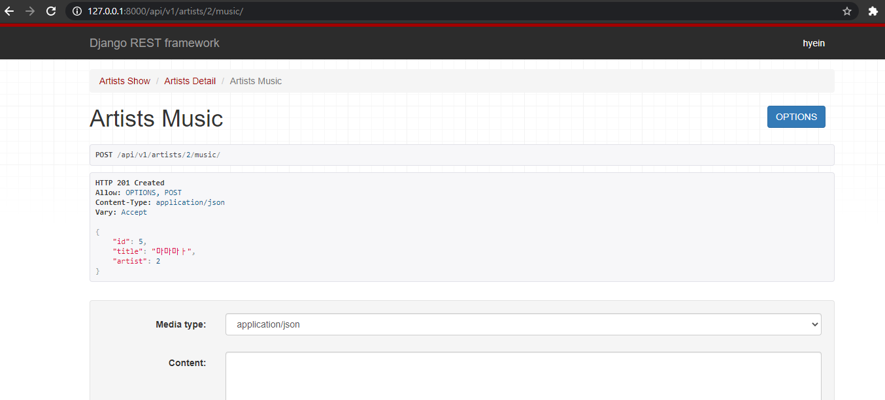
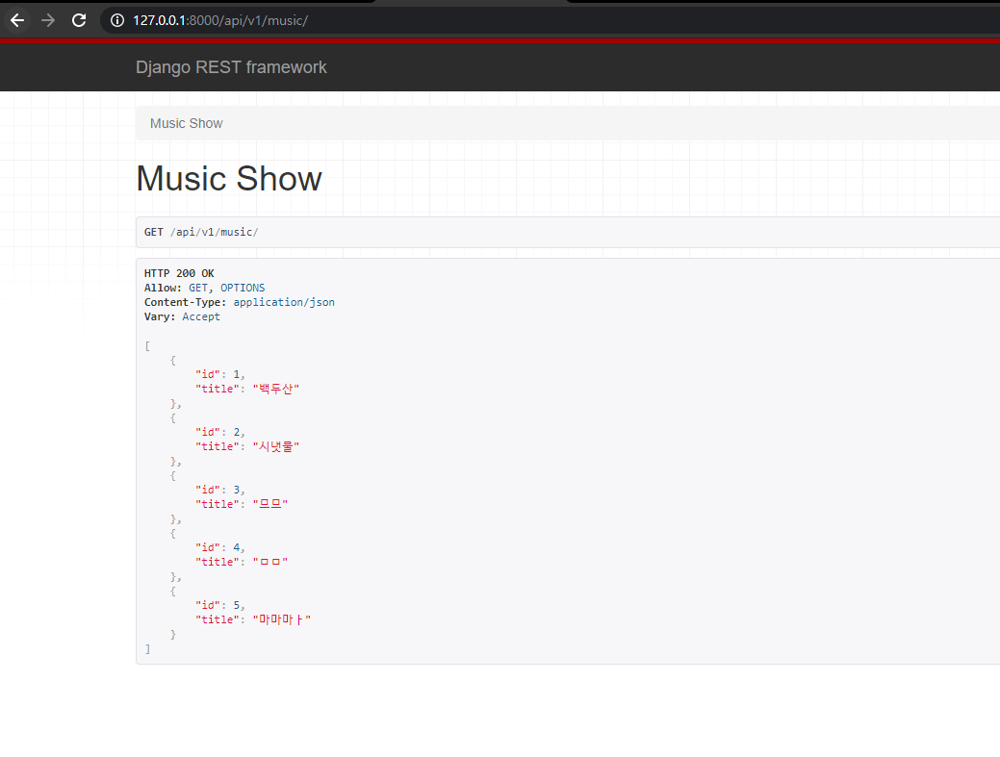
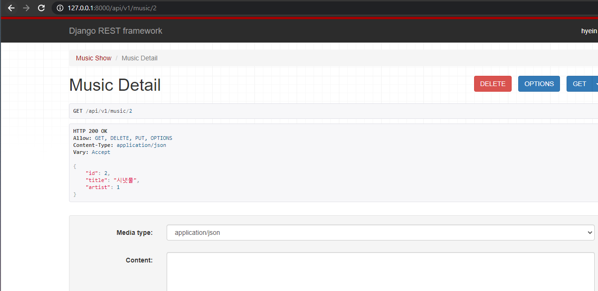
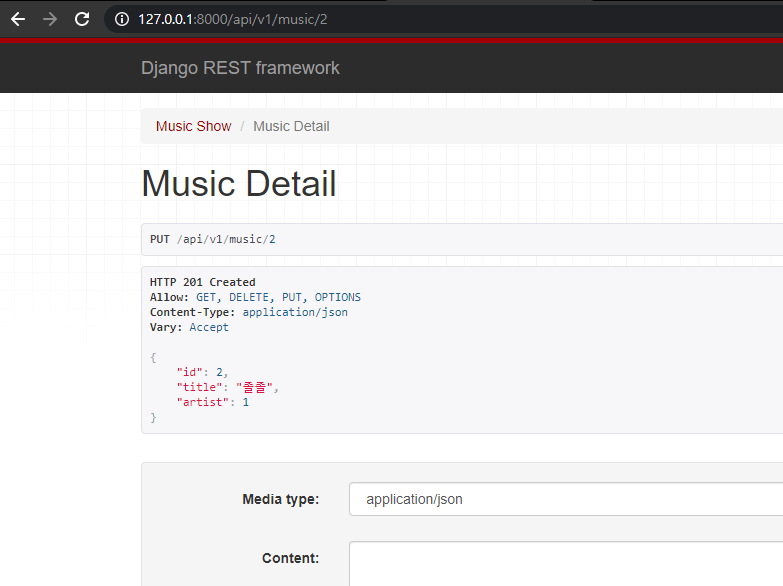
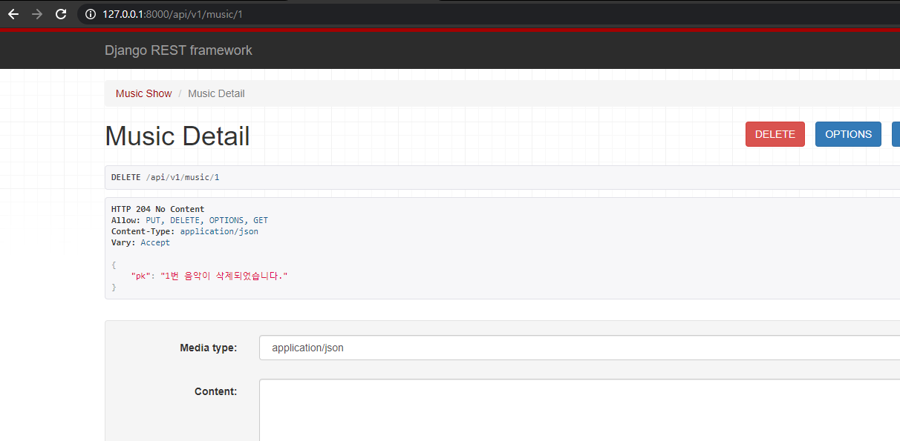

# 17_django_workshop


### Code

**views.py**

```python
from django.shortcuts import render, get_list_or_404, get_object_or_404
from .models import Artist, Music
from rest_framework.decorators import api_view
from rest_framework.response import Response
from .serializers import ArtistListSerializer, ArtistSerializer, MusicListSerializer, MusicSerializer
from rest_framework import status


# 모든 가수 id와 name 조회 / 가수 정보 생성
@api_view(['GET', 'POST'])
def artists_show(request):
    if request.method == 'GET':
        artists = get_list_or_404(Artist)
        serializer = ArtistListSerializer(artists, many=True)
        return Response(serializer.data)
    elif request.method == 'POST':
        serializer = ArtistListSerializer(data=request.data)
        if serializer.is_valid(raise_exception=True):
            serializer.save()
            return Response(serializer.data, status=status.HTTP_201_CREATED)

# 특정 가수의 모든 컬럼
@api_view(['GET'])
def artists_detail(request, artist_pk):
    artist = get_object_or_404(Artist, pk=artist_pk)
    if request.method == 'GET':
        serializer = ArtistSerializer(artist)
        return Response(serializer.data)

# 특정 가수의 음악 정보 생성
@api_view(['POST'])
def artists_music(request, artist_pk):
    artist = get_object_or_404(Artist, pk=artist_pk)
    serializer = MusicSerializer(data=request.data)
    if serializer.is_valid(raise_exception=True):
        serializer.save(artist=artist)
        return Response(serializer.data, status=status.HTTP_201_CREATED)

# 모든 음악의 id와 컬럼을 JSON으로 응답
@api_view(['GET'])
def music_show(request):
    musics = get_list_or_404(Music)
    serializer = MusicListSerializer(musics, many=True)
    return Response(serializer.data)

# 특정 음악 조회, 수정, 삭제
@api_view(['GET', 'DELETE', 'PUT'])
def music_detail(request, music_pk):
    music = get_object_or_404(Music, pk=music_pk)
    if request.method == 'GET':
        serializer = MusicSerializer(music)
        return Response(serializer.data)
    elif request.method == 'DELETE':
        music.delete()
        return Response({'pk':f'{music_pk}번 음악이 삭제되었습니다.'}, status=status.HTTP_204_NO_CONTENT)
    elif request.method == 'PUT':
        serializer = MusicSerializer(music, data=request.data)
        if serializer.is_valid(raise_exception=True):
            serializer.save()
            return Response(serializer.data, status=status.HTTP_201_CREATED)
```

**serializers.py**

```python
from rest_framework import serializers
from .models import Artist, Music

class ArtistListSerializer(serializers.ModelSerializer):
    class Meta:
        model = Artist
        fields = ('id','name',)          # id는 자동?

class MusicSerializer(serializers.ModelSerializer):
    class Meta:
        model = Music
        fields = '__all__'
        read_only_fields = ('artist',)

class ArtistSerializer(serializers.ModelSerializer):
    music_set = MusicSerializer(many=True, read_only=True)
    music_count = serializers.IntegerField(source='music_set.count', read_only=True)
    
    class Meta:
        model = Artist
        fields = '__all__'

class MusicListSerializer(serializers.ModelSerializer):
    class Meta:
        model = Music
        fields = ('id', 'title',)
```


### JSON 응답 결과

> POST man으로  해보니 `Cloud Agent Error: Can not send requests to localhost. `이렇게 돼서 서버 켜는 방식으로 응답결과 확인했습니다.

`GET api/v1/artists`



`POST api/v1/artists`



`GET api/v1/artists/<artist_pk>`



`POST api/v1/artists/<artist_pk>/music/`



`GET api/v1/music`



`GET api/v1/music/<music_pk>`



`PUT api/v1/music/<music_pk>`



`DELETE api/v1/music/<music_pk>`

