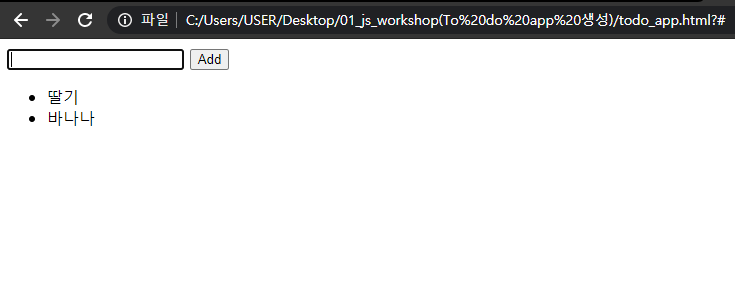

# 01_js_workshop


### 결과



### html 코드

**(선택 사항)은 빼고 만든 코드**

```html
<!DOCTYPE html>
<html lang="en">
<head>
  <meta charset="UTF-8">
  <meta http-equiv="X-UA-Compatible" content="IE=edge">
  <meta name="viewport" content="width=device-width, initial-scale=1.0">
  <title>To Do App</title>
</head>
<body>
  <form action="#">
    <input type="text">
    <button>Add</button>
  </form>
  <ul></ul>

  <script>
    // form 가져오기
    const myForm = document.querySelector('form')
    
    function addTodo (event) {
      // form태그 url로 가는 것 막기
      event.preventDefault()
      // input 가져오기
      const myInput = document.querySelector('input')
      // li 가져와서 input 값 넣기
      const li = document.createElement('li')
      li.innerText = myInput.value
      // ul 가져와서 li 넣기
      const ul = document.querySelector('ul')
      ul.appendChild(li)
      // 초기화
      event.target.reset()
    }

    myForm.addEventListener('submit', addTodo)    // 함수 아래에 써야함

  </script>
  
</body>
</html>
```


**(선택사항)을 넣으려고 했으나 실패한 코드**....

```html
<!DOCTYPE html>
<html lang="en">
<head>
  <meta charset="UTF-8">
  <meta http-equiv="X-UA-Compatible" content="IE=edge">
  <meta name="viewport" content="width=device-width, initial-scale=1.0">
  <title>To Do App</title>
</head>
<body>
  <form action="#">
    <input type="text">
    <button>Add</button>
  </form>
  <ul></ul>

  <script>
    const myForm = document.querySelector('form')
    const myInput = document.querySelector('input')

    const alertMessage = function (){
      alert('공백이 아닌 값을 입력하시요')
    }

    function addTodo (event) {
      event.preventDefault()
        
      const li = document.createElement('li')
      li.innerText = myInput.value

      const ul = document.querySelector('ul')
      ul.appendChild(li)

      event.target.reset()
    }

    if (myInput == ""){
      myForm.addEventListener('submit', alertMessage)
    }else{
      myForm.addEventListener('submit', addTodo) 
    }
  </script>
  
</body>
</html>
```


