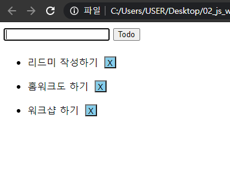
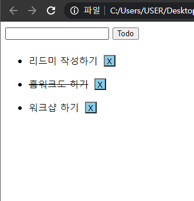

# 02_js_workshop


### 결과 사진






### Code

```javascript
<!DOCTYPE html>
<html lang="en">
<head>
  <meta charset="UTF-8">
  <meta http-equiv="X-UA-Compatible" content="IE=edge">
  <meta name="viewport" content="width=device-width, initial-scale=1.0">
  <title>Document</title>
  <style>
    .done {
      text-decoration: line-through;
    }
    .box {
      background-color: skyblue;
      height: 20px;
      width: 20px;
      margin: 10px;
      padding: 2px;
    }
  </style>
</head>
<body>
  <form action="/todos/">
    <input type="text">
    <button>Todo</button>
  </form>
  <ul></ul>

<script>
  const form = document.querySelector('form')

  function addTodo (event) {
    // 이벤트를 취소한다.
    event.preventDefault()

    // input element와 input element의 value 값을 저장한다.
    const myInput = document.querySelector('input')
    const data = myInput.value

    // li element를 생성 후 input element의 value 값을 데이터로 저장한다
    const li = document.createElement('li')
    li.innerText = data

    // ul 태그의 자식 태그로 위에서 생성한 li element를 넣는다.
    const ul = document.querySelector('ul')
    ul.append(li)

    // 삭제 버튼을 생성 후 li 태그의 자식 태그로 넣는다.
    const del = document.createElement('button')
    const delText = document.createTextNode('X')
    del.appendChild(delText)
    del.setAttribute('class', 'box')
    li.append(del)

    // 삭제 버튼을 클릭하면 해당 li element를 삭제한다
    del.addEventListener('click', function(event) {
      const delLi = del.parentNode
      delLi.parentNode.removeChild(delLi)
    })

    // li element를 클릭하면 취소선이 토글된다.
    li.addEventListener('click', function(event){
      li.classList.toggle('done')
    })
    // 데이터 작성 후 input value 초기화
    event.target.reset()
  }

  form.addEventListener('submit', addTodo)
</script>
</body>
</html>

```

