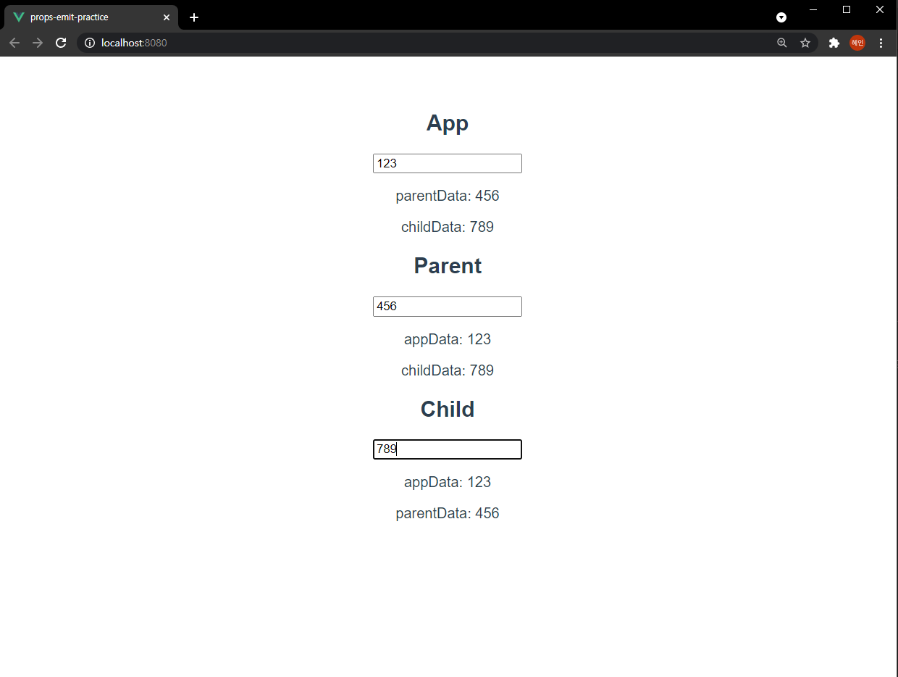

# 03_vue_practice




### Code

##### App.vue

```vue
<template>
  <div id="app">
    <h2>App</h2>
    <input type="text" v-model="appInputData">
    <p>parentData: {{ parentData }}</p>
    <p>childData: {{ childData }}</p>
    <Parent 
    :appData="appInputData"
    @child-change="onchildData"
    @parent-change="onparentData"
    />
  </div>
</template>

<script>
import Parent from './components/Parent'

export default {
  name: 'App',
  components: {
    Parent
  },
  data: function() {
    return {
      appInputData: '',
      parentData: '',
      childData: '',
    }
  },
  methods: {
    onparentData: function (text) {
      this.parentData = text 
    },
    onchildData: function (text) {
      this.childData = text 
    }
  }
}
</script>

<style>
#app {
  font-family: Avenir, Helvetica, Arial, sans-serif;
  -webkit-font-smoothing: antialiased;
  -moz-osx-font-smoothing: grayscale;
  text-align: center;
  color: #2c3e50;
  margin-top: 60px;
}
</style>

```


##### Parent.vue

```vue
<template>
  <div>
    <h2>Parent</h2>
    <input type="text" v-model="parentInputData" @input="parentChange">
    <p>appData: {{ appData }}</p>
    <p>childData: {{ childData }}</p>
    <Child 
    :appData="appData"
    :parentData="parentInputData"
    @child-change="onchildData"
    />
  </div>
</template>

<script>
import Child from './Child'

export default {
  name: 'Parent',
  components: {
    Child,
  },
  data: function() {
    return { 
      parentInputData: '',
      childData: '',
    }
  },
  props: {
    appData: {
      type: String,
      required: true
    }
  },
  methods: {
    onchildData: function (text) {
      this.childData = text 
      this.$emit('child-change', text)
    },
    parentChange: function(event) {
      this.$emit('parent-change', event.target.value)
    }
  }
}
</script>

<style>

</style>
```


##### Child.vue

```vue
<template>
  <div>
    <h2>Child</h2>
    <input type="text" @input="childChange">
    <p>appData: {{ appData }}</p>
    <p>parentData: {{ parentData }}</p>
  </div>
</template>

<script>
export default {
  name: 'Child',
  props: {
    appData: {
      type: String,
    },
    parentData: {
      type: String,
    },
  },
  methods: {
    childChange: function (event) {
      this.$emit('child-change', event.target.value)
    }
  }
}
</script>

<style>

</style>
```

