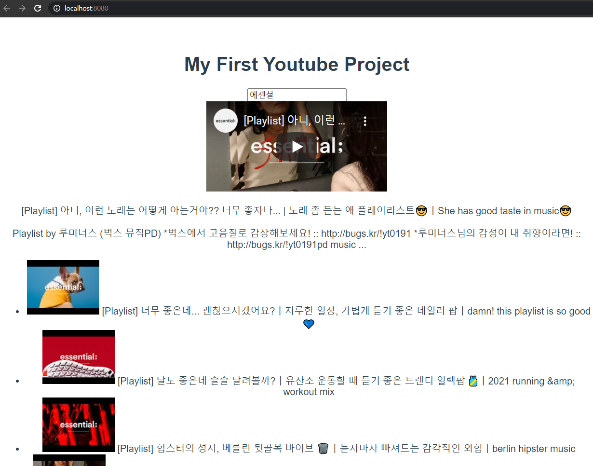

# 03_vue_workshop





### Code

##### App.vue

```vue
<template>
  <div id="app">
    <div class="container">
      <h1>My First Youtube Project</h1>
      <SearchBar 
      @input-change="onInputChange"
      />
      <Detail
      :targetVideo="targetVideo"
      />
      <VideoList
      :videos="videos"
      @get-video="getVideo"
      />
      
    </div>
  </div>
</template>

<script>
import axios from 'axios'
import SearchBar from './components/SearchBar.vue'
import Detail from './components/Detail.vue'
import VideoList from './components/VideoList.vue'


const API_KEY = process.env.VUE_APP_VUETUBE_API_KEY
const API_URL = 'https://www.googleapis.com/youtube/v3/search'

export default {
  name: 'App',
  components: {
    SearchBar,
    VideoList,
    Detail,
  },
  data: function () {
    return {
      inputValue: '',
      videos: [],
      targetVideo: '',
    }
  },
  methods: {
    onInputChange: function (inputText) {
      this.inputValue = inputText

      const params = {
        key: API_KEY,
        part: 'snippet',
        type: 'video',
        q: this.inputValue
      }

      axios.get(API_URL, { params })
      .then(res => {
        // console.log(res.data.items)
        this.videos = res.data.items
      })
      .catch(err => {
        console.log(err)
      })
    },
    getVideo: function(object) {
      this.targetVideo = object
      console.log(this.targetVideo)
    }
  }
}
</script>

<style>
#app {
  font-family: Avenir, Helvetica, Arial, sans-serif;
  -webkit-font-smoothing: antialiased;
  -moz-osx-font-smoothing: grayscale;
  text-align: center;
  color: #2c3e50;
  margin-top: 60px;
}
</style>
```


##### SearchBar.vue

```vue
<template>
  <div>
    <input @keyup.enter="onInputChange" type="text">
  </div>
</template>

<script>
export default {
  name: 'SearchBar',
  methods: {
    onInputChange: function (event) {
      this.$emit('input-change', event.target.value)
    }
  }
}
</script>
<style>
</style>
```


##### VideoList.vue

```vue
<template>
  <div>
    <ul>
      <VideoListItem 
      v-for="(video, idx) in videos" 
      :key="idx"
      :video="video" 
      @get-video="getVideo"
      />

    </ul>
  </div>
</template>

<script>
import VideoListItem from './VideoListItem'
export default {
  name: 'VideoList',
  components: {
    VideoListItem,
  },
  props: {
    videos: {
      type: Array,
      required: true,
    }
  },
  methods: {
    getVideo: function (object) {
      this.$emit('get-video', object)
    }
  }
}
</script>
<style>
</style>
```


##### VideoListItem.vue

```vue
<template>
  <li @click="getVideo">
    
    {{ video.snippet.title }}
  </li>
</template>

<script>
export default {
  name: 'VideoListItem',
  props: {
    video: {
      type: Object,
    }
  },
  computed: {
    youtubeImageSrc: function () {
      return this.video.snippet.thumbnails.default.url
    }
  },
  methods: {
    getVideo: function () {
      this.$emit('get-video', this.video)
      // console.log(this.video.snippet)
    }
  }
}
</script>

<style>

</style>
```


##### Detail.vue

```vue
<template>
  <div>
    <iframe :src="youtubeVideoSrc" frameborder="0"></iframe>
    <p>{{ targetVideo.snippet.title }}</p>
    <p>{{ targetVideo.snippet.description }}</p>
  </div>
</template>

<script>
// import _ from 'lodash'

export default {
  name:'Detail',
  props: {
    targetVideo: {
      type: Object,
      required: true
    }
  },
  computed: {
    youtubeVideoSrc: function () {
      const videoId = this.targetVideo.id.videoId
      return `https://www.youtube.com/embed/${videoId}`
    }
  },
}
</script>

<style>

</style>
```

