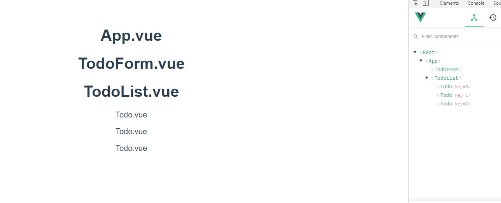

# 04_vue_workshop





##### App.vue

```vue
<template>
  <div id="app">
    <h1>App.vue</h1>
    <TodoForm/>
    <TodoList/>
  </div>
</template>

<script>
import TodoForm from './components/TodoForm.vue'
import TodoList from './components/TodoList.vue'

export default {
  name: 'App',
  components: {
    TodoForm,
    TodoList,
  }
}
</script>
```


#### Components

##### TodoForm.vue

```vue
<template>
  <div>
    <h1>TodoForm.vue</h1>
    
  </div>
</template>

<script>
export default {
  name: 'TodoForm',
}
</script>
<style>
</style>
```


##### TodoList.vue

```vue
<template>
  <div>
    <h1>TodoList.vue</h1>
    <Todo v-for="(todo, idx) in todos" :key="idx" :todo="todo"/>
  </div>
  
</template>

<script>
import Todo from '@/components/Todo'

export default {
  name: 'TodoList',
  components: {
    Todo,
  },
  data: function () {
    return {
      todos: ["Todo.vue", "Todo.vue", "Todo.vue" ]
    }
  }
}
</script>
<style>
</style>
```


##### Todo.vue

```vue
<template>
  <div>
    <p>{{ todo }}</p>
  </div>
</template>

<script>
export default {
  name: 'Todo',
  props: {
    todo: {
      type: String,
    }
  }
}
</script>
<style>
</style>
```

