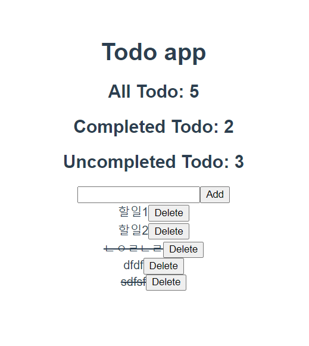

# 05_vue_workshop



### App.vue

```vue
<template>
  <div id="app">
    <h1>Todo app</h1>
    <h2>All Todo: {{ TodosCount }}</h2>
    <h2>Completed Todo: {{ completedTodosCount }}</h2>
    <h2>Uncompleted Todo: {{ uncompletedTodosCount }}</h2>
    <TodoForm/>
    <TodoList/>
  </div>
</template>

<script>
import { mapGetters } from 'vuex'
import TodoForm from '@/components/TodoForm'
import TodoList from '@/components/TodoList'

export default {
  name: 'App',
  components: {
    TodoForm,
    TodoList,
  },
  computed: {
    // completedTodosCount : function() {
    //   return this.$store.getters.completedTodosCount
    // }
    ...mapGetters([
      'TodosCount',
      'completedTodosCount',
      'uncompletedTodosCount',
    ])
  }
}
</script>
<style>
#app {
  font-family: Avenir, Helvetica, Arial, sans-serif;
  -webkit-font-smoothing: antialiased;
  -moz-osx-font-smoothing: grayscale;
  text-align: center;
  color: #2c3e50;
  margin-top: 60px;
}
</style>
```


### Store > index.js

```javascript
import Vue from 'vue'
import Vuex from 'vuex'
import createPersistedState from "vuex-persistedstate"
// 위에 거는 새로고침 했을 때 사라지는 거 안하게끔 하는 코드 + plugins 넣기 (로컬스토리지 저장됨)

Vue.use(Vuex)

export default new Vuex.Store({
  plugins: [
    createPersistedState(),
  ],
  state: {
    todos: [
      {
        title: '할일1',
        completed: false,
      },
      {
        title: '할일2',
        completed: false,
      }
    ]
  },
  // mutations는 데이터 조작 역할, 첫번째 인자로 항상 state를 받음  + actions의 commit으로 mutation을 호출하게됨
  mutations: {
    CREATE_TODO: function (state, todoItem) {
      // console.log(state)
      state.todos.push(todoItem)
    },
    DELETE_TODO: function (state, todoItem) {
      // console.log(state)
      // 1. todoitem이 첫번째로 만나는 요소의 인덱스를 가져옴
      const index = state.todos.indexOf(todoItem)
      // 2. 해당 인덱스 1개만 삭제하고 나머지 요소를 토대로 새로운 배열 생성
      state.todos.splice(index, 1)    // 이렇게만 해도 새로운 배열이 생성됨
    },
    UPDATE_TODO: function (state, todoItem) {
      // console.log(state)
      // console.log(todoItem)
      state.todos = state.todos.map((todo) => {
        if (todo === todoItem) {
          // return {title: todoItem.title, completed: !todo.completed}
          return { ...todo, completed: !todo.completed}
        }
        return todo
      })
       
    }
  },
  actions: {
    createTodo: function ({ commit }, todoItem) {
      commit('CREATE_TODO', todoItem)
      // context.commit('CREATE_TODO', todoItem)
    },
    deleteTodo: function ({ commit }, todoItem) {
      commit('DELETE_TODO', todoItem)
    },
    updateTodo: function ({ commit }, todoItem) {
      commit('UPDATE_TODO', todoItem)
    }
    // crateTodo: function (context, todoItem) {
    //   context.commit('CREATE_TODO', todoItem)
    // }
  },
  // 완료된 투두개수, 진행중인 투두개수 위함
  getters: {
    completedTodosCount: function (state) {
      return state.todos.filter((todo) => {
        return todo.completed === true
      }).length
    },
    uncompletedTodosCount: function (state) {
      return state.todos.filter((todo) => {
        return todo.completed === false
      }).length
    },
    TodosCount: function (state) {
      return state.todos.length
    }
  },
  modules: {
  }
})
```


#### Components > TodoForm.vue

```vue
<template>
  <div>
    <!-- 엔터누르거나 클릭 누를 때 할일이 추가됨 -->
    <input type="text" v-model="todoTitle" @keyup.enter="createTodo">
    <button @click="createTodo">Add</button>
  </div>
</template>

<script>
export default {
  name: 'TodoForm',
  data: function () {
    return {
      todoTitle: '',
    }
  },
  methods: {
    createTodo: function () {
      const todoItem ={
        title: this.todoTitle,
        completed: false,
      }
      // todoItem의 제목을 공백제거했을 떄도 있다면
      if (todoItem.title.trim()) {
      // this.$store.commit('CREATE_TODO', todoItem)
        this.$store.dispatch('createTodo', todoItem)
      }
      this.todoTitle = ''
      // console.log('Todo생성')
    }
  }
}
</script>
<style>
</style>
```


#### Components > TodoList.vue

```vue
<template>
  <div>
    <!-- <TodoListItem v-for="(todo, idx) in $store.state.todos" :key="idx"/> -->
    <TodoListItem 
      v-for="(todo, idx) in todos" 
      :key="idx"
      :todo="todo"
    />
    <!-- :todo="todo" 에서 props에서 받는 이름은 왼쪽 todo 인것 -->
  </div>
</template>

<script>
import { mapState } from 'vuex'
import TodoListItem from '@/components/TodoListItem'


export default {
  name: 'TodoList',
  components: {
    TodoListItem,
  },
  computed: {
    // todos: function () {
    //   return this.$store.state.todos
    // },
    // mapstate의 역할 : computed와 state를 연결, 매핑
    // mapGetters의 역할 : Computed와 getters 매핑
    ...mapState ([
      'todos',
    ])
  }

}

// Component
// 1. 불러온다
// 2. 불러온 걸 등록한다
// 3. 등록한 걸 사용한다.
</script>
<style>
</style>
```


#### Components > TodoListItem.vue

```vue
<template>
  <div>
    <!-- this.todo 때문에 todo가 들어가야함 -->
    <span 
    @click="updateTodo(todo)"
    :class="{ completed: todo.completed }"
    >{{ todo.title }}</span>
    <button @click="deleteTodo(todo)">Delete</button>
    <!-- completed class 값을 todo의 completed 값에 따라서 속성부여한다.(False면 안들어가게) -->
  </div>
</template>

<script>
import { mapActions } from 'vuex'
export default {
  name: 'TodoListItem',
  props: {
    todo: {
      type: Object,
    }
  },
  methods: {
    // deleteTodo: function () {
    //   // console.log('Todo 삭제')
    //   this.$store.dispatch('deleteTodo', this.todo)
    // },
    // updateTodo: function () {
    //   // console.log('수정!')    // console에 나오는지 확인
    //   this.$store.dispatch('updateTodo', this.todo)
    // }
    ...mapActions([
      'deleteTodo',
      'updateTodo',
    ])
  }
}
</script>
<style>
  .completed {
    text-decoration: line-through;
  }
</style>
```

