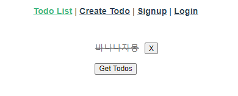

# 06_vue_workshop


####  사전 제공된 django와 vue 프로젝트를 통해 Todo를 가져오는 과정에서 발생하는 CORS 관련 이슈를 해결하고 Todo의 작성/수정(취소선 토글)/삭제를 구현하시오.


##### 1. CORS 관련 이슈 해결

```python
# settings.py
INSTALLED_APPS = [
    ...
    'corsheaders',
    ...
]

MIDDLEWARE = [
    ...
    'corsheaders.middleware.CorsMiddleware',
    ...
]

# 2. 모든 Origin 허용
CORS_ALLOW_ALL_ORIGINS = True
```

주석을 해지한다.


#### 2. Todo의 작성 / 수정 / 삭제 구현

```vue
// 삭제
deleteTodo: function (todo) {
      axios({
        method: 'delete',
        url: `http://127.0.0.1:8000/todos/${todo.id}/`,
        headers: this.setToken()
      })
        .then((res) => {
          console.log(res)
          this.getTodos()
        })
        .catch((err) => {
          console.log(err)
        })
    },

```

this.getTodos()의 주석을 해지한다.

```vue
// 수정
updateTodoStatus: function (todo) {
      const todoItem = {
        ...todo,
        completed: !todo.completed
      }

      axios({
        method: 'put',
        url: `http://127.0.0.1:8000/todos/${todo.id}/`,
        data: todoItem,
      })
        .then((res) => {
          console.log(res)
          todo.completed = !todo.completed
          console.log(todo)
        })
      },
    },
```



