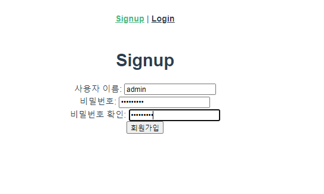
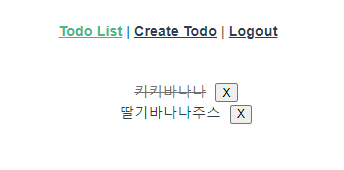

# 07_vue_workshop






```
pip install djangorestframework-jwt
```

### Server

##### accounts > urls.py

```python
from rest_framework_jwt.views import obtain_jwt_token

urlpatterns = [
    path('signup/', views.signup),
    path('api-token-auth/', obtain_jwt_token),
]
```

위 코드를 추가한다.

##### accounts > serializers.py

```python
from rest_framework import serializers
from django.contrib.auth import get_user_model

User = get_user_model()

class UserSerializer(serializers.ModelSerializer):
    password = serializers.CharField(write_only=True)
    class Meta:
        model = User
        fields = ('username', 'password')
```

위 코드를 추가한다. 

##### accounts > views.py

```python
from .serializers import UserSerializer

@api_view(['POST'])
def signup(request):
	#1-1. Client에서 온 데이터를 받아서
    password = request.data.get('password')
    password_confirmation = request.data.get('passwordConfirmation')
		
	#1-2. 패스워드 일치 여부 체크
    if password != password_confirmation:
        return Response({'error': '비밀번호가 일치하지 않습니다.'}, status=status.HTTP_400_BAD_REQUEST)
		
	#2. UserSerializer를 통해 데이터 직렬화
    serializer = UserSerializer(data=request.data)
    
	#3. validation 작업 진행 -> password도 같이 직렬화 진행
    if serializer.is_valid(raise_exception=True):
        user = serializer.save()
        #4. 비밀번호 해싱 후 
        user.set_password(request.data.get('password'))
        user.save()
    # password는 직렬화 과정에는 포함 되지만 → 표현(response)할 때는 나타나지 않는다.
    return Response(serializer.data, status=status.HTTP_201_CREATED)
```

주석을 해지한다. 

##### todos > views.py

```python
from django.shortcuts import get_object_or_404
from rest_framework import status
from rest_framework.response import Response
from rest_framework.decorators import api_view

from rest_framework.decorators import authentication_classes, permission_classes
from rest_framework.permissions import IsAuthenticated
from rest_framework_jwt.authentication import JSONWebTokenAuthentication

from .serializers import TodoSerializer
from .models import Todo


@api_view(['GET', 'POST'])
@authentication_classes([JSONWebTokenAuthentication])
@permission_classes([IsAuthenticated])
def todo_list_create(request):
    if request.method == 'GET':
        # todos = Todo.objects.all()
        serializer = TodoSerializer(request.user.todos, many=True)
        return Response(serializer.data)

    elif request.method == 'POST':
        serializer = TodoSerializer(data=request.data)
        if serializer.is_valid(raise_exception=True):
            serializer.save(user=request.user)
            return Response(serializer.data, status=status.HTTP_201_CREATED)

@api_view(['PUT', 'DELETE'])
@authentication_classes([JSONWebTokenAuthentication])
@permission_classes([IsAuthenticated])
def todo_update_delete(request, todo_pk):
    todo = get_object_or_404(Todo, pk=todo_pk)
    if not request.user.todos.filter(pk=todo_pk).exists():
        return Response({'detail': '권한이 없습니다.'}, status=status.HTTP_403_FORBIDDEN)


    if request.method == 'PUT':
        serializer = TodoSerializer(todo, data=request.data)
        if serializer.is_valid(raise_exception=True):
            serializer.save()
            return Response(serializer.data)

    elif request.method == 'DELETE':
        todo.delete()
        return Response({ 'id': todo_pk }, status=status.HTTP_204_NO_CONTENT)

```


### Client

##### src > views > App.vue

```vue
<template>
  <div id="app">
    <div id="nav">
      <span v-if="isLogin">
        <router-link :to="{ name: 'TodoList' }">Todo List</router-link> | 
        <router-link :to="{ name: 'CreateTodo' }">Create Todo</router-link> |
        <router-link @click.native="logout" to="#">Logout</router-link>
      </span>
      <span v-else>
        <router-link :to="{ name: 'Signup' }">Signup</router-link> |
        <router-link :to="{ name: 'Login' }">Login</router-link> 
      </span>
    </div>
    <router-view @login="isLogin = true"/>
  </div>
</template>

<script>
export default {
  name: 'App',
  data: function () {
    return {
      isLogin: false,
    }
  },
  methods: {
    logout: function() {
      this.isLogin = false
      localStorage.removeItem('jwt')
      this.$router.push({name: 'Login'})
    }

  },
  created: function () {
    const token = localStorage.getItem('jwt')
    if (token) {
      this.isLogin = true
    }
  }
}
</script>
```

##### src > views > accounts > Signup.vue

```vue
<template>
  <div>
    <h1>Signup</h1>
    <div>
      <label for="username">사용자 이름: </label>
      <input type="text" id="username" v-model="credentials.username">
    </div>
    <div>
      <label for="password">비밀번호: </label>
      <input type="password" id="password" v-model="credentials.password">
    </div>
    <div>
      <label for="passwordConfirmation">비밀번호 확인: </label>
      <input type="password" id="passwordConfirmation" v-model="credentials.passwordConfirmation">
    </div>
    <button @click="signup(credentials)">회원가입</button>
  </div>
</template>

<script>
import axios from 'axios'

// const SERVER_URL = process.env.VUE_APP_SERVER_URL

export default {
  name: 'Signup',
  data: function () {
    return {
      credentials: {
        username: null,
        password: null,
        passwordConfirmation: null,
      }
    }
  },
  methods: {
    signup: function () {
      axios({
        method: 'post',
        url: 'http://127.0.0.1:8000/accounts/signup/',
        data: this.credentials,
      })
        .then(res => {
          console.log(res)
          this.$router.push({ name: 'Login' })
        })
        .catch(err => {
          console.log(err)
        })
    }
  }
}
</script>
```

##### todos > TodoList.vue

```vue
<template>
  <div>
    <ul>
      <li v-for="(todo, idx) in todos" :key="idx">
        <span @click="updateTodoStatus(todo)" :class="{ completed: todo.completed }">{{ todo.title }}</span>
        <button @click="deleteTodo(todo)" class="todo-btn">X</button>
      </li>
    </ul>
    <!-- <button @click="getTodos">Get Todos</button> -->
  </div>
</template>

<script>
import axios from 'axios'

export default {
  name: 'TodoList',
  data: function () {
    return {
      todos: [],
    }
  },
  methods: {
    setToken: function() {
      const token = localStorage.getItem('jwt')
      const config = {
        Authorization: `JWT ${token}`
      }
      return config
    },
    getTodos: function () {
      axios({
        method: 'get',
        url: 'http://127.0.0.1:8000/todos/',
        headers: this.setToken()
      })
        .then((res) => {
          console.log(res)
          this.todos = res.data
        })
        .catch((err) => {
          console.log(err)
        })
    },
    deleteTodo: function (todo) {
      axios({
        method: 'delete',
        url: `http://127.0.0.1:8000/todos/${todo.id}/`,
        headers: this.setToken()
      })
        .then((res) => {
          console.log(res)
          this.getTodos()
        })
        .catch((err) => {
          console.log(err)
        })
    },
    updateTodoStatus: function (todo) {
      const todoItem = {
        ...todo,
        completed: !todo.completed
      }
      // DB에 적용하기 위해 
      axios({
        method: 'put',
        url: `http://127.0.0.1:8000/todos/${todo.id}/`,
        data: todoItem,
        headers: this.setToken(),
      })
        .then((res) => {
          console.log(res)
          todo.completed = !todo.completed
          console.log(todo)
        })
      },
    },
    // vue instance 생성되자마자 실행됨
  created: function () {
    if (localStorage.getItem('jwt')) {
      this.getTodos()
    } else {
      this.$router.push({name: 'Login'})
    }
  }
}
</script>

<style scoped>
  .todo-btn {
    margin-left: 10px;
  }

  .completed {
    text-decoration: line-through;
    color: rgb(112, 112, 112);
  }
</style>

```


