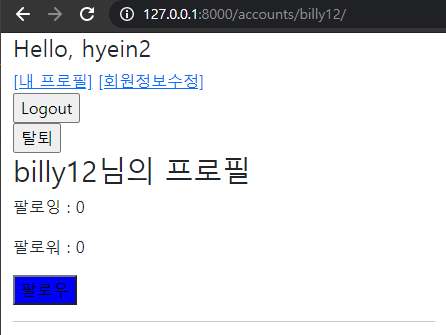
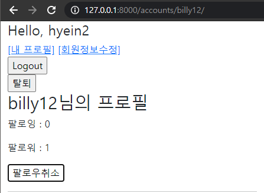

# 04_js_practice






### Code

**profile.html**

```javascript



  <h1>{{ person.username }}님의 프로필</h1>
  
    <div>
      <div>
        <p>팔로잉 : {{ person.followings.all|length }}</p>
        <p id = "follow-count-{{ person.pk }}">팔로워 : {{ followers|length }}</p>
      </div>
      
        <div>
          <form class = 'follow-form' data-user-id="{{ person.pk }}">
            
            
              <button id = "follow-{{ person.pk }}">언팔로우</button>
            
              <button id = "follow-{{ person.pk }}">팔로우</button>
            
          
          </form>
        </div>
      
    </div>
  
  
  <hr>
  <h2>{{ person.username }}'s 게시글</h2>
  
    <div>{{ article.title }}</div>
  
  <hr>
  <h2>{{ person.username }}'s 댓글</h2>
  
    <div>{{ comment.content }}</div>
  
  <hr>
  <h2>{{ person.username }}'s likes</h2>
  
    <div>{{ article.title }}</div>
  
  <hr>

  <a href="">[Back]</a>

   javascript 코드 
  <script src="https://cdn.jsdelivr.net/npm/axios/dist/axios.min.js"></script>
  <script>
    const form = document.querySelector('.follow-form')
    const csrftoken = document.querySelector('[name=csrfmiddlewaretoken]').value

    form.addEventListener('submit', function (event) {
      event.preventDefault()
      const userId = event.target.dataset.userId
      // console.log(userId)
      // console.log(csrftoken)

      axios ({
        method: 'post',
        url: `http://127.0.0.1:8000/accounts/${userId}/follow/`,
        headers: {'X-CSRFToken':csrftoken}
      })
      .then(response => {
        // console.log(response)
        const following = response.data.following
        const count = response.data.count
        const followBtn = document.querySelector(`#follow-${userId}`)
        const followCount = document.querySelector(`#follow-count-${userId}`)

        if (following) {
          followBtn.innerText = '팔로우취소'
          followBtn.style.backgroundColor = 'white'
        } else {
          followBtn.innerText = '팔로우'
          followBtn.style.backgroundColor = 'blue'
        }
        followCount.innerText = `팔로워 : ${count}`
      })
    })
  </script>

```

**views.py**

```python
@require_POST
def follow(request, user_pk):
    if request.user.is_authenticated:
        # 팔로우 받는 사람
        you = get_object_or_404(get_user_model(), pk=user_pk)
        me = request.user
        if you != me:           # 나 자신은 팔로우 할 수 없다

            if you.followers.filter(pk=me.pk).exists():
            # if request.user in you.followers.all():
                you.followers.remove(me)        # 팔로우 끊음
                following = False
            else:
                you.followers.add(me)           # 팔로우 신청
                following = True
        # you == me일 때는?
            follow_status = {
                'following' : following,
                'count' : you.followers.count()
            }
        return JsonResponse(follow_status)
    return redirect('accounts:login')

```

