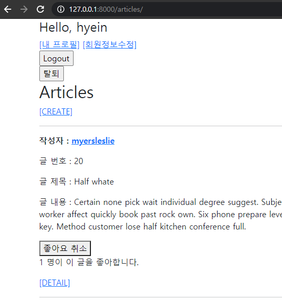

# 04_js_workshop



### Code

**index.html**

- 좋아요 여부에 따라 아이콘 변경
- 좋아요를 누른 사용자 수가 반영
- 비로그인 상태에서 좋아요 접근 시 로그인 페이지로 감

```javascript



  <h1>Articles</h1>
  
    <a href="">[CREATE]</a>
  
    <a href="">[새 글을 작성하려면 로그인하세요.]</a>
  
  <hr>
  
    <p>
      <b>작성자 : <a href="">{{ article.user }}</a></b>
    </p>
    <p>글 번호 : {{ article.pk }}</p>
    <p>글 제목 : {{ article.title }}</p>
    <p>글 내용 : {{ article.content }}</p>
    <div>
      <form class="like-form" data-article-id = "{{ article.pk }}">
        
        
          <button id="like-{{ article.pk }}">좋아요 취소</button>
        
          <button id="like-{{ article.pk }}">좋아요</button>
        
      </form>
    </div>
    <p id = "like-count-{{ article.pk }}">{{ article.like_users.all|length }}명이 이 글을 좋아합니다.</p>
    <a href="">[DETAIL]</a>
    <hr>
  
  <script src="https://cdn.jsdelivr.net/npm/axios/dist/axios.min.js"></script>
  <script>
    const forms = document.querySelectorAll('.like-form')
    const csrftoken = document.querySelector('[name=csrfmiddlewaretoken]').value

    forms.forEach(form => {
      form.addEventListener('submit', function(event) {
        event.preventDefault()
        // console.log(event)
        const articleId = event.target.dataset.articleId
        // console.log(articleId)
        axios ({
          method: 'post',
          url: `http://127.0.0.1:8000/articles/${articleId}/likes/`,
          headers: {'X-CSRFToken':csrftoken},
        })
        .then(response => {
          const like = response.data.like
          const count = response.data.count

          const likeButton = document.querySelector(`#like-${articleId}`)
          const likeCount = document.querySelector(`#like-count-${articleId}`)
          if (like) {
            likeButton.innerText = '좋아요 취소'
          } else {
            likeButton.innerText = '좋아요'
          }
          likeCount.innerText = `${count} 명이 이 글을 좋아합니다.`
        })
        .catch(err => {
          if (err.response.status === 401) {
            location.href = 'http://127.0.0.1:8000/accounts/login'
          }
        })
      })
    })
  
  </script>


```

**views.py**

```python
@require_POST
def likes(request, article_pk):
    if request.user.is_authenticated:
        article = get_object_or_404(Article, pk=article_pk)

        if article.like_users.filter(pk=request.user.pk).exists():
        # if request.user in article.like_users.all():
            # 좋아요 취소
            article.like_users.remove(request.user)
            like = False
        else:
            # 좋아요 누름
            article.like_users.add(request.user)
            like = True
        like_status = {
            'like' : like,
            'count' : article.like_users.count(),
        }
        return JsonResponse(like_status)
    return HttpResponse(status=401)
```

