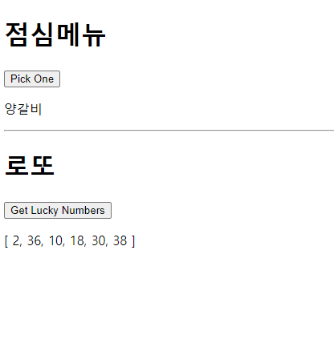
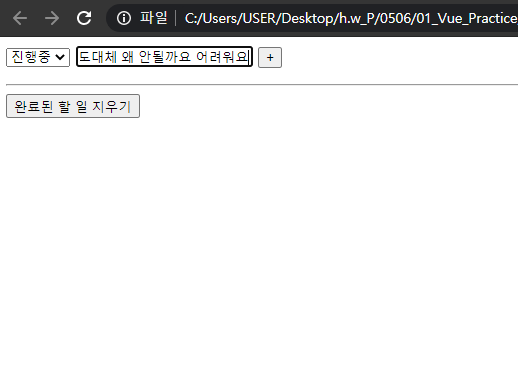

# 01_Vue_Workshop



### Code

```vue
<!DOCTYPE html>
<html lang="en">
<head>
  <meta charset="UTF-8">
  <meta http-equiv="X-UA-Compatible" content="IE=edge">
  <meta name="viewport" content="width=device-width, initial-scale=1.0">
  <title>Document</title>
</head>
<body>
  <div id="app">
    <h1>점심메뉴</h1>
    <button v-on:click="pickOne">Pick One</button>
    <p>{{ LunchMenu }}</p>
    <hr>

    <h1>로또</h1>
    <button v-on:click="getLuckyNumbrs">Get Lucky Numbers</button>
    <p>{{ LuckyNumbers }}</p>

    
  </div>
  <script src="https://cdn.jsdelivr.net/npm/vue/dist/vue.js"></script>
  <script src="https://cdnjs.cloudflare.com/ajax/libs/lodash.js/4.17.20/lodash.min.js"></script>
  <script>
    const app = new Vue({
      el: '#app',
      data: {
        Lunch: ['초밥', '코다리찜', '순두부찌개', '양꼬치', '돈까스', '라멘', '텐동', '양갈비'],
        LunchMenu: '',
        LuckyNumbers: [],
      },
      methods: {
        pickOne: function() {
          this.LunchMenu = _.sample(this.Lunch)
        },
        getLuckyNumbrs: function() {
          const numbers = _.range(1, 46)
          this.LuckyNumbers = _.sampleSize(numbers, 6)
        }
      }
    })
  </script>
</body>
</html>
```

두 앱 각자 버튼을 click했을 때의 method를 정의해주었다. 정말 Vue는 너무 신기하다!




```html
<!DOCTYPE html>
<html lang="en">
<head>
  <meta charset="UTF-8">
  <meta http-equiv="X-UA-Compatible" content="IE=edge">
  <meta name="viewport" content="width=device-width, initial-scale=1.0">
  <title>Document</title>
</head>
<body>

  <div id="app">
    <select v-model="selected">
      <option value="all">전체</option>
      <option value="progress">진행중</option>
      <option value="finished">완료</option>
    </select>

    <input type="text" v-model="content">
    <button v-on:click="addTodo">+</button>
    <ul>
      <li v-for="todo in todoList" :key="todo.date">
        <input type="checkbox" :checked="todo.isCompleted" @click="toggleTodo(todo)">
        <span :class="{ completed: todo.isCompleted }">{{ todo.content }}</span>
      </li>
    </ul>
    <hr>
    <button v-on:click="deleteTodo">완료된 할 일 지우기</button>

  </div>

  <script src="https://cdn.jsdelivr.net/npm/vue/dist/vue.js"></script>
  <script>
    const app = new Vue({
      el: '#app',
      data: {
        content: '',
        todos: [],
        status: 'all',
      },
      methods: {
        addTodo: function() {
          const todo = {
            content: this.content,
            isCompleted: false,
            date: new Date().getTime(),
          }
          this.todos.push(todo)

        },
        toggleTodo: function (todo) {
          todo.isCompleted = !todo.isCompleted
        }
      },
      computed: {
        todoList: function() {
          return this.todos.filter(todo => {
            if (this.status === 'progress') {
              return !todo.isCompleted
            }
            if (this.status === 'completed') {
              return todo.isCompleted
            }
            return true
          })
        }
      }
    }
    
    )
  </script>
</body>
</html>
```

잘 모르겠어서 vue에 올라온 파일을 참고해서 했습니다.. 그런데도 추가와 삭제 등등 되지 않는 상태입니다! 코드를 참고했으나 이해가 안되는 코드들이 있어서 그 부분은 우선 보류했습니다...😢

to do list는 여기까지 해서 제출하겠습니다..

(하지만 주말에 다시 한번 도전..!)


