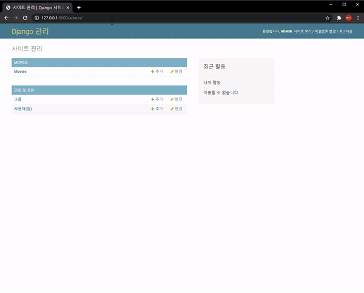
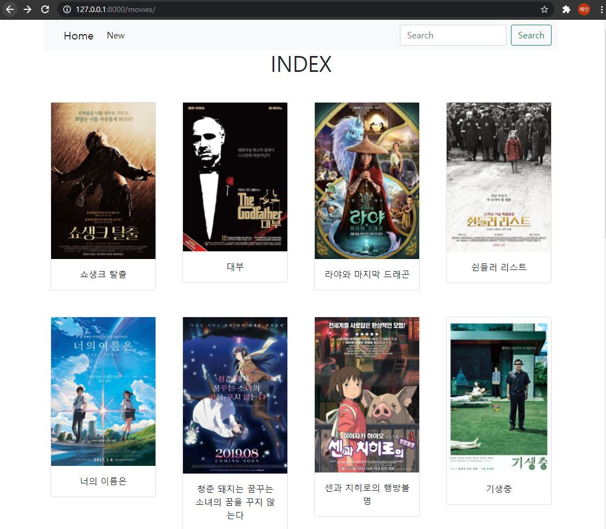
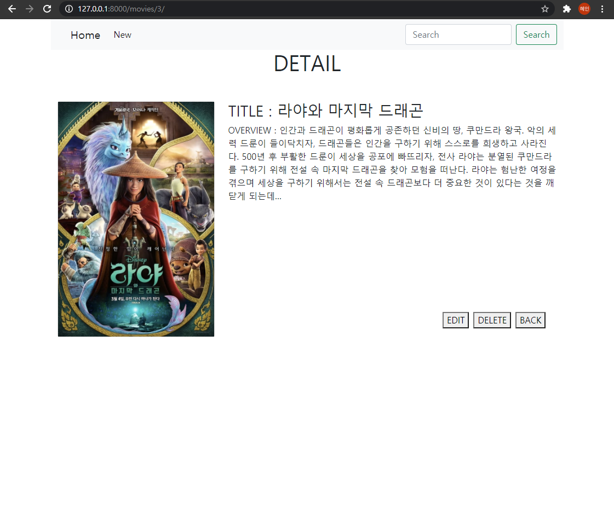
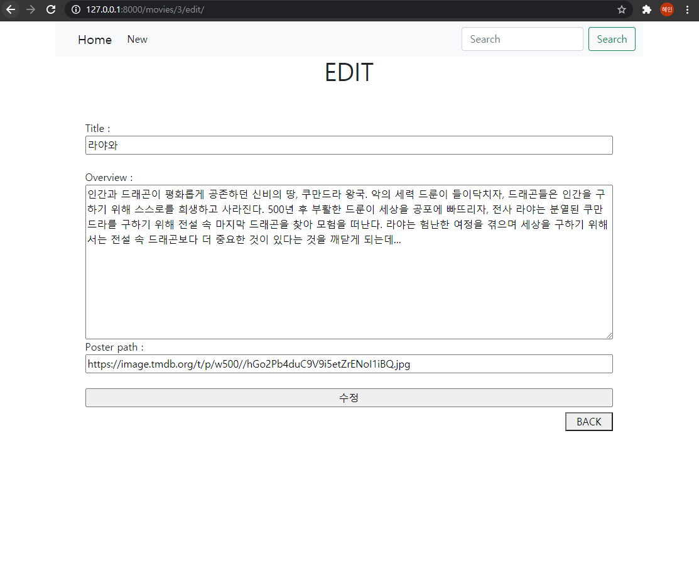
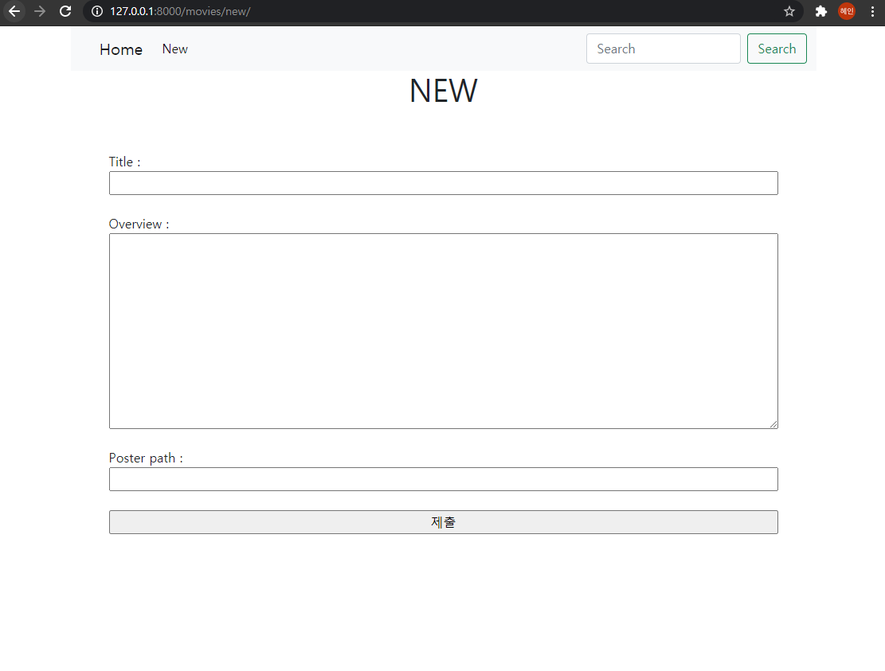
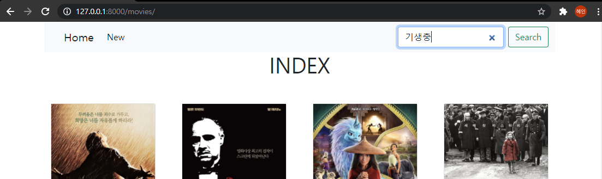
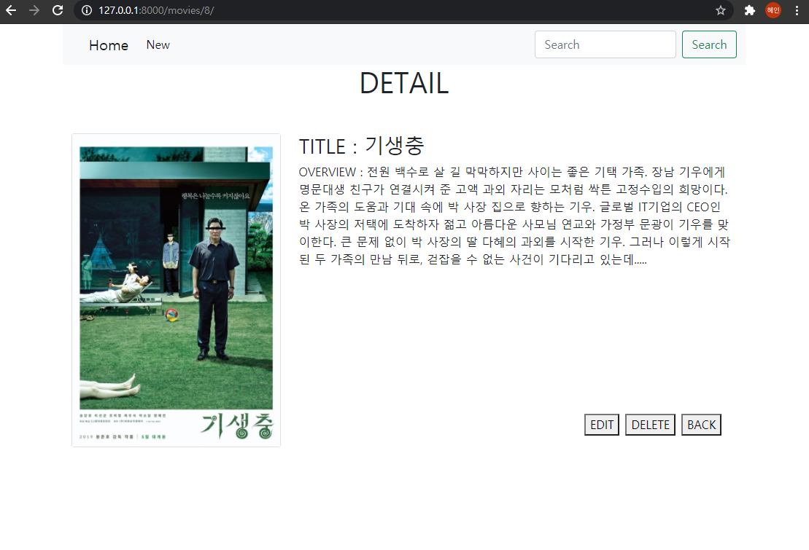
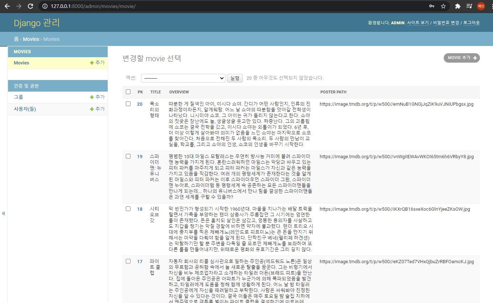
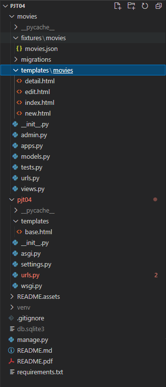

# pjt 04_프레임워크 기반 웹페이지 구현


#### Goal

> 데이터를 생성, 조회, 수정, 삭제 할 수 있는 Web Application 제작
>
> Python Web Framework 를 통한 데이터 조작
>
> Object Relational Mapping에 대한 이해
>
> 관리자 페이지를 통한 관리


#### 준비사항

> 언어
>
> Python 3.8+
>
> Django 3.1x
>
> 도구
>
> vsCode
>
> Chrome Browser


#### 결과화면

##### - CRUD


##### - Admin



##### 1. 전체 영화 목록 조회



##### 2. 단일 영화 상세 조회

영화 제목을 누르면 상세 페이지로 이동한다.

수정, 삭제, 홈화면으로 돌아가기 기능을 할 수 있다. 



##### 3. 단일 영화 수정

단일 영화 상세 조회 페이지에서 EDIT을 누르면 수정 페이지로 이동한다.



##### 4. 새로운 영화 작성 Form

Nav바 상단에 New를 누르면 새로운 영화를 작성할 수 있는 Form이 나온다.



##### 5. 영화 제목으로 영화 상세 정보 찾기

SEARCH에 영화 제목 입력시 영화 제목에 맞는 상세 페이지로 이동한다.






##### 6. admin 페이지



##### 7. 프로젝트 구조

pjt04는 프로젝트 디렉토리이고, movies는 application 디렉토리이다. 




----------------

#### Code

#### [ pjt04 ]

##### 1. settings.py

INSTALLED_APPS 에 movies를 추가하고, DIRS에 [BASE_DIR / 'pjt04' / 'templates']로 경로 설정을 해주었다. LANGUAGE_CODE는 Ko-kr로 바꿔주었다.

##### 2. urls.py

```python
from django.contrib import admin
from django.urls import path, include

urlpatterns = [
    path('admin/', admin.site.urls),
    path('movies/', include('movies.urls')),
]
```

movies 경로로 들어오는 url들을 include로 해주었다.

##### 3. templates / base.html

```python
<!DOCTYPE html>
<html lang="en">
<head>
  <meta charset="UTF-8">
  <meta http-equiv="X-UA-Compatible" content="IE=edge">
  <meta name="viewport" content="width=device-width, initial-scale=1.0">
  <link href="https://cdn.jsdelivr.net/npm/bootstrap@5.0.0-beta2/dist/css/bootstrap.min.css" rel="stylesheet" integrity="sha384-BmbxuPwQa2lc/FVzBcNJ7UAyJxM6wuqIj61tLrc4wSX0szH/Ev+nYRRuWlolflfl" crossorigin="anonymous">
  <title>Document</title>
</head>
<body>
  <div class="container">
    <nav class="navbar navbar-expand-lg navbar-light bg-light sticky-top">
      <div class="container-fluid">
        <a class="navbar-brand ms-4" href="">Home</a>
        <button class="navbar-toggler" type="button" data-bs-toggle="collapse" data-bs-target="#navbarSupportedContent" aria-controls="navbarSupportedContent" aria-expanded="false" aria-label="Toggle navigation">
          <span class="navbar-toggler-icon"></span>
        </button>
        <div class="collapse navbar-collapse" id="navbarSupportedContent">
          <ul class="navbar-nav me-auto mb-2 mb-lg-0">
            <li class="nav-item">
              <a class="nav-link active" aria-current="page" href="">New</a>
            </li>
          </ul>
          <form action="" method="GET" class="d-flex">
            <input class="form-control me-2" type="search" placeholder="Search" aria-label="Search" name="title">
            <button class="btn btn-outline-success" type="submit">Search</button>
          </form>
        </div>
      </div>
    </nav>
    
    
  </div>
  
  <script src="https://cdn.jsdelivr.net/npm/bootstrap@5.0.0-beta2/dist/js/bootstrap.bundle.min.js" integrity="sha384-b5kHyXgcpbZJO/tY9Ul7kGkf1S0CWuKcCD38l8YkeH8z8QjE0GmW1gYU5S9FOnJ0" crossorigin="anonymous"></script>
</body>
</html>
```

htm l기본 구조와 block을 넣어주고, 추가적으로 Bootstrap에서 Navbar 코드를 가져와 Home과 New를 넣어주었다. 

이때 Home은 index url로, New는 new url로 연결하고 Navbar에 sticky top 클래스를 넣어 스크롤을 내려도 고정되게 하였다. 

Search에는 ```action=""```  form의 데이터를 넘겨줄 url을 지정하였고, input태그에 ```name="title"``` title이라는 이름을 붙여 넘겨주도록 하였다. 

#### [ movies ]

##### 1. models.py

```python
from django.db import models

class Movie(models.Model):
    title = models.CharField(max_length=100)
    overview = models.TextField()
    poster_path = models.CharField(max_length=500)

    def __str__(self):
        return self.title
```

title, overview, poster_path를 넣어 스키마를 만들어준다.

##### 2. urls.py

```python
from django.urls import path
from . import views

app_name = 'movies'
urlpatterns = [
    path('', views.index, name='index'),
    path('<int:pk>/', views.detail, name='detail'),
    path('new/', views.new, name='new'),
    path('create/', views.create, name='create'),
    path('<int:pk>/edit/', views.edit, name='edit'),
    path('<int:pk>/update/', views.update, name='update'),
    path('<int:pk>/delete/', views.delete, name='delete'),
    path('search/', views.search, name='search'),
]
```

index, detail, new, create, edit, update, delete, search url을 만들어주었고, 이때 create과 update는 DB 저장을 위한 url이며 delete는 DB에서 삭제를 위한 url이다. 또한 serach는 title로 넘어온 영화제목과 일치하는 영화를 찾아 detail url로 연결해주는 것이다. 

##### 3. views.py

```python
from django.shortcuts import render, redirect
from .models import Movie

def index(request):
    movies = Movie.objects.all()
    context = {
        'movies': movies,
    }
    return render(request, 'movies/index.html', context)

def detail(request, pk):
    movie = Movie.objects.get(pk=pk)
    context = {
        'movie': movie,
    }
    return render(request, 'movies/detail.html', context)

def new(request):
    return render(request, 'movies/new.html')

def create(request):
    movie = Movie()
    movie.title = request.POST.get('title')
    movie.overview = request.POST.get('overview')
    movie.poster_path = request.POST.get('poster_path')
    movie.save()
    return redirect('movies:detail', movie.pk)

def edit(request, pk):
    movie = Movie.objects.get(pk=pk)
    context = {
        'movie': movie,
    }
    return render(request, 'movies/edit.html', context)

def update(request, pk):
    movie = Movie.objects.get(pk=pk)
    movie.title = request.POST.get('title')
    movie.overview = request.POST.get('overview')
    movie.poster_path = request.POST.get('poster_path')
    movie.save()
    return redirect('movies:detail', movie.pk)

def delete(request, pk):
    movie = Movie.objects.get(pk=pk)
    if request.method == 'POST':
        movie.delete()
        return redirect('movies:index')
    else:
        return redirect('movies:detail', movie.pk)

def search(request):
    movie = Movie.objects.get(title=request.GET.get('title'))
    return redirect('movies:detail', movie.pk)

```

index는 DB에 저장된 영화들을 모두 가져와 index.html로 넘겨준다. 

detail은 넘어온 pk 와 일치하는 movie를 찾아 detail.html로 넘겨준다.

new는 new.html로 리턴해 new.html에서 입력 값을 받고 거기서 저장을 위한 create url로 넘겨준다.

create는 Movie 클래스에 movie 인스턴스 객체를 만들어주고 ```movie.title = request.POST.get('title')``` 로 넘어온 title을 DB에 넣어준다. 이때 보내고 받을 때 POST method를 사용하여 url에 그 내용이 보이지 않도록 한다.

edit은 넘어온 pk에 맞는 movie를 가져와 edit.html로 넘겨준다.

update은 넘어온 pk와 일치하는 movie를 찾고 ```movie.title = request.POST.get('title')``` 이런식으로 넣어준다. 그러면 기존 내용에서 수정한 내용으로 덮어씌어진다. save() 한 후 ```movies:detail```로 redirect 해준다.

delete는 넘어온 pk와 일치하는 movie를 가져오고 만약 request.method가 POST 방식이라면 delete() 하고 홈페이지로 돌아가게 하고, 아니라면 detail 페이지로 돌아가게 한다. 이렇게 함으로써 아무나 접근하여 해당 게시글을 지울 수 없게 한다. 

search는 ```movie = Movie.objects.get(title=request.GET.get('title'))``` 이렇게 하여 request에서 GET방식으로 title을 가져온 후 이 title과 일치하는 movie를 찾아 이 movie의 pk를 detail로 redirect 해준다. 이전 base.html에서 input에서 title이라는 name으로 넘겨준 것이 search.url을 거쳐 이곳으로 연결된다. 이 부분은 페어와 함께 시도해본 구현이었는데 배운대로 응용해 보니 실제로 search가 돼서 신기하였다. 

##### 4. templates/movies/index.html

```django



<h1 class="text-center">INDEX</h1>
<section class="container my-5">
  <div class="row row-cols-1 row-cols-sm-4 g-5">
    
      <div class="col">
        <article class="card">
          
          <div class="card-body text-center">
            <a href="" class="card-title text-decoration-none text-dark">{{ movie.title }}</a><br>
          </div>
        </article>
      </div>
    
  </div>
</section>

```

movies에 있는 movie들을 순회하는 방식이다. Bootstrap에 그리드와 card를 이용해 container > row >  col로 설정하고 작은 화면일 때는 한 줄에 한개, sm사이즈 이상일 때는 한 줄에  4개가 보이도록 하였다. 

##### 5. templates/movies/new.html

```django



  <h1 class="text-center">NEW</h1>
  <form action="" method="POST" class="d-flex flex-column p-5">
    
    <label for="title">Title :</label>
    <input type="text" name="title" id="title"><br>
    <label for="overview">Overview :</label>
    <textarea name="overview" id="overview" cols="30" rows="10"></textarea><br>
    <label for="poster_path">Poster path :</label>
    <input type="text" name="poster_path" id="poster_path"><br>
    <input type="submit" value="제출">
  </form>

```

title 과 poster_path는 input태그로 만들어주고 overview는 내용이 들어가기 때문에 textarea로 하였다. 각각 name과 id를 추가적으로 넣어주었다. 

##### 6. templates/movies/detail.html

```django



  <h1 class="text-center">DETAIL</h1>
  <section class="container my-5">
    <div class="row">
      <div class="col-4">
        <article class="card">
          
        </article>
      </div>
      <div class="col-8 d-flex flex-column justify-content-between">
        <div>
          <h3>TITLE : {{ movie.title }}</h3>
          <p>OVERVIEW : {{ movie.overview }}</p>
        </div>
        <div class="d-flex justify-content-end m-3">
          <a href="" class="mx-1">
            <button>EDIT</button>
          </a>
          <form action="" method="POST" class="mx-1">
            
            <button>DELETE</button>
          </form>
          <a href="" class="mx-1">
            <button>BACK</button>
          </a>
        </div>
      </div>
    </div>
  </section>

```

그리드를 이용하여 영화의 이미지는 col-4로 나머지는 col-8로 설정하였다. flex를 이용하여 정렬을 해주고 DELETE는 POST method로 해주었다.

##### 7. templates / movies / edit.html

```django



  <h1 class="text-center">EDIT</h1>
  <div class="container p-5">
    <form action="" method="POST" class="d-flex flex-column">
      
      <label for="title">Title :</label>
      <input type="text" name="title" id="title" value={{ movie.title }}><br>
      <label for="overview">Overview :</label>
      <textarea name="overview" id="overview" cols="30" rows="10">{{ movie.overview }}</textarea>
      <label for="poster_path">Poster path :</label>
      <input type="text" name="poster_path" id="poster_path" value={{ movie.poster_path }}><br>
      <input type="submit" value="수정">
    </form>
    <div class="d-flex justify-content-end mt-2">
      <a href="">
        <button class="px-3">BACK</button>
      </a>
    </div>
  </div>

```

new.html과 비슷한 방식으로 하되 input태그에는 value값으로 기존 값을 넣어주고 textarea는 오픈태그와 클로즈태그 사이에 기존 값을 넣어준다. 

##### 8. admin.py

```python
from django.contrib import admin
from .models import Movie

class MovieAdmin(admin.ModelAdmin):
    list_display = ('pk', 'title', 'overview', 'poster_path',)
admin.site.register(Movie, MovieAdmin)
```

pk와 title, overview, poster_path를 보여주는 클래스를 만든 뒤 등록한다. 

