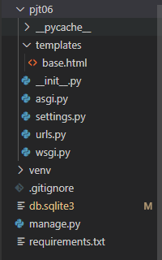

# PJT 06 사용자인증 기반 웹 페이지 구현

### 1.  Goal

- 데이터를 생성, 조회, 수정, 삭제할 수 있는 Web Application 제작
- Python Web Framework를 통한 데이터 조작
- Authentication에 대한 이해
- Database 1:N의 이해와 데이터 관계 설정


### 2. 결과화면

##### Community


##### Admin


### 3. 코드

#### 0) PJT06

**pjt06 / settings.py**

```python
INSTALLED_APPS = [
    'community',
    'accounts',
    'django.contrib.admin',
    'django.contrib.auth',
    'django.contrib.contenttypes',
    'django.contrib.sessions',
    'django.contrib.messages',
    'django.contrib.staticfiles',
]
'DIRS': [BASE_DIR/'pjt06'/'templates',],
LANGUAGE_CODE = 'ko-kr'
TIME_ZONE = 'Asia/Seoul'
AUTH_USER_MODEL = 'accounts.User' 
```

앱을 추가하고 DIRS경로를 설정하고 언어와 시간을 설정한다. 여기서 AUTH_USER_MODEL은 커스텀 유저 모델을 설정해주기 위함이다. 

**pjt06 / urls.py**

```python
from django.contrib import admin
from django.urls import path, include

urlpatterns = [
    path('admin/', admin.site.urls),
    path('community/', include('community.urls')),
    path('accounts/', include('accounts.urls')),
]
```

url에 community와 accounts를 나눠서 만들어준다. 

##### pjt06 / templates / base.html

```html
<!DOCTYPE html>
<html lang="en">
<head>
  <meta charset="UTF-8">
  <meta http-equiv="X-UA-Compatible" content="IE=edge">
  <meta name="viewport" content="width=device-width, initial-scale=1.0">
  <link href="https://cdn.jsdelivr.net/npm/bootstrap@5.0.0-beta3/dist/css/bootstrap.min.css" rel="stylesheet" integrity="sha384-eOJMYsd53ii+scO/bJGFsiCZc+5NDVN2yr8+0RDqr0Ql0h+rP48ckxlpbzKgwra6" crossorigin="anonymous">
  <title>Document</title>
</head>
<body>
  <nav class="navbar navbar-expand-lg navbar-light bg-light">
    <div class="container-fluid">
      <div class="collapse navbar-collapse" id="navbarNav">
        <ul class="navbar-nav">
          <li class="nav-item mt-2">
            <p>{{ request.user }}</p>
          </li>
          <li class="nav-item">
            <a class="nav-link active ms-3" aria-current="page" href="">INDEX</a>
          </li>
          <li class="nav-item">
            <a class="nav-link active ms-3" href="">CREATE</a>
          </li>
          
            <li class="nav-item">
              
              <form action="" method="POST" clas="nav-link active ms-3">
                
                <input type="submit" value="Logout" class="btn btn-primary">
              </form>
            </li>
          
          
            <li class="nav-item">
              <a class="nav-link active ms-3" href="">Login</a>
            </li>
            <li class="nav-item">
              <a class="nav-link active ms-3" href="">Signup</a>
            </li>
          

        </ul>
      </div>
    </div>
  </nav>

  <div class="container">
    
    
  </div>
  <script src="https://cdn.jsdelivr.net/npm/bootstrap@5.0.0-beta3/dist/js/bootstrap.bundle.min.js" integrity="sha384-JEW9xMcG8R+pH31jmWH6WWP0WintQrMb4s7ZOdauHnUtxwoG2vI5DkLtS3qm9Ekf" crossorigin="anonymous"></script>
</body>
</html>
```

다른 html들에서 확장할 base.html을 만들어준다. 상단에 네비게이션바를 넣기 위해 Navbar코드를 넣어주고 전체 리뷰 목록 조회 페이지, 새로운 리뷰 작성 페이지로 이동할 링크를 넣는다. request.user.is_authenticated를 넣어서 사용자가 로그인 되어있을 경우 로그아웃 링크, 로그인 안되어 있다면 로그인과 회원가입 페이지 링크를 넣는다. 


#### 1) accounts

##### accounts / urls.py

```python
from django.urls import path
from . import views

app_name = 'accounts'
urlpatterns = [
    path('signup/', views.signup, name='signup'),
    path('login/', views.login, name='login'),
    path('logout/', views.logout, name='logout'),
]

```

회원가입을 위한 signup, 로그인을 위한 login, 로그아웃을 위한 logout 페이지를 만들어준다. 

**accounts / models.py**

```python
from django.db import models
from django.contrib.auth.models import AbstractUser

class User(AbstractUser):
	pass
```

커스텀 유저 모델을 설정하기 위해 위와 같이 모델을 설정한다.

##### accounts / forms.py

```python
from django.contrib.auth.forms import UserCreationForm
from django.contrib.auth import get_user_model

class CustomerUserCreationForm(UserCreationForm):

  class Meta(UserCreationForm.Meta):
    model = get_user_model()
    fields = UserCreationForm.Meta.fields
```

회원가입에서 사용할 form을 위와 같이 만들어준다. 

##### accounts / admin.py

```python
from django.contrib import admin
from django.contrib.auth.admin import UserAdmin
from .models import User

admin.site.register(User, UserAdmin)
```

커스텀 유저 모델을 설정하기 위해 위와 같이 admin을 설정한다. 

##### accounts / views.py

```python
from django.shortcuts import render, redirect
from django.contrib.auth.forms import UserCreationForm, AuthenticationForm
from .forms import CustomerUserCreationForm
from django.contrib.auth import login as auth_login, logout as auth_logout
from django.views.decorators.http import require_POST, require_http_methods


@require_http_methods(['GET', 'POST'])
def signup(request):
  if request.user.is_authenticated:
    return redirect('community:index')

  if request.method == 'POST':
    form = CustomerUserCreationForm(request.POST)
    if form.is_valid():
      user = form.save()
      auth_login(request, user)
      return redirect('community:index')
  else:
    form = CustomerUserCreationForm()
  context = {
    'form' : form,
  }
  return render(request, 'accounts/signup.html', context)


@require_http_methods(['GET', 'POST'])
def login(request):
  if request.user.is_authenticated:
    return redirect('community:index')
  if request.method == 'POST':
    form = AuthenticationForm(request, request.POST)
    if form.is_valid():
      auth_login(request, form.get_user())
      return redirect(request.GET.get('next') or 'community:index') 
  else:
    form = AuthenticationForm()
  context = {
    'form' : form,
  }
  return render(request, 'accounts/login.html', context)


@require_POST
def logout(request):
  if request.user.is_authenticated:
    auth_logout(request)
  return redirect('community:index')
```

- Signup 함수의 경우, 우선 로그인 한 사용자가 접근할 경우 ```request.user.is_authenticated``` community의 article url로 redirect한다. HTTP method가 GET일 경우 forms.py에서 만들어준 form을 signup.html로 넘겨주어 회원가입할 수 있도록 한다. 그리고 그 signup.html에서 입력해 POST로 넘어온 데이터를 처리해주기 위해, HTTP method가 POST일 경우 저장을 한다. 

  이때, form의 리턴은 user이므로 ```user = form.save()``` 이렇게 하고 auth_login 함수로 로그인까지 진행해준다.  auth_login은 login 함수의 별칭이다. 로그인 후 전체 리뷰 목록 페이지로 돌아가게 한다. 그리고 ```is_valid()``` 에서 유효하지 못해 나왔을 경우, signup form을 보여준다.

- Login 함수의 경우, 로그인이 이미 된 경우 전체 목록 페이지로 돌아간다. HTTP method가 GET일 경우, 로그인 form을 보내주어 html에서 보여준다. 그리고 그 html에서 입력 후 넘어온 POST 데이터는 유효할 경우 ```auth_login(request, form.get_user())``` 로그인을 진행한다. 로그인 전, 기존 URL이 함께 넘어왔다면 ```request.GET.get('next')```으로 redirect하고 아니라면 전체 목록 페이지로 보낸다.

- Logout 함수의 경우, 로그인 되어있을 경우 ```auth_logout``` 함수를 통해 로그아웃 하고, 전체 목록 페이지로 돌아간다. HTTP method는 POST를 선택하였다. 

##### accounts / signup.html

```html


  <h1 class="text-center">Sign Up</h1>
  <form action="" method="POST">
    
    {{ form.as_p }}
    <input type="submit" value="회원가입" class="btn btn-primary">
  </form><br>
  <a href="" class="btn btn-warning">Back</a>

```

signup 함수에서 넘어온 form을 보여준다. 그리고 form태그를 이용해 POST method로 보낸다. 

##### accounts / login.html

```html


  <h1 class="text-center">Login</h1>
  <form action="" method="POST">
    
    {{ form.as_p }}
    <input type="submit" value="로그인" class="btn btn-primary">
  </form><br>
  <a href="community:index" class="btn btn-warning">Back</a>

```

login 함수에서 넘어온 form을 보여준다. 마찬가지로 POST method로 보낸다. 


#### 2) community

##### community / urls.py

```python
from django.urls import path
from . import views

app_name = 'community'
urlpatterns = [
    path('', views.index, name='index'),
    path('<int:review_pk>/', views.detail, name='detail'),
    path('create/', views.create, name='create'),
    path('<int:review_pk>/comments/', views.comments_create, name='comments_create'),
]
```

차례로 목록, 세부 조회, 생성, 댓글생성 url이다. 

##### community / models.py

```python
from django.db import models
from django.conf import settings

class Review(models.Model):
	user = models.ForeignKey(settings.AUTH_USER_MODEL, on_delete=models.CASCADE)
	title = models.CharField(max_length=100)
	movie_title = models.CharField(max_length=50)
	rank = models.IntegerField()
	content = models.TextField()
	created_at = models.DateTimeField(auto_now_add=True)
	updated_at = models.DateTimeField(auto_now=True)

class Comment(models.Model):
	review = models.ForeignKey(Review, on_delete=models.CASCADE)
	content = models.CharField(max_length=100)	
```

Review와 Comment class을 명세에 나와있는 요구사항대로 스키마를 만들어준다. 이때 Review class에는 user foreign key, Comment에는 review foreign key를 넣어서 1:N의 관계를 성립한다. 

##### community / forms.py

```python
from django import forms
from .models import Review, Comment

class ReviewForm(forms.ModelForm):
  class Meta:
    model = Review
    exclude = ('user',)
    
class CommentForm(forms.ModelForm):
  class Meta:
    model = Comment
    exclude = ('review',)
```

review 생성 form과 comment 생성 form을 다음과 같이 만들어준다. 이때 이전 models에서 만든 클래스들을 import해오고 django의 forms.ModelForm을 받아온다. 

##### community / views.py

```python
from django.shortcuts import render, redirect, get_object_or_404
from .models import Review, Comment
from .forms import ReviewForm, CommentForm
from django.views.decorators.http import require_safe, require_http_methods, require_POST
from django.contrib.auth.decorators import login_required

@require_safe
def index(request):
	reviews = Review.objects.order_by('-pk')
	context = {
		'reviews' : reviews,
	}	
	return render(request, 'community/index.html', context)

@require_safe
def detail(request, review_pk):
	review = get_object_or_404(Review, pk=review_pk)
	comment_form = CommentForm()
	comments = review.comment_set.all()
	context = {
		'review' : review,
		'comment_form' : comment_form,
		'comments' : comments,
	}
	return render(request, 'community/detail.html', context)

@login_required
@require_http_methods(['GET', 'POST'])
def create(request):
	if request.method == 'POST':
		form = ReviewForm(request.POST)
		if form.is_valid():
			review = form.save(commit=False)
			review.user = request.user
			review.save()
			return redirect('community:detail', review.pk)
	else:
		form = ReviewForm()
	context = {
		'form' : form,
	}
	return render(request, 'community/create.html', context)

@require_POST
def comments_create(request, review_pk):
	if request.user.is_authenticated:
		review = get_object_or_404(Review, pk=review_pk)
		comment_form = CommentForm(request.POST)
		if comment_form.is_valid():
			comment = comment_form.save(commit=False)
			comment.review = review
			comment.save()
			return redirect('community:detail', review.pk)
		context = {
			'comment_form': comment_form,
			'review' : review,
		}
		return render(request, 'community/detail.html', context)
	return redirect('accounts:login')
```

- index 함수는 전체 목록 조회를 위해 Review클래스를 import해온 후, ```Review.objects.order_by('-pk')```를 통해 역순으로 불러온다. 
- detail 함수는 review_pk를 같이 받아와서 해당 review를 가져온다. 이를  context에 담아서 detail html로 보낸다. ```get_object_or_404``` 를 통해 해당 pk의 리뷰가 없는 경우 404 에러 페이지를 표시한다. 추가적으로 comment_form 과 comments는 댓글 기능을 위한 것인데, comment_form은 forms.py에서 만든 CommentForm()을 detail페이지로 보내 댓글 생성을 위한 것이다. comments는 해당 review에 있는 comment를 전체 불러온 것이다. 해당 게시글에서 지금까지의 댓글을 보여주기 위함이다. 
- create 함수는 새로운 리뷰 생성을 위한 것으로, HTTP method가 GET일 경우 forms.py에서 만든 ReviewForm을 create.html로 보내준다. 그리고 후에 그 html에서 입력한 후 POST로 보낸 데이터를 받아왔을 때는 review의 user는 request의 user인 것을 넣고 저장해서 상세 페이지로 보낸다. 
- comments_create 함수는 새로운 댓글 생성을 위한 것으로, detail 함수에서 보낸 CommentForm을 detail.html에서 입력하고 POST요청으로 데이터가 넘어왔을 때 실행하는 함수이다. 따라서 우선, 로그인이 되어있지 않다면 로그인 페이지로 넘겨주고 로그인이 되어있을 경우 넘어온 review_pk를 통해 해당 review를 가져와 comment.review에 해당 review를 넣어준다. 그리고 저장을 한 후 detail페이지로 넘겨준다. 유효하지 않을 때는 다시 review와 comment_form을 보내 detail페이지로 넘겨준다. 
- create일 때는 login_requrired와 GET, POST를 받을 수 있는 데코레이터를 넣어준다. comments_create일 때는 POST를 받을 수 있는 데코레이터를 넣어준다. 나머지는 GET으로 해주어 접근을 가능하게 한다. 

##### community / templates / community / index.html

```html


  <h1 class=text-center>Reviews</h1>
  
    <div class="d-flex justify-content-between">
      <div>
        <h4>NO. {{ review.pk }}</h4>
        <a href="" class="text-decoration-none">{{ review.title }}</a><br>
      </div>
      {{ review.created_at }}
    </div>
    <hr>
  

```

index 함수에서 넘어온 review의 pk와 title, 생성시각을 보여준다.

**community / templates / community / detail.html**

```html


  <h1 class="text-center">DETAIL</h1>
  <p>제목 : {{ review.title }}</p>
  <p>영화제목 : {{ review.movie_title }}</p>
  <p>영화순위 : {{ review.rank }}</p>
  <p>내용 : {{ review.content }}</p>
  <p>생성일 : {{ review.created_at }}</p>
  <p>수정일 : {{ review.updated_at }}</p>

  <a href="" class="btn btn-warning">Back</a>
  
  <h3 class="text-center">댓글작성</h3>
  <form action="" method="POST">
    
    {{ comment_form }}
    <input type="submit" value="댓글작성" class="btn btn-primary">
  </form>
  <hr>
  <h3 class="text-center">댓글목록</h3>
  
    {{ comment.content }}<br>
    <hr>
  

```

review의 상세 내용을 보여주고 comments create을 위한 form태그를 만들어주었다. 그리고 쌓인 댓글들을 보여준다.

**community/ templates / community / create.html**

```html


  <h1 class="text-center">Create</h1>
  <form action="" method="POST">
  
  {{ form.as_p }}
  <input type="submit" value="생성" class="btn btn-primary">
  </form><br>
  <a href="" class="btn btn-warning">Back</a>


```

새로운 리뷰 생성을 위한 form을 ```form.as_p``` 로 만들어준다. 

##### community / admin

```python
from django.contrib import admin
from .models import Review, Comment

admin.site.register(Review)
admin.site.register(Comment)
```

Review와 Comment의 데이터 생성, 조회, 수정. 삭제가 가능하도록 admin을 다음과 같이 만들어준다.


### 4. 프로젝트 구조





### 5. 화면 사진


