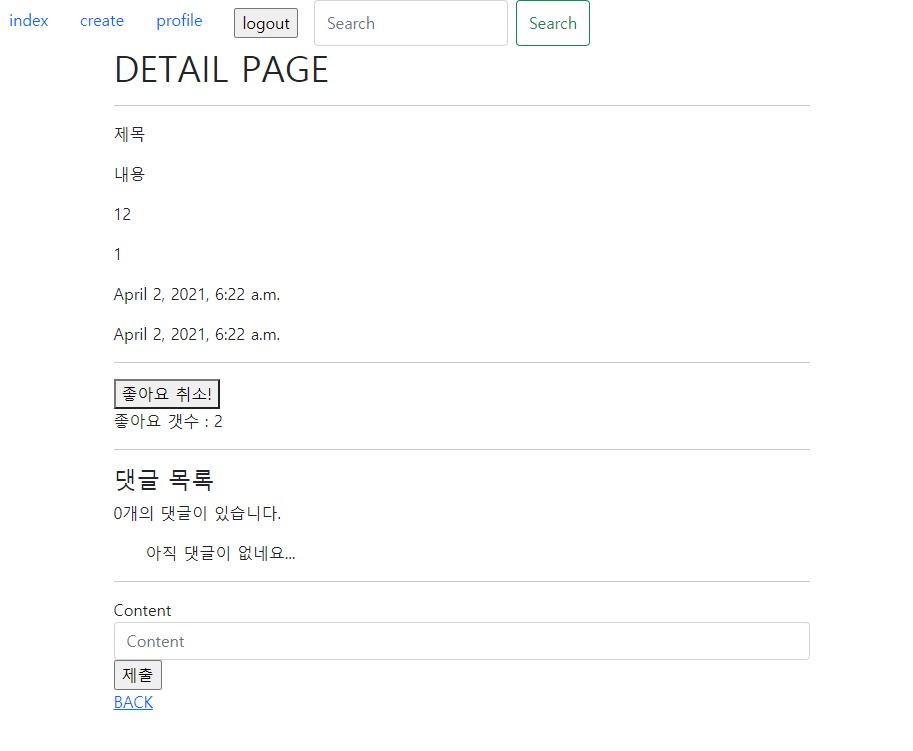
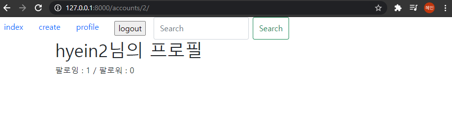
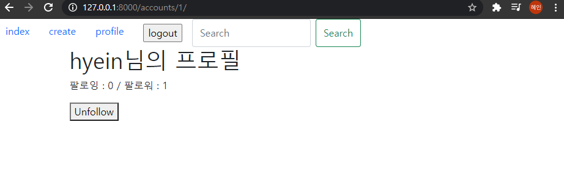
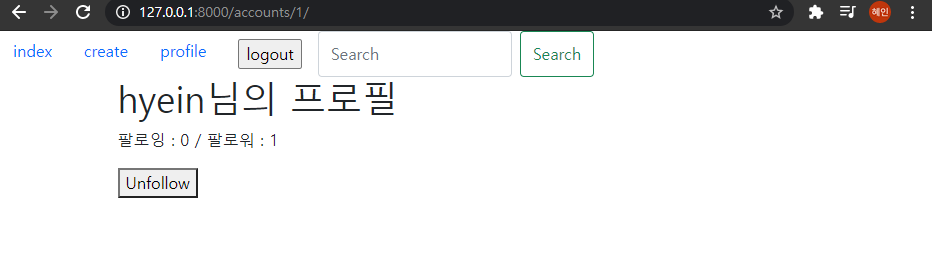

# PJT07  관계형 데이터베이스 설계


### Goal

- 데이터를 생성, 조회, 수정, 삭제 할 수 있는 Web Application 제작
- Python Web Framework를 통한 데이터 조작
- Authentication 에 대한 이해
- Database 1:N  M:N  관계의 이해와 데이터 관계 설정


### 요구사항

커뮤니치 서비스의 상세 기능 개발을 위한 단계로, 모델 간의 관계 설정 후 데이터의 생성, 조회, 수정, 삭제 할 수 있는 기능을 완성한다. 해당 기능은 향후 커뮤니티 서비스의 필수 기능으로 사용된다. 


#### 💛 [ 리뷰 좋아요 기능 ]



##### community / Models.py

```python
class Review(models.Model):
    user = models.ForeignKey(settings.AUTH_USER_MODEL, on_delete=models.CASCADE)
    like = models.ManyToManyField(settings.AUTH_USER_MODEL, related_name='review_like')
    title = models.CharField(max_length=100)
    movie_title = models.CharField(max_length=50)
    rank = models.IntegerField()
    content = models.TextField()
    created_at = models.DateTimeField(auto_now_add=True)
    updated_at = models.DateTimeField(auto_now=True)

    def __str__(self):
        return self.title
```

models.py에서 명세에 있는 ERD에 맞춰서 Review클래스에 like 필드를 추가한다. 이때 게시글도 여러 유저에게 좋아요를 받을 수 있고 유저도 여러 게시글에 좋아요를 남길 수 있으므로 다대다 관계의 ManyToManyField를 설정한다. 

makemigrations와 migrate를 다시 진행한다.

##### community / forms.py

```python
class ReviewForm(forms.ModelForm):

    class Meta:
        model = Review
        exclude = ('user', 'like',)
```

ReviewForm 생성시 앞서 모델에서 정의한 like부분이 같이 보이게 되므로 exclude해서 제외시켜준다.

##### community / urls.py

```python
app_name = 'community'
urlpatterns = [
    path('', views.index, name='index'),
    path('create/', views.create, name='create'),
    path('<int:review_pk>/', views.detail, name='detail'),
    path('<int:review_pk>/comment', views.comments_create, name='comments_create'),
    path('<int:review_pk>/like', views.like, name='like'),
]
```

좋아요 기능을 위해 like url을 만들어준다. 이때 어떤 게시글을 좋아하는 건지 알기 위해 review의 pk를 받는다.

##### community / views.py

```python
@require_POST
def like(request, review_pk):
    if request.user.is_authenticated:
        review = get_object_or_404(Review, pk=review_pk)
        if review.like.filter(pk=request.user.pk).exists():
            review.like.remove(request.user)
        else:
            review.like.add(request.user)
        return redirect('community:detail', review.pk)
    return redirect('accounts:login')
```

like할 리뷰를 찾아오고, 그 해당 리뷰를 좋아하는 유저들에서 filter로 요청을 보낸 유저의 pk로 찾아서 exists하는지 확인한다. 만약 존재한다면 요청을 보낸 유저를 review를 좋아하는 유저들에서 제거한다. 그렇지 않다면 추가시켜준다. 

##### community / templates / community / detail.html

```django
<form action="" method="POST">
    
    
      <button>좋아요 취소!</button>
    
      <button>좋아요!</button>
    
    <p>좋아요 갯수 : {{ review.like.all|length }}</p>
  </form>
```

요청을 보낸 유저가 review를 좋아하는 모든 사용자 중 있을 경우 좋아요 취소를 누르도록 하고 없다면 좋아요를 누를 수 있게 한다. 좋아요 개수는 length로 하였고, 이때 method는 POST로 한다. 


------------------

#### 💛 [ 유저 팔로우 기능 ]

(자신의 계정을 들어갔을 때)



(다른사람의 계정을 들어갔을 때)




##### accounts / models.py

```python
from django.db import models
from django.contrib.auth.models import AbstractUser

class User(AbstractUser):
    followings = models.ManyToManyField('self', symmetrical=False, related_name='followers')
```

User 클래스에 followings를 필드를 다대다 관계로 넣어준다. 이때 대칭 symmetrical은 False로 해주어 한쪽이 following이어도 다른 쪽은 꼭 대칭관계가 아닐 수 있음을 명시해준다. 

##### accounts / urls.py

```python
from django.urls import path
from . import views

app_name = 'accounts'
urlpatterns = [
    path('signup/', views.signup, name='signup'),
    path('login/', views.login, name='login'),
    path('logout/', views.logout, name='logout'),
    path('<int:user_id>/', views.profile, name='profile'),
    path('<int:user_id>/follow/', views.follow, name='follow'),
    path('search/', views.search, name="search"),
]
```

follow기능 구현을 위한 url을 넣어준다. 이때 user_id를 함께 받는다. 

##### accounts / views.py

```python
@require_POST
def follow(request, user_id):
    if request.user.is_authenticated:
        you = get_object_or_404(get_user_model(), pk=user_id)
        me = request.user
        if you != me:
            if you.followers.filter(pk=me.pk).exists():
                you.followers.remove(me)
            else:
                you.followers.add(me)
        return redirect('accounts:profile', you.pk)
    return redirect('accounts:login')
```

follow버튼은 요청을 보낸 쪽에서 user_id를 가진 사용자를 팔로우할 때 작용한다. 따라서 you는 pk가 user_id인 사람이게 되고, me나는 요청을 보낸 사용자 request.user가 된다. 이때 나와 너가 다르고, you의 followers에서 내가 있다면 나를 remove하고 없다면 나를 add한다. 그리고 profile로 redirect하고 이때 you의 pk도 함께 넘겨준다. 

##### accounts / templates / accounts / profile.html

```django



<h1>{{ person.username }}님의 프로필</h1>
<p>팔로잉 : {{ person.followings.all|length }} / 팔로워 : {{ person.followers.all|length }}</p>

  <form action="" method="POST">
    
    
      <button>Unfollow</button>
    
      <button>Follow</button>
    
  </form>



```

profile 함수에서 넘겨준 person으로 length를 이용하여 팔로잉과 팔로워를 넣어준다. 그리고 person과 요청을 보낸 사용자 request.user가 다를 경우 팔로우, 팔로우 취소 버튼이 나타나게 한다. 이때 요청을 보낸 사용자 (request.user)가 person의 팔로워들 전체 중에 있을 경우 unfollow버튼이 나타나게 한다. 이때 followers는 역참조의 related_name이다. 


------------------

#### 💛[ 유저 검색 기능 ]

**hyein을 검색하면**


**짠**💥



##### pjt07 / templates / base.html

```django
<form class="d-flex" action="">
      <input class="form-control me-2" type="search" placeholder="Search" aria-label="Search" name="username">
      <button class="btn btn-outline-success" type="submit">Search</button>
    </form>
```

유저 검색 기능을 넣어주기 위해 Navbar의 search 코드를 bootstrap에서 가져온다. 이때 input의 name에 username을 넣어줘서 이 이름을 가지고 요청이 넘어가게 한다. 

##### accounts / urls.py

```python
from django.urls import path
from . import views

app_name = 'accounts'
urlpatterns = [
    path('signup/', views.signup, name='signup'),
    path('login/', views.login, name='login'),
    path('logout/', views.logout, name='logout'),
    path('<int:user_id>/', views.profile, name='profile'),
    path('<int:user_id>/follow/', views.follow, name='follow'),
    path('search/', views.search, name="search"),
]
```

search url을 만들어준다. ❗ **이때 user_id 와 같은 곳에 int형 같은 type 정의해주어야한다!!!!!!!!!!!!** ❗ 안그러면 나중에 오류가 생길 수 있다. 

##### accounts / views.py

```python
def search(request):
    person = get_object_or_404(get_user_model(), username=request.GET.get('username'))
    return redirect('accounts:profile', person.pk)
```

이전 form태그에서 넘겨준 username을 request에서 가져와 get_user_model()에서 해당되는 user를 찾아온다. 그리고 profile링크로 person의 pk와 함께 redirect 해준다. 


