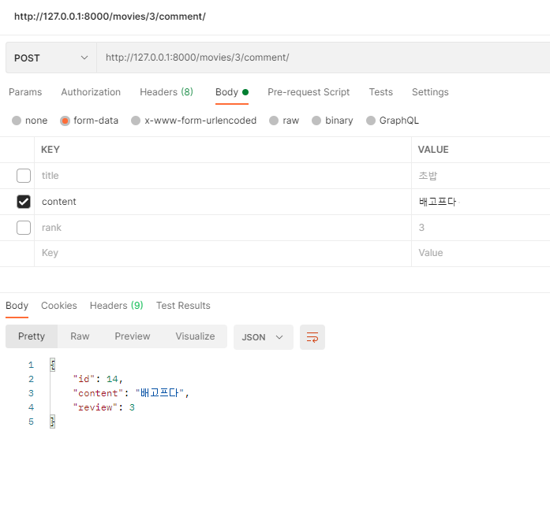

# PJT 08   데이터베이스 설계를 통한 REST API 설계


### ✔ Goal

- 데이터를 생성, 조회, 수정, 삭제를 할 수 있는 API Server 제작
- Django Rest Framework를 통한 데이터 조작
- Database 관계의 이해와 설정


### ✔ 준비사항

- Python 3.8+
- Django 3.X
- Postman, vsCode, Chrome Browser


### ✔ Code

#### 기본 세팅

```python
# pjt08 > settings.py
INSTALLED_APPS = [
    'movies',
    'django_seed',
    'rest_framework',
    ...
]

# pjt08 > urls.py
from django.contrib import admin
from django.urls import path, include

urlpatterns = [
    path('admin/', admin.site.urls),
    path('movies/', include('movies.urls')),
]
```

설치한 것들을 settings.py에 등록하고, movies의 include url을 만들어준다. 


----------

#### models.py

```python
from django.db import models

class Movie(models.Model):
    title = models.CharField(max_length=100)
    overview = models.TextField()
    release_date = models.DateTimeField(auto_now_add=True)
    poster_path = models.CharField(max_length=200)

class Review(models.Model):
    movie = models.ForeignKey(Movie, on_delete=models.CASCADE)
    title = models.CharField(max_length=100)
    content = models.TextField()
    rank = models.IntegerField()

class Comment(models.Model):
    review = models.ForeignKey(Review, on_delete=models.CASCADE)
    content = models.CharField(max_length=100)
```

명세의 ERD에 맞춰서 model을 정의한다. 

이때 Movie : Review = 1 : N 이고 Review : Comment = 1 : N이다.


-------

#### serializers.py

```python
from rest_framework import serializers
from .models import Movie, Review, Comment

class MovieListSerializer(serializers.ModelSerializer):
    class Meta:
        model = Movie
        fields = '__all__'

class MovieSerializer(serializers.ModelSerializer):
    class Meta:
        model = Movie
        fields = '__all__'

class ReviewListSerializer(serializers.ModelSerializer):
    class Meta:
        model = Review
        fields = '__all__'
        read_only_fields =('movie',)

class CommentListSerializer(serializers.ModelSerializer):
    class Meta:
        model = Comment
        fields = '__all__'
        read_only_fields = ('review',)
```

각 모델과 관련되어 serializers를 만들어준다. 

이때, 주의점은 ReviewListSerializer와 CommentListSerializer의 경우 **read_only_fields**를 넣어주어야 HTTP와 관련된 error가 생기지 않는다.


----

#### GET  `/movies/`   전체 영화 정보


**urls.py**

```python
from django.urls import path
from . import views

urlpatterns = [
    path('', views.movies_list),
    ...
]
```

**views.py**

```python
from django.shortcuts import render, get_list_or_404, get_object_or_404
from rest_framework.response import Response
from rest_framework.decorators import api_view
from rest_framework import status
from .models import Movie, Review, Comment
from .serializers import MovieListSerializer, MovieSerializer, ReviewListSerializer, CommentListSerializer


@api_view(['GET'])
def movies_list(request):
    if request.method == 'GET':
        movies = get_list_or_404(Movie)
        serializer = MovieListSerializer(movies, many=True)
        return Response(serializer.data)
```

단순 조회이므로 GET method로 api_view 데코레이터를 한다. movies에 담은 것들을 serializer해주고 리턴한다. 

이때, 주의점은 여러 정보가 들어가기 때문에 **many=True**를 넣는 것이다. 


-----------

#### GET  `movies/<movie_pk>`    단일 영화 정보


**urls.py**

```python
path('<int:movie_pk>/', views.movie_detail),
```

**views.py**

```python
@api_view(['GET'])
def movie_detail(request, movie_pk):
    movie = get_object_or_404(Movie, pk=movie_pk)
    serializer = MovieSerializer(movie)
    return Response(serializer.data)
```

movie_pk에 해당하는 데이터를 가져와 serializer해주고 리턴한다.


----------------------

#### GET  `movies/reviews/`    전체 리뷰 조회


**urls.py**

```python
path('reviews/', views.review_list),
```

**views.py**

```python
@api_view(['GET'])
def review_list(request):
    reviews = get_list_or_404(Review)
    serializer = ReviewListSerializer(reviews, many=True)
    return Response(serializer.data)
```

전체 리뷰를 **get_list_or_404**를 통해 가져온다. 이때, 역시 serializer를 해줄 때 **many=True**를 넣어주어야 한다. 

serializer.data를 리턴한다. 


------------

#### POST  `movies/<movie_pk>/review/`   리뷰 생성


**urls.py**

```python
path('<int:movie_pk>/review/', views.review_create),
```

**views.py**

```python
@api_view(['POST'])
def review_create(request, movie_pk):
    movie = get_object_or_404(Movie, pk=movie_pk)
    if request.method == 'POST':
        serializer = ReviewListSerializer(data=request.data)
        if serializer.is_valid(raise_exception=True):
            serializer.save(movie=movie)
            return Response(serializer.data, status=status.HTTP_201_CREATED)
```

movie_pk를 받아와 해당 movie를 가져온다. request.data를 serializer하고 movie에 가져온 movie를 넣어서 반환한다. 

이때, 1:N관계에서 생성하는 것이기 때문에 **movie=movie**가 들어가야한다.


------------

#### GET  `movies/reviews/<review_pk>`   리뷰 조회


#### PUT  `movies/reviews/<review_pk>`   리뷰 수정


#### DELETE  `movies/reviews/<review_pk>`   리뷰 삭제


**urls.py**

```python
path('reviews/<int:review_pk>/', views.review_detail),
```

**views.py**

```python
@api_view(['GET', 'DELETE', 'PUT'])
def review_detail(request, review_pk):
    review = get_object_or_404(Review, pk=review_pk)
    if request.method == 'GET':
        serializer = ReviewListSerializer(review)
        return Response(serializer.data)

    elif request.method == 'DELETE':
        review.delete()
        data = {
            'delete' : f'{review_pk}글이 삭제되었습니다.'
        }
        return Response(data, status=status.HTTP_204_NO_CONTENT)

    elif request.method == 'PUT':
        serializer = ReviewListSerializer(review, data=request.data)
        if serializer.is_valid(raise_exception=True):
            serializer.save()
            return Response(serializer.data)
```

위 사진은 13번 리뷰를 조회하고, 수정하고, 삭제한다. 조회의 경우, GET 메소드를 통해 review_pk에 해당하는 review를 serializer하고 리턴한다. 삭제의 경우, DELETE 메소드를 통해  delete한다. delete의 경우 status가 **status.HTTP_204_NO_CONTENT** 라는 점을 기억하자!

수정의 경우 PUT메소드를 통해 하는데, `serializer = ReviewListSerializer(review, data=request.data)` serializer할 때 **review와 data=request.data** 두가지 인자를 넣는 것을 기억하자!


------------

#### GET   `movies/comments/`   전체 댓글 조회


**urls.py**

```python
path('comments/', views.comment_list),
```

**views.py**

```python
@api_view(['GET'])
def comment_list(request):
    comments = get_list_or_404(Comment)
    serializer = CommentListSerializer(comments, many=True)
    return Response(serializer.data)
```

전체 댓글 조회는 전체 게시글 조회와 리뷰 조회와 마찬가지로 한다. 


----------

#### POST  `movies/<review_pk>/comment`    댓글 생성



**urls.py**

```python
path('<int:review_pk>/comment/', views.comment_create),
```

**views.py**

```python
@api_view(['POST'])
def comment_create(request, review_pk):
    review = get_object_or_404(Review, pk=review_pk)
    serializer = CommentListSerializer(data=request.data)
    if serializer.is_valid(raise_exception=True):
        serializer.save(review=review)
        return Response(serializer.data, status=status.HTTP_201_CREATED)
```

생성도 받아온 review_pk로 해당 review를 가져오고, serializer에 reqeust.data를 넣어 serializer한다. 그리고 이 serializer 한 것에 review를 넣어 반환한다. 


---------

### Model 구조


