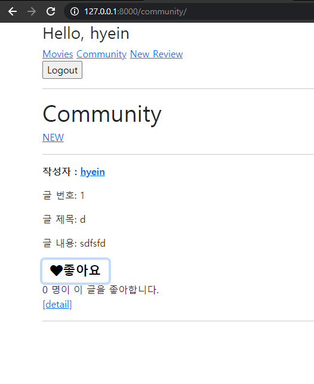
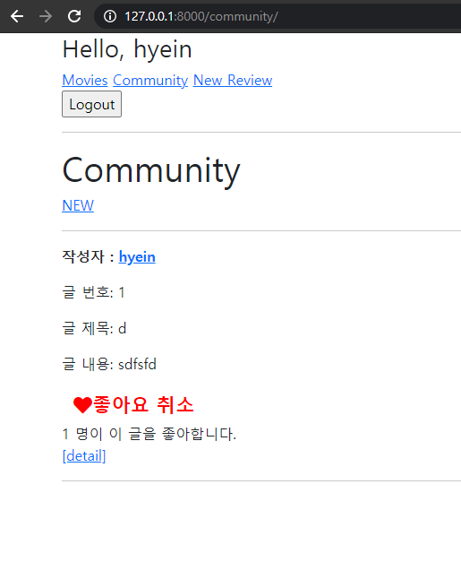
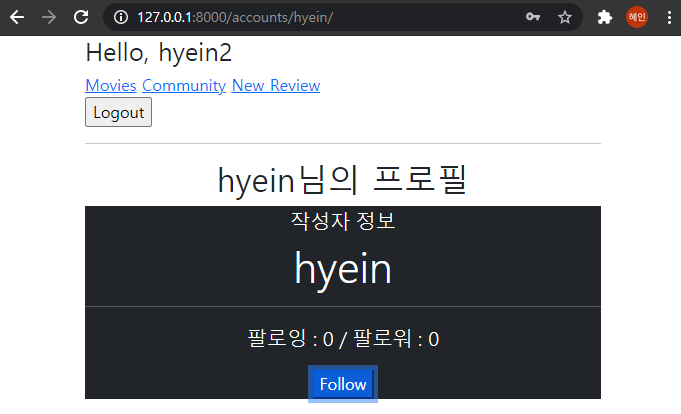
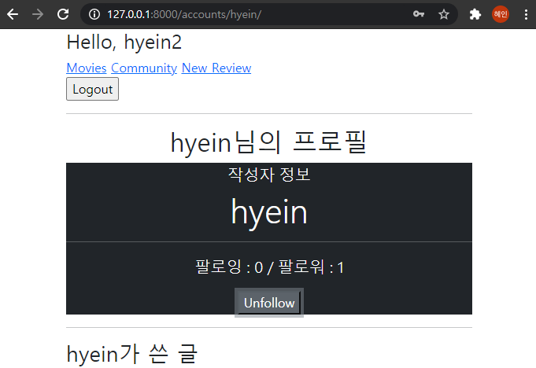
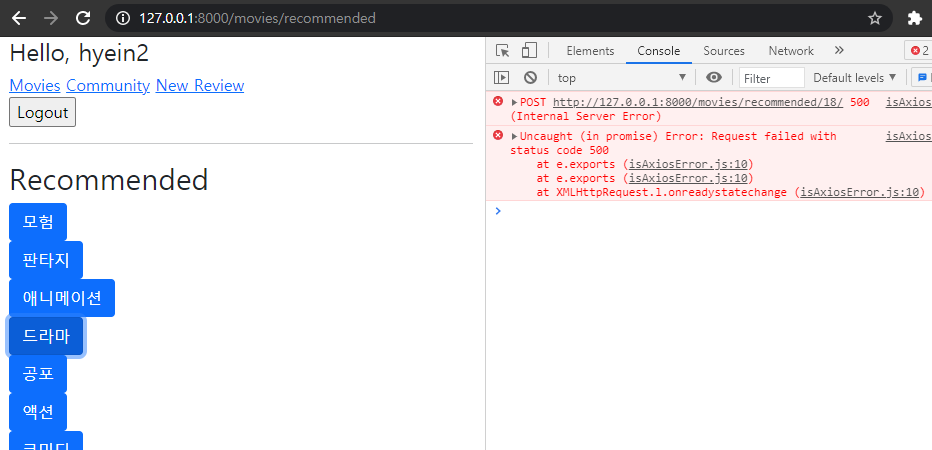

# PJT 09


### 1. 리뷰 좋아요 기능





#### community > index.html

```html
<form class="d-inline like-form" data-review-id="{{review.pk}}">
      
      
        <button class="btn" id="like-{{ review.pk }}">
          <i class="fas fa-heart fa-lg" style="color:crimson;">좋아요 취소</i>
        </button>
      
        <button class="btn" id="like-{{ review.pk }}">
          <i class="fas fa-heart fa-lg" style="color:black;">좋아요</i>
        </button>
      
    </form>
    <div id="like-count-{{ review.pk }}">{{ review.like_users.all|length }} 명이 이 글을 좋아합니다.</div>
...
...
<script src="https://cdn.jsdelivr.net/npm/axios/dist/axios.min.js"></script>
  <script>
    const forms = document.querySelectorAll('.like-form')
    const csrftoken = document.querySelector('[name=csrfmiddlewaretoken]').value

    forms.forEach(form => {
      form.addEventListener('submit', function(event) {
        event.preventDefault()
        // console.log(event.target.dataset.reviewId)
        const reviewId = event.target.dataset.reviewId
        axios({
          method: 'post',
          url: `http://127.0.0.1:8000/community/${reviewId}/like/`,
          headers: {'X-CSRFToken' : csrftoken},
        })
        .then(response => {
          const liked = response.data.liked
          const count = response.data.count
          // console.log(liked, count)
          // console.log(response.data.liked)

          const likeButton = document.querySelector(`#like-${reviewId} > i`)
          // console.log(likeButton)
          if (liked) {
            likeButton.innerText = '좋아요 취소'
            likeButton.style.color = 'red'
          } else {
            likeButton.innerText = '좋아요'
            likeButton.style.color = 'black'
          }

          const likeCount = document.querySelector(`#like-count-${reviewId}`)
          likeCount.innerText = `${count} 명이 이 글을 좋아합니다.`
        })
        .catch(error => {
          // console.log(error.response)
          if (error.response.status === 401) {
            window.location.href = '/accounts/login/'
          }
        })
      })
    })
  </script>
```

- 좋아요 버튼 안에 i 태그가 들어있어서 어떻게 해야할지 고민했는데,  버튼을 >i로 잡아주고 안에 텍스트와 컬러를 설정하니 가능했다! 기존에 django에서 페이지가 렌더링 되는 것과 자바스크립트 간에 헷갈리는 부분이 있었는데 좋아요 버튼과 하트 색상을 바꾸면서 이해하게 되었다.

- 좋아요 개수를 표시하는 부분이 그냥 글로 써있어서 div태그에 넣고 id를 설정해서 해주었다. 

- `console.log(error.response)` 를 하고 로그아웃 후 좋아요를 눌러보니 401에러와 함께 status에 401이 콘솔창에 출력되었다. 그래서 위와 같이 해주었다.

#### community > views.py

```python
from django.http import JsonResponse, HttpResponse


@require_POST
def like(request, review_pk):
    if request.user.is_authenticated:
        review = get_object_or_404(Review, pk=review_pk)
        user = request.user

        if review.like_users.filter(pk=user.pk).exists():
            review.like_users.remove(user)
            like = False
        else:
            review.like_users.add(user)
            like = True
        context = {
            'like' : like,
            'count' : review.like_users.count(),
        }
        return JsonResponse(context)
    return HttpResponse(status=401)
```

- 유효한 인증 자격이 없는 경우 401에러로 반환한다.


### 2. 유저 팔로우 기능





#### accounts > _follow.html

```html
<p class="lead" id="follow-count">
      팔로잉 : {{ followings|length }} / 팔로워 : {{ followers|length }}
    </p>
    <!-- 팔로우 버튼 -->
    
      <form id="follow-form" data-user-id="{{ person.pk }}">
        
        
          <button class="btn-secondary btn-lg" role="button">Unfollow</button>
        
          <button class="btn-primary btn-lg" role="button">Follow</button>
        
      </form>
...
...
<script src="https://cdn.jsdelivr.net/npm/axios/dist/axios.min.js"></script>
<script>
const form = document.querySelector('#follow-form')
const csrftoken = document.querySelector('[name=csrfmiddlewaretoken]').value

form.addEventListener('submit', function (event) {
  event.preventDefault()
  const userId = event.target.dataset.userId
  // console.log(userId)
  axios({
    method: 'post',
    url: `http://127.0.0.1:8000/accounts/follow/${userId}/`,
    headers: {'X-CSRFToken': csrftoken}
  })
  .then(response => {
    // console.log(response.data)
    const followed = response.data.followed
    const followbutton = document.querySelector(`#follow-form > button`)
    if (followed) {
      followbutton.innerText = 'Unfollow'
      followbutton.setAttribute('class', 'btn-secondary')
    } else {
      followbutton.innerText = 'Follow'
      followbutton.setAttribute('class', 'btn-primary')
    }

    const followers_count = response.data.followers_count
    const followings_count = response.data.followings_count
    const followCount = document.querySelector('#follow-count')
    followCount.innerText = `팔로잉 : ${followings_count} / 팔로워 : ${followers_count}`
  })
  .catch(error => {
    if (error.response.status === 401) {
      window.location.href = '/accounts/login/'
    }
  })

})
</script>
```

- 처음에는 profile.html에 accounts/_follow.html이 include 되어 있어서 profile.html에서 script 코드를 작성했으나, 작동이 안되는 것을 깨닫고 _follow.html에서 작성했다. include로 하게 되면 그 해당 파일의 자바스크립트 코드는 거기에 작성해야 함을 알게 되었다!

#### accounts > views.py

```python
from django.http import JsonResponse, HttpResponse

@require_POST
def follow(request, user_pk):
    if request.user.is_authenticated:
        person = get_object_or_404(get_user_model(), pk=user_pk)
        user = request.user
        if person != user:
            if person.followers.filter(pk=user.pk).exists():
                person.followers.remove(user)
                followed = False
            else:
                person.followers.add(user)
                followed = True
            context = {
                'followed' : followed,
                'followers_count' : person.followers.count(),
                'followings_count' : person.followings.count(),
            }
            return JsonResponse(context)
    return HttpResponse(status=401)
```


### 3. 추천 알고리즘



#### movies > recommended.html

```html



  <h1>Recommended</h1>
  
    <form class="recommend-form" data-recommend-id="{{ genre.pk }}">
       if user is  
      
      <button class="btn btn-primary" id="recommend-{{ genre.pk }}">{{ genre.name }}</button>
    </form>
  
  <div></div>

  
  <script src="https://cdn.jsdelivr.net/npm/axios/dist/axios.min.js"></script><script src="https://cdn.jsdelivr.net/npm/axios/dist/axios.min.js"></script>
  <script>
    const forms = document.querySelectorAll('.recommend-form')
    const csrftoken = document.querySelector('[name=csrfmiddlewaretoken]').value

    forms.forEach(form => {
      form.addEventListener('submit', function(event) {
        event.preventDefault()
        const recommendId = event.target.dataset.recommendId
        
        axios({
          method: 'post',
          url: `http://127.0.0.1:8000/movies/recommended/${recommendId}/`,
          headers: {'X-CSRFToken' : csrftoken}
        })
        .then(response => {
          console.log(response.data.movies)
        })
      })
    })
  
  </script>


```

원하는 장르를 선택하면 장르에 맞춰서 랜덤으로 10개의 영화 추천 페이지를 만드는 것이 본래 목적이었다. 

장르 버튼까지는 만들어졌으나 장르 id에 해당하는 영화들을 불러오는 views.py에서 막히게 되었다..

#### movies > views.py

```python
@require_GET
def recommended(request):
    genres = Genre.objects.all()
    context = {
        'genres' : genres,
    }
    return render(request, 'movies/recommended.html', context)

def genre_recommended(request, genre_pk):
    if request.user.is_authenticated:
        genre = get_object_or_404(Genre, pk=genre_pk)
        movies = genre.movie_set.all()
        # movies = serializers.serialize("json", movies)
        context = {
            'movies' : movies
        }
        return JsonResponse(context)
    return HttpResponse(status=401)
```

<QuerySet [<Movie: Movie object (8)>, <Movie: Movie object (9)>, <Movie: Movie object (11)>, <Movie: Movie object (26)>, <Movie: Movie object (31)>, <Movie: Movie object (34)>, <Movie: Movie object (35)>, <Movie: Movie object (38)>, <Movie: Movie object (39)>, <Movie: Movie object (50)>, <Movie: Movie object (55)>, <Movie: Movie object (57)>, <Movie: Movie object (78)>, <Movie: Movie object (80)>, <Movie: Movie object (94)>]>

쿼리셋은 이렇게 나오는데 `Object of type QuerySet is not JSON serializable` 이런에러가 계속해서 뜨는 걸 보니 Json형태로 넘어가질 않는 것 같다.. serializer도 설치해서 해보고 등등 여러 방법을 해보려 했지만 어디서 문제가 있는건지 잘 안된다. 아니면 여러개의 영화를 보여주는 것은 다른 페이지를 렌더링 해야하는 것인가??

왜 안될까요... ㅜㅜㅜㅜㅜㅜㅜㅜㅜㅜㅜㅜㅜㅜㅜㅜㅜㅜㅜㅜㅜㅜㅜㅜ