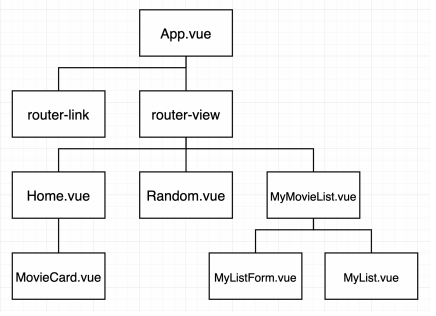
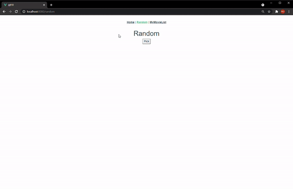
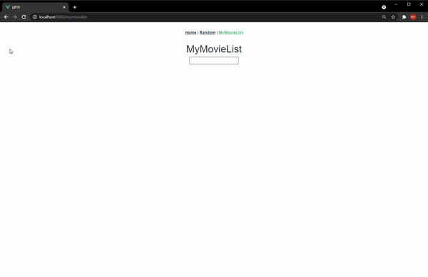
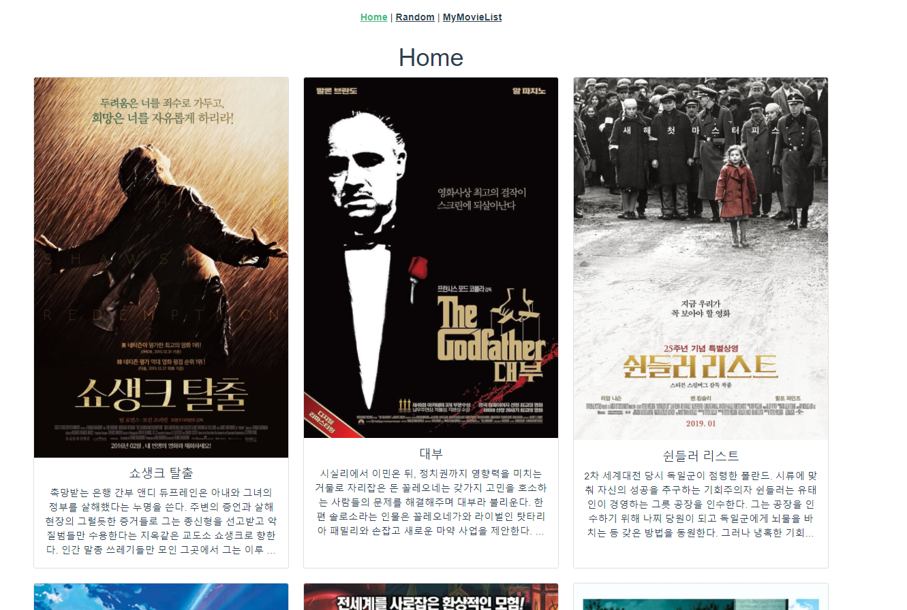
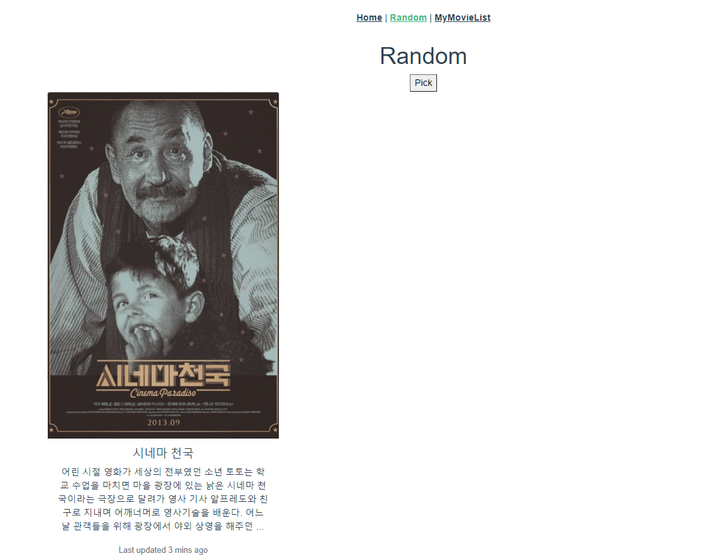

# PJT10  Vue를 활용한 SPA 구성

### ◽ 목표

- 영화 정보를 제공하는 SPA 제작
- AJAX통신과 JSON 구조에 대한 이해
- Single File Component 구조에 대한 이해
- vue-cli, vuex, vue-router등 플러그인 활용


### ◽ 사용언어 및 도구

- 언어 
  - Node 14.X ii. 
  - Vue.js 2.X 
- 도구 
  - vsCode
  - Chrome Browser


### ◽ 컴포넌트 구조




### ◽ 결과 화면







### ◽ 초기설정

```
vue add router
npm i --save lodash
vue add vuex
```


### ◽ Code

#### router > index.js

```javascript
import Vue from 'vue'
import VueRouter from 'vue-router'
import Home from '../views/Home.vue'
import Random from '@/views/Random.vue'
import MyMovieList from '@/views/MyMovieList.vue'

Vue.use(VueRouter)
const routes = [
  {
    path: '/',
    name: 'Home',
    component: Home
  },
  {
    path: '/random',
    name: 'Random',
    component: Random
  },
  {
    path: '/mymovielist',
    name: 'MyMovieList',
    component: MyMovieList
  }
]

const router = new VueRouter({
  mode: 'history',
  base: process.env.BASE_URL,
  routes
})
export default router
```

- vue router를 통해 Home, Random, mymovielist url 경로를 각각 만들어준다.

  

#### store > index.js

```javascript
import Vue from 'vue'
import Vuex from 'vuex'

Vue.use(Vuex)

export default new Vuex.Store({
  state: {
    movies: [],
    myMovies: [],
  },
  mutations: {
    GET_MOVIES: function (state, movies) {
      state.movies = movies
    },
    ADD_MY_MOVIE: function (state, movie) {
      state.myMovies.push(movie)
    },
    DELETE_MY_MOVIE: function (state, movie) {
      const index = state.myMovies.indexOf(movie)
      state.myMovies.splice(index, 1)
    }
  },
  actions: {
    getMovies: function({commit}, movies) {
      commit('GET_MOVIES', movies)
    },
    addMyMovie: function({commit}, movie) {
      commit('ADD_MY_MOVIE', movie)
    },
    deleteMyMovie: function({commit}, movie) {
      commit('DELETE_MY_MOVIE', movie)
    }
  },
  modules: {
  }
})
```

- vuex를 이용해서 state, mutations, actions를 해준다.
- vuex가 어렵게 느껴지는 부분들이 있었는데 이번에 써보면서 연습이 된 것 같다.


#### App.vue

```vue
<template>
  <div id="app">
    <!-- <button @click="getMovies">Click</button> -->
    <div id="nav">
      <router-link to="/">Home</router-link> |
      <router-link to="/random">Random</router-link> |
      <router-link to="/mymovielist">MyMovieList</router-link>
    </div>
    <router-view/>
  </div>
</template>

<script src="https://cdn.jsdelivr.net/npm/axios/dist/axios.min.js"></script>
<script>
import axios from 'axios'
// import { mapState } from 'vuex'

const URL = 'https://gist.githubusercontent.com/eduChange-hphk/d9acb9fcfaa6ece53c9e8bcddd64131b/raw/9c8bc58a99e2ea77d42abd41376e5e1becabea69/movies.json'

export default {
  name: 'App',
  created: function () {
    axios.get(URL)
    .then(response => {
      this.$store.dispatch('getMovies', response.data)
      // console.log(response.data)
    })
  },
}

</script>

<style>
#app {
  font-family: Avenir, Helvetica, Arial, sans-serif;
  -webkit-font-smoothing: antialiased;
  -moz-osx-font-smoothing: grayscale;
  text-align: center;
  color: #2c3e50;
}

#nav {
  padding: 30px;
}
#nav a {
  font-weight: bold;
  color: #2c3e50;
}
#nav a.router-link-exact-active {
  color: #42b983;
}
</style>
```

- Home, Random, MyMovieList의 router link를 만들어준다.
- created를 이용해 URL로 axios요청을 보내 응답을 받아온다. 받아온 것을 getMovies의 dispatch를 통해서 넘겨준다. 그리고 store의 index.js에서 mutations에서 state의 movies라는 array에 넣어준다. 이렇게 해서 movies데이터를 넣어두고 사용할 수 있게끔 하고자 했다.


### ◽ Home 화면



#### views > Home.vue

```vue
<template>
  <div class="container">
    <h1>Home</h1>
    <div class="row row-cols-1 row-cols-md-3 g-4">
      <MovieCard 
      v-for="(movie, idx) in movies"
      :key="idx"
      :movie="movie"
      />
    </div>
  </div>
  
</template>

<script>
import { mapState } from 'vuex'
import MovieCard from '@/components/MovieCard.vue'

export default {
  name: 'Home',
  components: {
    MovieCard,
  },
  computed: {
    ...mapState ([
      'movies',
    ])
  }
}
</script>
<style>
</style>
```

- mapState를 통해 위에서 데이터를 넣어준 movies를 가져온다. 그리고 그 movies를 순회하며 movie를 MovieCard 컴포넌트에 넘겨준다. 이때 movies를 카드 안에 형식으로 넣어주기 위해 bootstrap 카드 속성을 적용하였다. 

#### components > MovieCard.vue

```vue
<template>
  <div class="col">
    <div class="card h-100">
      
      <div class="card-body">
        <h5 class="card-title">{{ movie.title }}</h5>
        <p class="card-text">{{ movie.overview }}</p>
      </div>
    </div>
  </div>

</template>

<script>
export default {
  name: 'MovieCard',
  props: {
    movie: {
      type: Object,
    }
  },
  computed: {
    movieImage: function() {
      return 'https://image.tmdb.org/t/p/w500'+ this.movie.poster_path
    }
  }

}
</script>

<style>
.card-body > p {
  overflow: hidden;
  text-overflow: ellipsis;
  display: -webkit-box;
  -webkit-line-clamp: 5;
  -webkit-box-orient: vertical;
}
</style>
```

- **`img src="..."` 이 부분으로 인한 에러 화면 때문에 시간을 많이 허비했었다. 에러 화면에 나오는 ... 이 무슨 의미인지 몰랐으나 질문 후 img src를 넣어주지 않아서 생긴 문제라는 것을 알게 되었다. 설치가 안되어 있어서 생긴 문제라고 생각했는데 역시 문제는 코드에 있었다!!!**

- Home.vue에서 넘겨준 movie를 props로 받아오고 카드별로 movie.title과 movie.overview를 보여준다. 

- movieimage의 경우 computed에서  tmdb사이트를 참고해 function으로 해서 movied의 poster path에 url을 더해주었다. 

- **카드에 스타일을 더해주고자** 

  ```css
  .card-body > p {
    overflow: hidden;
    text-overflow: ellipsis;
    display: -webkit-box;
    -webkit-line-clamp: 5;
    -webkit-box-orient: vertical;
  }
  ```

  **위와 같이 해서 줄거리 길이를 보여주는 줄 수를 5줄로 제한했다.** **페어님의 좋은 아이디어 덕분에 새로운 코드를 넣게 되었다.**


### ◽ Random 화면




#### Random.vue

```vue
<template>
  <div class="container">
    <h1>Random</h1>
    <button @click="randomMovie">Pick</button>
    <div class="card mb-3" v-if="movie.title" id="imagesize">
      
      <div class="card-body">
        <h5 class="card-title">{{ movie.title }}</h5>
        <p class="card-text">{{ movie.overview }}</p>
        <p class="card-text"><small class="text-muted">Last updated 3 mins ago</small></p>
      </div>
    </div>
  </div>
</template>

<script>
import { mapState } from 'vuex'
import _ from 'lodash'

export default {
  name: 'Random',
  data: function () {
    return {
      movie: {},
    }
  },
  computed: {
    ...mapState([
      'movies'
    ]),
    movieImage: function() {
      return 'https://image.tmdb.org/t/p/w500'+ this.movie.poster_path
    }
  },
  methods: {
    randomMovie: function () {
      const movie = _.sample(this.movies)
      this.movie = movie
    }
  }

}
</script>

<style>
#imagesize {
  width: 400px;
  height: 500px;
}
</style>
```

- mapState를 통해 movies를 가져오고 pick 버튼을 눌렀을 때 methods에서 ransample lodash를 이용해 뽑아서 data의 movie에 넣어준다. 그리고 이 movie를 이용해 movieImage를 앞서 했던 방법과 유사하게 `'https://image.tmdb.org/t/p/w500'+ this.movie.poster_path` 이렇게 해준다. 
- style에서 이미지 사이즈를 조절해주었다.
- 시간관계상 이미지를 가운데로 옮기는 걸 하지 못해서 조금 아쉽다.


### ◽ MyMovieList 화면


#### MyMovieList.vue

```vue
<template>
  <div>
    <h1>MyMovieList</h1>
    <MyListForm/>
    <ul>
    <MyList
    v-for="(myMovie, idx) in myMovies" 
    :key="idx"
    :myMovie="myMovie"
    />
    </ul>
  </div>
</template>

<script>
import MyList from '@/components/MyList.vue'
import MyListForm from '@/components/MyListForm.vue'
import { mapState } from 'vuex'

export default {
  name: 'MyMovieList',
  components: {
    MyList,
    MyListForm,
  },
  computed: {
    ...mapState([
      'myMovies'
    ])
  }

}
</script>
<style>
</style>
```

- mapState로 mymovies를 가져오고 v-for를 통해 myMovie를 넘겨준다. 

#### components > MyListForm.vue

```vue
<template>
  <div>
    <input type="text" @keyup.enter="addMyMovie" v-model.trim="textInput" list="datalistOptions">
    <datalist id="datalistOptions">
      <option v-for="(movie, idx) in movies" :key="idx" v-bind:value="movie.title"></option>
    </datalist>
  </div>
</template>

<script>
import { mapState } from 'vuex'

export default {
  name: 'MyListForm',
  data: function () {
    return {
      textInput: '',
    }
  },
  methods: {
    addMyMovie: function() {
      const text = this.movies.filter(movie => {
        return this.textInput === movie.title
      })
      console.log(text)
      if (text[0].title.length) {
        this.$store.dispatch('addMyMovie', text[0].title)
      }
      this.textInput=''
    }
  },
  computed: {
    ...mapState([
      'movies'
    ])
  }
}
</script>
<style>
</style>
```

- **bootstrap에서 form에서 검색창 기능을 가져와서 사용했다. 처음에 입력하기 전에 movie의 title들이 밑에 나온다. '대'라고 입력했을 때 '대'가 들어있는 '대부'가 밑에 뜨게끔 만들고자 했다. 그리고 input창에서 enter를 눌렀을 때 methods의 addMyMovie 함수가 작동하고 textInput과 movies안에 movie의 title과 일치하면 리턴한다. 그리고 이 text의 title의 length가 참이면 dispatch로 넘겨줘서 MyMovieList에 저장되도록 했다. 그리고 textinput은 다시 초기화해준다!**

  **이렇게 하면 '대'라고 입력했을 때 저장이 안되도록 할 수 있어서 영화리스트에 있는 영화들만 저장될 수 있다.** 

#### MyList.vue

```vue
<template>
  <li>
    {{ myMovie }}
    <button @click="deleteMyMovie(myMovie)">X</button>
  </li>
</template>

<script>
import { mapActions } from 'vuex'
export default {
  name: 'MyList',
  props: {
    myMovie: {
      type: Object,
    }
  },
  methods: {
    ...mapActions([
      'deleteMyMovie',
    ])
  }
}
</script>
<style>
</style>
```

- state에  mymovielist에서 v-for로 받은 myMovie를 props로 해서 보여준다. 그리고 X 버튼을 눌렀을 때 영화가 삭제되도록 했다. mapActions로 deleteMyMovie를 넘겨주었다. 
